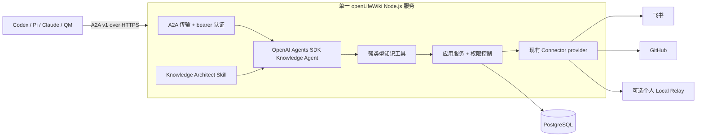
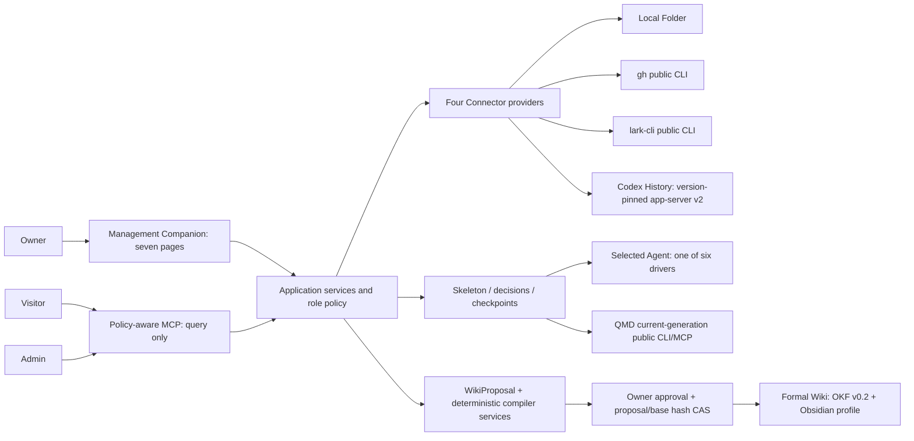
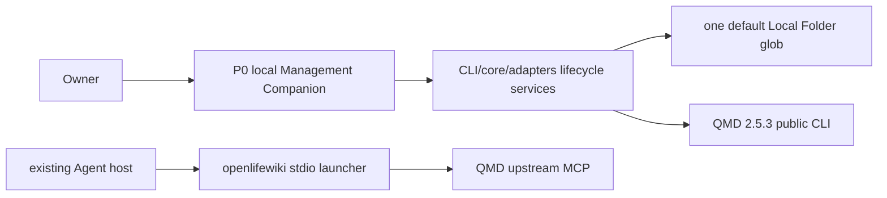

# openLifeWiki Architecture

- 状态：V2 云端目标已接受，尚未实施
- 当前实现：V1 本地优先链路正在开发
- V2 需求：[`docs/requirements/requirements-v2.md`](docs/requirements/requirements-v2.md)
- V2 设计：[`docs/design/active/2026-08-15-cloud-knowledge-agent-v2-design.md`](docs/design/active/2026-08-15-cloud-knowledge-agent-v2-design.md)
- V1 需求：[`docs/requirements/requirements-v1.md`](docs/requirements/requirements-v1.md)
- V1 设计：[`docs/design/active/design_doc-v1-progressive-scan-and-wiki.md`](docs/design/active/design_doc-v1-progressive-scan-and-wiki.md)

## V2 权威与兼容边界

V2 管理云端和多人场景。在某个 V2 Slice 明确替代现有本地行为前，本地兼容链路继续以 V1 为准。任何 V2 改动都不得静默削弱 V1 的 Source 授权、规范 hash、receipt、compare-and-swap 或 fail-closed 保证。

## V2 目标架构

openLifeWiki 以单一云端 Knowledge Agent 运行，是知识查询、注册、存储和整理的唯一公共产品入口。外部 Agent 通过基于 HTTPS 的 A2A v1 使用它。服务使用 OpenAI Agents SDK 执行 Agent loop，以强类型 openLifeWiki 应用操作控制权限，通过现有 Connector 边界访问外部知识，并以 PostgreSQL 作为唯一持久化数据库。



### V2 职责归属

| 关注点 | 负责人 |
| --- | --- |
| A2A、身份、知识、任务和结果合同 | `packages/protocol` |
| 权限、提案/CAS 和其他纯策略 | `packages/core` |
| PostgreSQL、Connector 和云端集成 adapter | `packages/adapters` |
| 强类型 query/register/store/organize 操作和 Agent loop | `packages/knowledge-agent` |
| 带认证的 A2A 传输、任务恢复和进程生命周期 | `apps/knowledge-server` |
| bootstrap、token 和个人 Local Relay 命令 | `apps/cli` |
| bootstrap/refactor 语义流程 | `skills/openlifewiki-knowledge-architect` |
| 持久 Registry、托管 Markdown、grant、任务和审计 | PostgreSQL 17 |

### V2 运行时边界

P0 只包含一个 Node.js 服务、一个 PostgreSQL 实例和可选出站 Local Relay。TLS termination 由宿主提供。只有满足已接受的量化触发条件后，才可以引入 MCP、Codex SDK、Pi、Redis、独立 Worker、对象存储、向量搜索、云端 QMD 或独立管理 UI。

### V2 请求链路

```text
A2A request
-> 认证 principal 并解析用户 delegation
-> 持久化 task
-> 运行 Knowledge Agent
-> 携带 AccessContext 调用强类型操作
-> 在检索或变更前过滤权限
-> 使用 PostgreSQL 或已批准 Connector location
-> 原子提交 Artifact 和脱敏审计
-> 返回带引用结果，或如实返回 input-required/failed 状态
```

同一个逻辑知识可以有托管 Markdown、飞书、GitHub 和 person-local location。注册只记录身份和位置，不复制外部或本地正文。组织结构变更必须形成不可变提案，并绑定精确审批和基础 Registry revision。

## Boundary

openLifeWiki owns Source authorization, lifecycle and scan control, public product contracts, policy, component isolation, Selected Agent orchestration, exact proposal approval and atomic Formal Wiki publication. External projects own their retrieval algorithms, platform access, Agent execution, formatting capabilities and private data.

Every external executable follows one rule:

```text
official release or existing authenticated executable
-> versioned public CLI / MCP / SDK
-> openLifeWiki contract validation
-> product-owned receipt
```

The repository contains no copied upstream source, vendor patch tree, QMD private storage access, credential value or durable normalized Source mirror.

## V1 Target Architecture

This section defines the authorized destination. Its components are available only after their delivery task and applicable acceptance gates pass.



### V1 Ownership

| Concern | Owner |
| --- | --- |
| JSON schemas, hashes and public envelopes | `packages/protocol` |
| lifecycle, authorization, scan decisions, progress, policy and proposal/CAS rules | `packages/core` |
| filesystem, process, Connector, QMD, Agent and compiler invocation | `packages/adapters` |
| policy-aware MCP role/tool exposure | `packages/mcp` |
| Owner command surface and recovery | `apps/cli` |
| seven-page local product surface and Canvas session boundary | `packages/companion` |
| canonical Selected Agent procedure | `skills/openlifewiki-progressive-scan` |
| current-source retrieval and index internals | QMD `2.5.3` |
| proven deterministic candidate checks and OKF v0.1 exchange | llm-wiki-compiler `1.1.0` |
| platform access | Local adapter, `gh`, `lark-cli`, Codex public surface |
| semantic scan decisions, grounded answers and WikiProposal content | the one Selected Agent |
| OKF v0.1-to-v0.2 adaptation and portable Wiki validation | openLifeWiki adapter implementing OKF v0.2 plus the Obsidian Compatibility Profile |

### V1 Data Flow

```text
Owner-approved Source scope
-> metadata-only Source Skeleton
-> disposable Layer Summary
-> Selected Agent descend/skip/defer/ask-user decision
-> selected current leaf streams
-> temporary QMD generation + public current/removed probes
-> policy-aware cited query
-> Selected Agent WikiProposal
-> deterministic compiler checks and OKF v0.1 exchange
-> openLifeWiki-owned OKF v0.2/Obsidian adaptation and validation
-> exact Owner approval + compare-and-swap
-> atomic Formal Wiki publication
```

Source bodies remain at the original provider and in QMD's rebuildable current generation. Durable openLifeWiki scan state stores metadata, hashes, decisions, coverage, counters and checkpoints. Layer Summary bodies stay in disposable scratch. The Formal Wiki contains only approved synthesized Concepts.

### V1 Public Surfaces

- Visitor MCP discovery exposes only `query`.
- Admin MCP/API exposes authorized status, scan and proposal management through preview/hash gates.
- Raw provider access, arbitrary paths and QMD private access are absent for every role.
- Management Companion has Query, Sources, Wiki, Review, Agent, Canvas and Health pages.
- Canvas carries one task-bound screen/event exchange and owns no durable lifecycle, scan or proposal truth.

## Current Implemented P0

The repository currently implements a narrower chain:



Implemented P0 behavior includes initialization, approval-gated activation of one default local Markdown folder, isolated QMD installation/config/cache, a real retrieval gate, direct QMD stdio MCP launch and a loopback-only Management Companion for lifecycle, Source activation, Codex registration guidance/action and health.

The following V1 capabilities remain pending until executable acceptance proves them: four Connector descriptors/providers, skeleton-first progressive scan, truthful multidimensional progress, restart checkpoints, six normalized Agent drivers, policy-aware MCP, WikiProposal/CAS publication, deterministic llm-wiki-compiler/OKF v0.1 exchange integration, the openLifeWiki-owned OKF v0.2/Obsidian adapter and the complete seven-page GUI.

`ACTIVE` currently proves the P0 authorized retrieval path. It cannot represent V1 completion, four-Connector readiness or Formal Wiki publication.

## Runtime And Workspace

```text
<platform application-data>/openLifeWiki/
  config.json                 authorization and Agent bindings
  state.json                  completed stable state and receipts
  components/                 isolated official releases
  data/qmd/generations/       rebuildable current-source generations
  data/connectors/            skeleton metadata and cursors
  data/scans/                 decisions, hashes, counters and checkpoints
  data/proposals/             immutable review candidates and receipts
  runtime/                    locks, leases and disposable scratch
  logs/                       redacted operational logs

~/openLifeWiki/
  sources/                    visible local Source root
  wiki/                       Owner-approved Formal Wiki / Obsidian Vault
```

The host platform convention selects the runtime root. `OPENLIFEWIKI_HOME` and `OPENLIFEWIKI_WORKSPACE` override runtime and visible roots independently for isolated tests. Initialization creates directories and reads no Source content. QMD receives a fixed working directory plus isolated configuration/cache paths, and its config/index/database remain opaque.

## Delivery Order

1. Pure protocol/core contracts.
2. Four-Connector visibility and authorization.
3. Local skeleton-first scan through a real current-only QMD generation.
4. Public-contract expansion to `gh`, `lark-cli` and version-pinned Codex app-server v2.
5. Six Agent drivers, canonical Skill and policy-aware MCP.
6. Selected Agent WikiProposal, deterministic compiler reuse, OKF/Obsidian validation and CAS publication.
7. Seven-page Management Companion and task-bound Canvas.
8. Real Full Journey and all acceptance veto gates.

The V1 delivery plan must freeze the detailed file map, first failing tests, verification commands and review gates before implementation begins.
