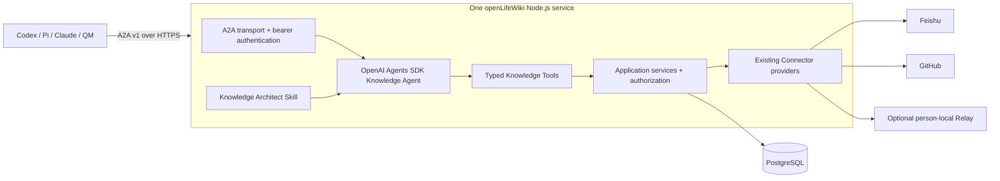
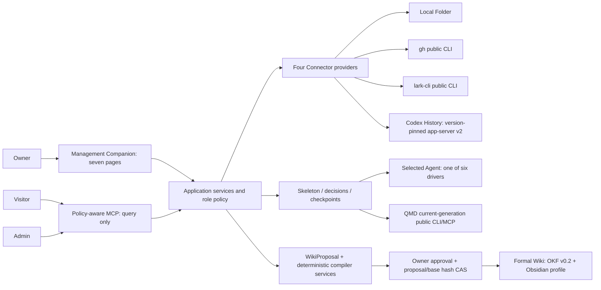
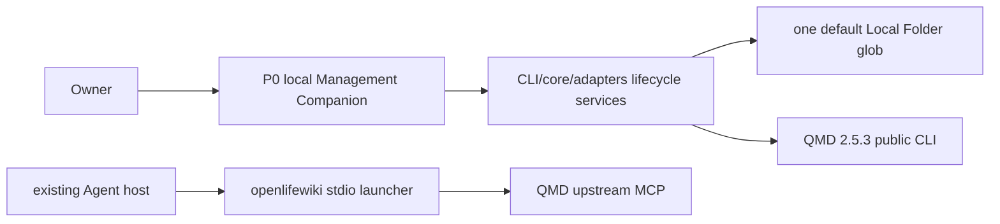

# openLifeWiki Architecture

- Status: V2 cloud target accepted; implementation pending
- Current implementation: V1 local-first path under active development
- V2 requirement: [`docs/requirements/requirements-v2.md`](docs/requirements/requirements-v2.md)
- V2 design: [`docs/design/active/2026-08-15-cloud-knowledge-agent-v2-design.md`](docs/design/active/2026-08-15-cloud-knowledge-agent-v2-design.md)
- V1 requirement: [`docs/requirements/requirements-v1.md`](docs/requirements/requirements-v1.md)
- V1 design: [`docs/design/active/design_doc-v1-progressive-scan-and-wiki.md`](docs/design/active/design_doc-v1-progressive-scan-and-wiki.md)

## V2 Authority And Compatibility

V2 is the target for cloud and multi-user work. V1 remains authoritative for the
existing local compatibility path until a V2 slice explicitly replaces that behavior.
No V2 change may silently weaken V1 Source authorization, canonical hashing, receipt,
compare-and-swap or fail-closed guarantees.

## V2 Target Architecture

openLifeWiki runs as one cloud Knowledge Agent. It is the only public product entry for
querying, registering, storing and organizing knowledge. External agents use A2A v1
over HTTPS. The service uses OpenAI Agents SDK for its agent loop, typed openLifeWiki
application operations for authority, the existing Connector boundary for external
knowledge and PostgreSQL as its only durable database.



### V2 Ownership

| Concern | Owner |
| --- | --- |
| A2A, identity, knowledge, task and result contracts | `packages/protocol` |
| authorization, proposal/CAS and other pure policy | `packages/core` |
| PostgreSQL, Connector and cloud integration adapters | `packages/adapters` |
| typed query/register/store/organize operations and agent loop | `packages/knowledge-agent` |
| authenticated A2A transport, task recovery and process lifecycle | `apps/knowledge-server` |
| bootstrap, token and person-local Relay commands | `apps/cli` |
| bootstrap/refactor semantic procedure | `skills/openlifewiki-knowledge-architect` |
| durable registry, managed Markdown, grants, tasks and audit | PostgreSQL 17 |

### V2 Runtime Boundary

P0 has one Node.js service, one PostgreSQL instance and an optional outbound local
Relay. TLS termination is supplied by the host. MCP, Codex SDK, Pi, Redis, a separate
worker, object storage, vector search, cloud QMD and a separate administration UI are
excluded until an accepted measured trigger justifies one of them.

### V2 Request Path

```text
A2A request
-> authenticate principal and resolve user delegation
-> persist task
-> run Knowledge Agent
-> invoke typed operation with AccessContext
-> filter authority before retrieval or mutation
-> use PostgreSQL or an approved Connector location
-> commit artifact and redacted audit atomically
-> return cited result or truthful input-required/failed state
```

One logical knowledge item may have managed Markdown, Feishu, GitHub and person-local
locations. Registration records identity and location; it does not copy an external or
local body. Organization changes are immutable proposals bound to exact approval and a
base Registry revision.

## Boundary

openLifeWiki owns Source authorization, lifecycle and scan control, public product contracts, policy, component isolation, Selected Agent orchestration, exact proposal approval and atomic Formal Wiki publication. External projects own their retrieval algorithms, platform access, Agent execution, formatting capabilities and private data.

Every external executable follows one rule:

```text
official release or existing authenticated executable
-> versioned public CLI / MCP / SDK
-> openLifeWiki contract validation
-> product-owned receipt
```

The repository contains no copied upstream source, vendor patch tree, QMD private storage access, credential value or durable normalized Source mirror.

## V1 Target Architecture

This section defines the authorized destination. Its components are available only after their delivery task and applicable acceptance gates pass.



### V1 Ownership

| Concern | Owner |
| --- | --- |
| JSON schemas, hashes and public envelopes | `packages/protocol` |
| lifecycle, authorization, scan decisions, progress, policy and proposal/CAS rules | `packages/core` |
| filesystem, process, Connector, QMD, Agent and compiler invocation | `packages/adapters` |
| policy-aware MCP role/tool exposure | `packages/mcp` |
| Owner command surface and recovery | `apps/cli` |
| seven-page local product surface and Canvas session boundary | `packages/companion` |
| canonical Selected Agent procedure | `skills/openlifewiki-progressive-scan` |
| current-source retrieval and index internals | QMD `2.5.3` |
| proven deterministic candidate checks and OKF v0.1 exchange | llm-wiki-compiler `1.1.0` |
| platform access | Local adapter, `gh`, `lark-cli`, Codex public surface |
| semantic scan decisions, grounded answers and WikiProposal content | the one Selected Agent |
| OKF v0.1-to-v0.2 adaptation and portable Wiki validation | openLifeWiki adapter implementing OKF v0.2 plus the Obsidian Compatibility Profile |

### V1 Data Flow

```text
Owner-approved Source scope
-> metadata-only Source Skeleton
-> disposable Layer Summary
-> Selected Agent descend/skip/defer/ask-user decision
-> selected current leaf streams
-> temporary QMD generation + public current/removed probes
-> policy-aware cited query
-> Selected Agent WikiProposal
-> deterministic compiler checks and OKF v0.1 exchange
-> openLifeWiki-owned OKF v0.2/Obsidian adaptation and validation
-> exact Owner approval + compare-and-swap
-> atomic Formal Wiki publication
```

Source bodies remain at the original provider and in QMD's rebuildable current generation. Durable openLifeWiki scan state stores metadata, hashes, decisions, coverage, counters and checkpoints. Layer Summary bodies stay in disposable scratch. The Formal Wiki contains only approved synthesized Concepts.

### V1 Public Surfaces

- Visitor MCP discovery exposes only `query`.
- Admin MCP/API exposes authorized status, scan and proposal management through preview/hash gates.
- Raw provider access, arbitrary paths and QMD private access are absent for every role.
- Management Companion has Query, Sources, Wiki, Review, Agent, Canvas and Health pages.
- Canvas carries one task-bound screen/event exchange and owns no durable lifecycle, scan or proposal truth.

## Current Implemented P0

The repository currently implements a narrower chain:



Implemented P0 behavior includes initialization, approval-gated activation of one default local Markdown folder, isolated QMD installation/config/cache, a real retrieval gate, direct QMD stdio MCP launch and a loopback-only Management Companion for lifecycle, Source activation, Codex registration guidance/action and health.

The following V1 capabilities remain pending until executable acceptance proves them: four Connector descriptors/providers, skeleton-first progressive scan, truthful multidimensional progress, restart checkpoints, six normalized Agent drivers, policy-aware MCP, WikiProposal/CAS publication, deterministic llm-wiki-compiler/OKF v0.1 exchange integration, the openLifeWiki-owned OKF v0.2/Obsidian adapter and the complete seven-page GUI.

`ACTIVE` currently proves the P0 authorized retrieval path. It cannot represent V1 completion, four-Connector readiness or Formal Wiki publication.

## Runtime And Workspace

```text
<platform application-data>/openLifeWiki/
  config.json                 authorization and Agent bindings
  state.json                  completed stable state and receipts
  components/                 isolated official releases
  data/qmd/generations/       rebuildable current-source generations
  data/connectors/            skeleton metadata and cursors
  data/scans/                 decisions, hashes, counters and checkpoints
  data/proposals/             immutable review candidates and receipts
  runtime/                    locks, leases and disposable scratch
  logs/                       redacted operational logs

~/openLifeWiki/
  sources/                    visible local Source root
  wiki/                       Owner-approved Formal Wiki / Obsidian Vault
```

The host platform convention selects the runtime root. `OPENLIFEWIKI_HOME` and `OPENLIFEWIKI_WORKSPACE` override runtime and visible roots independently for isolated tests. Initialization creates directories and reads no Source content. QMD receives a fixed working directory plus isolated configuration/cache paths, and its config/index/database remain opaque.

## Delivery Order

1. Pure protocol/core contracts.
2. Four-Connector visibility and authorization.
3. Local skeleton-first scan through a real current-only QMD generation.
4. Public-contract expansion to `gh`, `lark-cli` and version-pinned Codex app-server v2.
5. Six Agent drivers, canonical Skill and policy-aware MCP.
6. Selected Agent WikiProposal, deterministic compiler reuse, OKF/Obsidian validation and CAS publication.
7. Seven-page Management Companion and task-bound Canvas.
8. Real Full Journey and all acceptance veto gates.

The V1 delivery plan must freeze the detailed file map, first failing tests, verification commands and review gates before implementation begins.
