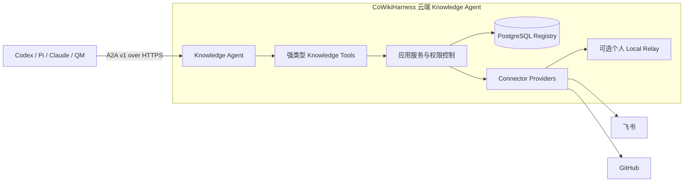

# CoWikiHarness

> 面向多人共享知识中心的 Agent Harness：统一登记知识，由不同 Connector 按授权访问，并通过一个 Knowledge Agent 提供查询、存储和整理入口。

项目仓库名和对外品牌为 **CoWikiHarness**。当前 V1 本地兼容链路仍使用 `openLifeWiki` 命令和 `@openlifewiki/*` package namespace；这是现有运行合同，后续如需整体改名必须单独形成迁移决策。

## 当前状态

- `main`：稳定、可发布的产品基线。
- `dev`：下一版集成分支，V2 Knowledge Agent 正在这里集成和验收。
- V2 设计已确认：一个云端 Knowledge Agent 作为知识查询、注册、存储和整理的唯一入口。
- 公共 Agent 协议采用 A2A v1 over HTTPS。
- P0 Agent runtime 采用 OpenAI Agents SDK，持久化事实源采用 PostgreSQL 17。
- V1 本地路径继续保留，用于本地 Markdown、现有 Connector 和 QMD 兼容能力。

当前 V2 已具备 PostgreSQL Registry、多人身份与 delegation、A2A 服务、OpenAI Agents SDK 查询、知识注册、托管 Markdown 存储、审批后替换，以及权限感知的只读知识图谱投影。

## 目标架构



核心原则：

1. 所有外部 Agent 只访问一个 Knowledge Agent，不直接访问 Connector、数据库或索引。
2. Registry 记录稳定的知识身份、多个知识位置、版本、来源、权限和可用状态。
3. 注册外部或个人本地知识时只登记位置，不自动复制正文。
4. 用户权限、Agent 权限和 delegation 权限取交集，检索前完成权限过滤。
5. 整理知识架构和覆盖稳定内容先生成不可变提案，再绑定精确审批和 revision 执行。

## P0 组件

P0 只部署以下组件：

- 一个 Node.js 云端服务，负责 A2A、认证、Agent 执行、应用操作和 Connector 编排；
- 一个 PostgreSQL 17 实例，负责 Registry、托管 Markdown、权限、任务、会话和审计；
- 一个可选的个人电脑 `openlifewiki relay` 进程，用于访问仅存在于个人本地的知识。

P0 暂不引入云端 MCP、Codex SDK、Pi、Redis、独立 Worker、对象存储、向量数据库、云端 QMD 或独立管理后台。每个新增组件都必须先满足量化触发条件并补充 ADR。

## 快速开始

### 本地 V1 兼容链路

要求 Node.js `>=24.16.0 <25` 和 pnpm `10.33.2`：

```bash
./scripts/bootstrap_dev_env.sh
pnpm openlifewiki companion --open --json
```

本地链路使用本机管理页面完成初始化、资料激活、Connector 授权和健康检查。默认知识目录为 `~/openLifeWiki/sources/`，当前 P0 读取 Markdown 并通过 QMD 提供本地检索。

### V2 Knowledge Agent

当前可用闭环：

1. PostgreSQL 保存知识身份、位置、版本、权限、任务、会话和审计；
2. Knowledge Agent 通过 A2A 接收自然语言查询和强类型写入操作；
3. Codex 通过 `cowikiharness` Skill 和 `cowiki` 客户端访问唯一入口；
4. 外部知识可以只登记 Feishu、GitHub 或个人本地 locator，不复制正文；
5. 托管 Markdown 默认以私有草案创建，替换采用精确 preview hash 和 revision 确认。

云端管理命令只需要 PostgreSQL 连接和 token HMAC secret，不要求模型配置。完成下方 Linux 源码目录初始化后，先在服务器仓库中由非 root 部署用户一次生成 HMAC secret；已有文件会直接复用，不会被覆盖：

```bash
test "$(id -u)" -ne 0
cd /opt/cowikiharness
test -O /opt/cowikiharness
COWIKI_CREDENTIALS_DIR="$HOME/.config/cowikiharness/credentials"
HMAC_SECRET_FILE="$COWIKI_CREDENTIALS_DIR/token-hmac-secret"
install -d -m 0700 "$COWIKI_CREDENTIALS_DIR"
if test ! -e "$HMAC_SECRET_FILE"; then
  (umask 077; openssl rand -hex 32 > "$HMAC_SECRET_FILE")
fi
chmod 0600 "$HMAC_SECRET_FILE"
```

配置 Gateway 时复用该文件中的同一个值。Linux installer 完成后，返回 `/opt/cowikiharness`，由 secret manager 安全注入 `DATABASE_URL`，再从仓库外文件读取 HMAC；禁止 source `gateway.env`。服务器管理命令从已安装 systemd unit 读取 installer 使用的绝对 Node.js 路径，直接执行已编译 CLI：

```bash
cd /opt/cowikiharness
NODE_BIN="$(sed -n 's|^ExecStart=\([^[:space:]]*\)[[:space:]].*|\1|p' \
  /etc/systemd/system/cowikiharness-gateway.service)"
case "$NODE_BIN" in /*) ;; *) exit 1;; esac
test -x "$NODE_BIN"
COWIKI_CREDENTIALS_DIR="$HOME/.config/cowikiharness/credentials"
HMAC_SECRET_FILE="$COWIKI_CREDENTIALS_DIR/token-hmac-secret"
IFS= read -r OPENLIFEWIKI_TOKEN_HMAC_SECRET < "$HMAC_SECRET_FILE"
export OPENLIFEWIKI_TOKEN_HMAC_SECRET
test "${#OPENLIFEWIKI_TOKEN_HMAC_SECRET}" -eq 64
case "$OPENLIFEWIKI_TOKEN_HMAC_SECRET" in *[!0-9A-Fa-f]*) exit 1;; esac
test -n "${DATABASE_URL:-}"
"$NODE_BIN" apps/cli/dist/main.js cloud migrate --json
```

bootstrap 只在全新数据库执行一次。以下流程只允许一个部署用户在本地 POSIX 文件系统、权限 `0700` 且由当前用户拥有的凭据目录中串行执行；Windows 会直接拒绝。管理 CLI 在数据库提交前将含完整一次性凭据的 JSON 以权限 `0600` 安全提交到 `--credential-file`，并把 `<credential-file>.pending` 作为确定性恢复标记；final 或 pending 任一存在都会停止。标准输出只包含非 secret ID、凭据文件路径和持久化状态。后续 Node.js 流程继续检查全部 token、ID final 和 `.pending` 目标，并把凭据拆分为独立文件：

```bash
set -euo pipefail
test "$(id -u)" -ne 0
cd /opt/cowikiharness
test -O /opt/cowikiharness
NODE_BIN="$(sed -n 's|^ExecStart=\([^[:space:]]*\)[[:space:]].*|\1|p' \
  /etc/systemd/system/cowikiharness-gateway.service)"
case "$NODE_BIN" in /*) ;; *) exit 1;; esac
test -x "$NODE_BIN"
COWIKI_CREDENTIALS_DIR="$HOME/.config/cowikiharness/credentials"
HMAC_SECRET_FILE="$COWIKI_CREDENTIALS_DIR/token-hmac-secret"
test -f "$HMAC_SECRET_FILE"
test "$(stat -c '%a' "$HMAC_SECRET_FILE")" = 600
IFS= read -r OPENLIFEWIKI_TOKEN_HMAC_SECRET < "$HMAC_SECRET_FILE"
export OPENLIFEWIKI_TOKEN_HMAC_SECRET
test -n "${DATABASE_URL:-}"
test "${#OPENLIFEWIKI_TOKEN_HMAC_SECRET}" -eq 64
case "$OPENLIFEWIKI_TOKEN_HMAC_SECRET" in *[!0-9A-Fa-f]*) exit 1;; esac
BOOTSTRAP_JSON="$COWIKI_CREDENTIALS_DIR/bootstrap.json"
BOOTSTRAP_IDS="$COWIKI_CREDENTIALS_DIR/bootstrap-ids.json"
OWNER_TOKEN="$COWIKI_CREDENTIALS_DIR/owner.token"
AGENT_TOKEN="$COWIKI_CREDENTIALS_DIR/agent.token"
install -d -m 0700 "$COWIKI_CREDENTIALS_DIR"
umask 077
for target in \
  "$BOOTSTRAP_JSON" "$BOOTSTRAP_JSON.pending" \
  "$OWNER_TOKEN" "$AGENT_TOKEN" "$BOOTSTRAP_IDS" \
  "$OWNER_TOKEN.pending" "$AGENT_TOKEN.pending" "$BOOTSTRAP_IDS.pending"; do
  test ! -e "$target"
done
set -o noclobber
"$NODE_BIN" apps/cli/dist/main.js cloud bootstrap \
  --organization openLifeWiki \
  --owner Anthony \
  --agent codex \
  --credential-file "$BOOTSTRAP_JSON" \
  --json
test -s "$BOOTSTRAP_JSON"
test "$(stat -c '%a' "$BOOTSTRAP_JSON")" = 600

COWIKI_CREDENTIALS_DIR="$COWIKI_CREDENTIALS_DIR" \
BOOTSTRAP_JSON="$BOOTSTRAP_JSON" \
"$NODE_BIN" --input-type=module <<'NODE'
import { link, lstat, open, readFile, unlink } from "node:fs/promises";
import { join } from "node:path";

const credentialsDir = process.env.COWIKI_CREDENTIALS_DIR;
const inputPath = process.env.BOOTSTRAP_JSON;
if (!credentialsDir || !inputPath) throw new Error("Bootstrap paths are required");
const finalPaths = ["owner.token", "agent.token", "bootstrap-ids.json"].map((name) => join(credentialsDir, name));
const pendingPaths = finalPaths.map((path) => `${path}.pending`);
const createdPending = new Set();

for (const path of [...finalPaths, ...pendingPaths]) {
  try {
    await lstat(path);
  } catch (error) {
    if (error?.code === "ENOENT") continue;
    throw error;
  }
  throw new Error(`Credential target already exists: ${path}`);
}

async function writePending(path, content) {
  let handle;
  try {
    handle = await open(path, "wx", 0o600);
    createdPending.add(path);
    await handle.chmod(0o600);
    await handle.writeFile(content, "utf8");
    await handle.sync();
  } finally {
    if (handle) await handle.close();
  }
}

async function syncDirectory(path) {
  const handle = await open(path, "r");
  try {
    await handle.sync();
  } finally {
    await handle.close();
  }
}

try {
  const result = JSON.parse(await readFile(inputPath, "utf8"));
  const ids = {
    orgId: result.orgId,
    ownerPrincipalId: result.ownerPrincipalId,
    agentPrincipalId: result.agentPrincipalId,
    delegationId: result.delegationId,
  };
  if ([result.ownerToken, result.agentToken].some((value) => typeof value !== "string" || value.length === 0)) {
    throw new Error("Bootstrap token is missing");
  }
  if (Object.values(ids).some((value) => typeof value !== "string" || value.length === 0)) {
    throw new Error("Bootstrap identifiers are missing");
  }

  const files = [
    { final: finalPaths[0], pending: pendingPaths[0], content: result.ownerToken + "\n" },
    { final: finalPaths[1], pending: pendingPaths[1], content: result.agentToken + "\n" },
    { final: finalPaths[2], pending: pendingPaths[2], content: JSON.stringify(ids) + "\n" },
  ];
  for (const file of files) {
    await writePending(file.pending, file.content);
  }
  for (const file of files) await link(file.pending, file.final);
  for (const file of files) {
    const [pendingStat, finalStat] = await Promise.all([lstat(file.pending), lstat(file.final)]);
    if (!pendingStat.isFile() || !finalStat.isFile()
      || pendingStat.dev !== finalStat.dev || pendingStat.ino !== finalStat.ino
      || pendingStat.nlink !== 2 || finalStat.nlink !== 2) {
      throw new Error(`Credential hard-link verification failed: ${file.final}`);
    }
  }
  for (const file of files) {
    await unlink(file.pending);
    createdPending.delete(file.pending);
  }
  await syncDirectory(credentialsDir);
  for (const file of files) {
    const finalStat = await lstat(file.final);
    if (!finalStat.isFile() || finalStat.isSymbolicLink()
      || (finalStat.mode & 0o777) !== 0o600 || finalStat.nlink !== 1) {
      throw new Error(`Credential final verification failed: ${file.final}`);
    }
  }
  await unlink(inputPath);
  await syncDirectory(credentialsDir);
  process.stdout.write(JSON.stringify(ids) + "\n");
} catch (error) {
  await Promise.all([...createdPending].map(async (path) => {
    try {
      await unlink(path);
    } catch (cleanupError) {
      if (cleanupError?.code !== "ENOENT") throw cleanupError;
    }
  }));
  await syncDirectory(credentialsDir);
  throw error;
}
NODE
for target in "$OWNER_TOKEN" "$AGENT_TOKEN" "$BOOTSTRAP_IDS"; do
  test -s "$target"
  test "$(stat -c '%a' "$target")" = 600
done
```

任一步失败都会立即停止，grant 等后续操作不得继续。拆分脚本对每个 pending 完成写入、文件同步和关闭，经硬链接提交、移除 pending 并同步目录；三个 final 全部核验后才删除 `bootstrap.json`，随后再次同步目录。

异常恢复只允许按数据库事实进入一个分支：

- 数据库已提交：保留 `bootstrap.json` final，继续用它恢复 token 和 ID 文件；已有 final/pending 先核对，禁止覆盖。
- 数据库确认为空：由管理员确认 `bootstrap.json`、`bootstrap.json.pending` 以及拆分流程留下的 stale final/pending 均属于本次失败；只清理已核验为当前用户拥有的普通文件，清理后用 Node.js 打开凭据目录执行 `FileHandle.sync()`，再执行 bootstrap。
- 数据库状态不明：停止操作并保留所有 final/pending，完成数据库核验前禁止清理或重跑。

#### macOS 本地安装

将模型和数据库配置保存到：

```text
~/Library/Application Support/CoWikiHarness/config.env
```

将 bootstrap 产生的 Agent token 保存到：

```text
~/Library/Application Support/CoWikiHarness/credentials/agent.token
```

然后运行：

```bash
PATH="/opt/homebrew/opt/node@24/bin:$PATH" ./scripts/install_local_macos.sh
curl http://127.0.0.1:8080/healthz
```

安装器完成四件事：构建 Knowledge Server、注册 macOS 常驻服务、安装 `cowiki` 命令、把 `cowikiharness` Skill 链接到 Codex。配置和 token 始终保留在仓库外。

#### Linux 云端 Gateway

单机试运行采用一个 Gateway、PostgreSQL 17 和现有 HTTPS 边缘。Gateway 固定监听 `127.0.0.1:8080`，systemd 负责常驻，公网 HTTPS 由 Caddy、云负载均衡器或 Tailscale Serve 提供。Linux installer 以 root 构建 Gateway、管理 CLI 及其传递依赖；管理 CLI 由非 root SSH 部署用户按需执行已编译入口，不注册常驻服务，也不触发源码重建。Linux installer 不安装 `cowiki` 客户端。根命令 `pnpm openlifewiki` 保留给本地开发和 fresh source 使用。

先确认当前 SSH 身份不是 root，为部署用户创建并接管源码目录，再由该用户 clone 和记录候选 SHA：

```bash
test "$(id -u)" -ne 0
sudo install -d -o "$USER" -g "$(id -gn)" -m 0755 /opt/cowikiharness
git clone --branch dev https://github.com/MetaInFLow/CoWikiHarness.git /opt/cowikiharness
cd /opt/cowikiharness
test -O /opt/cowikiharness
git fetch origin dev
export COWIKIHARNESS_RELEASE_COMMIT="$(git rev-parse origin/dev)"
printf 'Candidate commit %s\n' "$COWIKIHARNESS_RELEASE_COMMIT"
```

批准该完整 SHA 后，固定代码并创建配置。复用前文一次生成的 64 位十六进制 HMAC 文件，在编辑器中把值写入 `OPENLIFEWIKI_TOKEN_HMAC_SECRET`，同时替换数据库密码、模型 key、模型地址、模型名称和公共域名。`OPENLIFEWIKI_PUBLIC_URL` 必须是无路径、查询参数、片段或 userinfo 的远程 HTTPS Origin，例如 `https://knowledge.example.com`；`OPENAI_BASE_URL` 必须使用远程 HTTPS 且不得包含 username/password userinfo。

```bash
git checkout --detach "$COWIKIHARNESS_RELEASE_COMMIT"
test "$(git rev-parse HEAD)" = "$COWIKIHARNESS_RELEASE_COMMIT"
sudo install -d -m 0750 /etc/cowikiharness
sudo cp deploy/linux/gateway.env.example /etc/cowikiharness/gateway.env
sudo chmod 0600 /etc/cowikiharness/gateway.env
HMAC_SECRET_FILE="$HOME/.config/cowikiharness/credentials/token-hmac-secret"
test -f "$HMAC_SECRET_FILE"
sudo install -o root -g root -m 0600 \
  "$HMAC_SECRET_FILE" /etc/cowikiharness/hmac-secret.pending
sudo editor /etc/cowikiharness/gateway.env /etc/cowikiharness/hmac-secret.pending
sudo rm /etc/cowikiharness/hmac-secret.pending
if sudo systemctl cat cowikiharness-gateway.service >/dev/null 2>&1; then
  sudo systemctl stop cowikiharness-gateway.service
fi
NODE_BIN="$(readlink -f "$(command -v node)")"
PNPM_BIN="$(readlink -f "$(command -v pnpm)")"
sudo COWIKIHARNESS_NODE="$NODE_BIN" COWIKIHARNESS_PNPM="$PNPM_BIN" \
  ./scripts/install_server_linux.sh
```

生产部署必须固定到已批准 commit，公网只开放 SSH 和 `443`，外部不能访问 `8080`。Gateway 主机只提供常驻 Gateway 与按需运行的已编译管理 CLI；`cowiki ask/graph` 从已完成上方 macOS 本地安装的外部管理工作站执行，并指向公网 HTTPS。开放域名前还要完成 PostgreSQL 备份、HTTPS 边缘和 token 文件 `0600` 权限检查。完整安装、初始化、验收、升级、备份和回滚步骤见 [Linux Gateway 部署手册](docs/deployment/linux-gateway.md)。

#### 直接使用

以下 `cowiki` 命令在已完成本地安装的管理工作站执行。Linux Gateway 主机不提供该客户端。

查询中央知识：

```bash
cowiki ask "CoWikiHarness 的架构是什么？"
```

登记一个外部知识地址，不复制正文：

```bash
cowiki register \
  --title "项目知识库" \
  --kind feishu \
  --locator "https://example.feishu.cn/wiki/example" \
  --tag architecture
```

保存一份托管 Markdown 私有草案：

```bash
cowiki store --title "CoWikiHarness 使用说明" --body-file /absolute/path/guide.md --tag product
```

在 Codex 中可以直接说：

```text
查一下知识中枢里 CoWikiHarness 的架构。
把这份 Markdown 作为私有草案存进知识中枢。
```

替换已有知识必须先运行 `preview-replace`，展示返回的 `previewHash` 并得到用户确认，再运行 `apply-replace`。完整参数由已安装的 `cowikiharness` Skill 约束。

#### 外部图谱快速路径

`cowiki graph` 从 Knowledge Server 的 `GET /api/v1/graph` 读取当前用户有权查看的知识结构。响应采用 `cowikiharness.graph/v1`，其中 `elements.nodes` 和 `elements.edges` 可以直接交给 Cytoscape.js；其他可视化工具可以在这一公共结构上做轻量转换。

Linux Gateway 主机不安装 `cowiki`。先在服务器仓库中由非 root 部署用户创建最小权限 member；执行前由 secret manager 注入 `DATABASE_URL`，并从仓库外权限 `0600` 的文件读取 `OPENLIFEWIKI_TOKEN_HMAC_SECRET`，禁止 source `gateway.env`。以下流程只允许该用户在权限 `0700` 的凭据目录中串行执行；它会在签发前检查全部目标，raw token 先进入权限 `0600` 的中间文件，再经 `.pending` 文件提交为独立 token 与 ID 文件：

```bash
set -euo pipefail
test "$(id -u)" -ne 0
cd /opt/cowikiharness
test -O /opt/cowikiharness
NODE_BIN="$(sed -n 's|^ExecStart=\([^[:space:]]*\)[[:space:]].*|\1|p' \
  /etc/systemd/system/cowikiharness-gateway.service)"
case "$NODE_BIN" in /*) ;; *) exit 1;; esac
test -x "$NODE_BIN"
COWIKI_CREDENTIALS_DIR="$HOME/.config/cowikiharness/credentials"
HMAC_SECRET_FILE="$COWIKI_CREDENTIALS_DIR/token-hmac-secret"
test -f "$HMAC_SECRET_FILE"
test "$(stat -c '%a' "$HMAC_SECRET_FILE")" = 600
IFS= read -r OPENLIFEWIKI_TOKEN_HMAC_SECRET < "$HMAC_SECRET_FILE"
export OPENLIFEWIKI_TOKEN_HMAC_SECRET
test -n "${DATABASE_URL:-}"
test "${#OPENLIFEWIKI_TOKEN_HMAC_SECRET}" -eq 64
case "$OPENLIFEWIKI_TOKEN_HMAC_SECRET" in *[!0-9A-Fa-f]*) exit 1;; esac
MEMBER_CREATE_JSON="$COWIKI_CREDENTIALS_DIR/member-create.json"
MEMBER_TOKEN="$COWIKI_CREDENTIALS_DIR/member.token"
MEMBER_IDS="$COWIKI_CREDENTIALS_DIR/member-ids.json"
install -d -m 0700 "$COWIKI_CREDENTIALS_DIR"
umask 077
for target in \
  "$MEMBER_CREATE_JSON" \
  "$MEMBER_TOKEN" "$MEMBER_IDS" \
  "$MEMBER_TOKEN.pending" "$MEMBER_IDS.pending"; do
  test ! -e "$target"
done
set -o noclobber
"$NODE_BIN" apps/cli/dist/main.js cloud member create \
  --name graph-viewer \
  --owner-token-file "$COWIKI_CREDENTIALS_DIR/owner.token" \
  --json > "$MEMBER_CREATE_JSON"
chmod 0600 "$MEMBER_CREATE_JSON"

COWIKI_CREDENTIALS_DIR="$COWIKI_CREDENTIALS_DIR" \
MEMBER_CREATE_JSON="$MEMBER_CREATE_JSON" \
"$NODE_BIN" --input-type=module <<'NODE'
import { access, chmod, link, readFile, unlink, writeFile } from "node:fs/promises";
import { join } from "node:path";

const credentialsDir = process.env.COWIKI_CREDENTIALS_DIR;
const inputPath = process.env.MEMBER_CREATE_JSON;
if (!credentialsDir || !inputPath) throw new Error("Member paths are required");
const finalPaths = ["member.token", "member-ids.json"].map((name) => join(credentialsDir, name));
const pendingPaths = finalPaths.map((path) => `${path}.pending`);

for (const path of [...finalPaths, ...pendingPaths]) {
  try {
    await access(path);
  } catch (error) {
    if (error?.code === "ENOENT") continue;
    throw error;
  }
  throw new Error(`Credential target already exists: ${path}`);
}

try {
  const result = JSON.parse(await readFile(inputPath, "utf8"));
  const ids = {
    orgId: result.principal?.orgId,
    principalId: result.principal?.principalId,
    tokenId: result.tokenId,
  };
  if (typeof result.token !== "string" || result.token.length === 0) {
    throw new Error("Member token is missing");
  }
  if (Object.values(ids).some((value) => typeof value !== "string" || value.length === 0)) {
    throw new Error("Member identifiers are missing");
  }

  const files = [
    { final: finalPaths[0], pending: pendingPaths[0], content: result.token + "\n" },
    { final: finalPaths[1], pending: pendingPaths[1], content: JSON.stringify(ids) + "\n" },
  ];
  for (const file of files) {
    await writeFile(file.pending, file.content, { encoding: "utf8", flag: "wx", mode: 0o600 });
    await chmod(file.pending, 0o600);
  }
  for (const file of files) await link(file.pending, file.final);
  for (const file of files) await unlink(file.pending);
  process.stdout.write(JSON.stringify(ids) + "\n");
} catch (error) {
  await Promise.all(pendingPaths.map(async (path) => {
    try {
      await unlink(path);
    } catch (cleanupError) {
      if (cleanupError?.code !== "ENOENT") throw cleanupError;
    }
  }));
  throw error;
}
NODE
for target in "$MEMBER_TOKEN" "$MEMBER_IDS"; do
  test -s "$target"
  test "$(stat -c '%a' "$target")" = 600
done
rm -- "$MEMBER_CREATE_JSON"
```

任一步失败都会立即停止，`member-create.json` 会保留，grant 与 token 交付不得继续。脚本会清理可安全清理的 `.pending` 文件；若存储故障留下部分 final 文件，先依据原始 JSON 核对并完成恢复，处理完成前禁止再次运行 `member create`。member token 不输出到终端。

`member-ids.json` 只记录 `orgId`、`principalId` 和 `tokenId`。选择以下一种授权范围。组织内全部知识使用 organization scope：

```bash
set -euo pipefail
cd /opt/cowikiharness
NODE_BIN="$(sed -n 's|^ExecStart=\([^[:space:]]*\)[[:space:]].*|\1|p' \
  /etc/systemd/system/cowikiharness-gateway.service)"
case "$NODE_BIN" in /*) ;; *) exit 1;; esac
test -x "$NODE_BIN"
COWIKI_CREDENTIALS_DIR="$HOME/.config/cowikiharness/credentials"
ORG_ID="$("$NODE_BIN" -e 'console.log(JSON.parse(require("node:fs").readFileSync(process.argv[1], "utf8")).orgId)' "$COWIKI_CREDENTIALS_DIR/member-ids.json")"
MEMBER_PRINCIPAL_ID="$("$NODE_BIN" -e 'console.log(JSON.parse(require("node:fs").readFileSync(process.argv[1], "utf8")).principalId)' "$COWIKI_CREDENTIALS_DIR/member-ids.json")"
"$NODE_BIN" apps/cli/dist/main.js cloud grant \
  --principal "$MEMBER_PRINCIPAL_ID" \
  --scope "organization:$ORG_ID" \
  --capability knowledge.query \
  --owner-token-file "$COWIKI_CREDENTIALS_DIR/owner.token" \
  --json > "$COWIKI_CREDENTIALS_DIR/member-grant.json"
chmod 0600 "$COWIKI_CREDENTIALS_DIR/member-grant.json"
```

应用只需要查看单条知识时，跳过 organization scope，把 `--scope` 改为 `item:<itemId>`。两种方案不能同时执行。

通过 secret manager 把 `member.token` 安全交付给已完成 README 本地安装的外部管理工作站，并在工作站保存为仓库外权限 `0600` 的文件。工作站指向公网 HTTPS 后执行图谱读取：

```bash
set -euo pipefail
export COWIKIHARNESS_URL=https://knowledge.example.com
chmod 0600 "$HOME/.config/cowikiharness/credentials/member.token"
cowiki graph \
  --depth 2 \
  --include tags,locations \
  --token-file "$HOME/.config/cowikiharness/credentials/member.token"
```

生产环境由外部可视化应用的后端向 `${COWIKIHARNESS_URL}/api/v1/graph` 发起带 Bearer user token 的 GET 请求，member token 只保存在该后端的 secret store，前端只访问自己的后端。token 值不得放入 URL、命令参数、前端源码、终端输出或日志；生产环境必须使用 HTTPS。

当前 P0 未提供独立用户登录/session 机制，因此生产浏览器直连暂不开放。外部管理工作站使用显式 user token 文件。`OPENLIFEWIKI_GRAPH_ALLOWED_ORIGINS` 只控制哪些浏览器来源可以读取跨域响应，不提供身份认证，也无法阻止已提取 token 的重放；配置只接受精确 origin，通配符不受支持。

resource grant 采用追加授权。给已有 organization grant 再追加 item grant，不会缩小原有访问范围。若误授 organization scope，应立即停止使用，在 Linux Gateway 主机由部署用户撤销 member token，再创建新的 member principal 并只授予 item scope。当前 CLI 没有 grant revoke 命令：

```bash
set -euo pipefail
cd /opt/cowikiharness
NODE_BIN="$(sed -n 's|^ExecStart=\([^[:space:]]*\)[[:space:]].*|\1|p' \
  /etc/systemd/system/cowikiharness-gateway.service)"
case "$NODE_BIN" in /*) ;; *) exit 1;; esac
test -x "$NODE_BIN"
COWIKI_CREDENTIALS_DIR="$HOME/.config/cowikiharness/credentials"
MEMBER_TOKEN_ID="$("$NODE_BIN" -e 'console.log(JSON.parse(require("node:fs").readFileSync(process.argv[1], "utf8")).tokenId)' "$COWIKI_CREDENTIALS_DIR/member-ids.json")"
"$NODE_BIN" apps/cli/dist/main.js cloud token revoke \
  --token-id "$MEMBER_TOKEN_ID" \
  --owner-token-file "$COWIKI_CREDENTIALS_DIR/owner.token" \
  --json > "$COWIKI_CREDENTIALS_DIR/member-revoke.json"
chmod 0600 "$COWIKI_CREDENTIALS_DIR/member-revoke.json"
```

member token 的 raw 值只出现在受控中间 JSON、权限 `0600` 的 token 文件和目标 secret store，不进入仓库、前端、终端输出、终端历史采集或日志。

Graph REST 保持只读。目录创建、目录移动和知识归档分别通过 `cowiki collection-create`、`cowiki collection-move`、`cowiki knowledge-place` 进入 A2A 授权写入链路，并遵守 revision 与人工批准规则。图谱响应不包含知识正文、locator、凭据或个人本地绝对路径。完整合同和取舍见 [ADR 0009](docs/decisions/ADR-0009-authorized-graph-projection-api.md) 与[图谱接口设计](docs/superpowers/specs/2026-08-16-authorized-knowledge-graph-projection-design.md)。

## 文档

- [V2 需求说明](docs/requirements/requirements-v2.md)
- [V2 云端架构设计](docs/design/active/2026-08-15-cloud-knowledge-agent-v2-design.md)
- [V2 实施计划](docs/superpowers/plans/2026-08-15-cloud-knowledge-agent-v2.md)
- [文档索引与权威顺序](docs/README.md)
- [架构总览](ARCHITECTURE.md)
- [开发说明](DEVELOPMENT.md)
- [分支规则](BRANCHING.md)
- [当前工程上下文](docs/memory-bank/active-context.md)

关键架构决策：

- [ADR 0005：A2A v1 公共 Agent 协议](docs/decisions/ADR-0005-a2a-v1-public-agent-protocol.md)
- [ADR 0006：OpenAI Agents SDK Harness](docs/decisions/ADR-0006-openai-agents-sdk-harness.md)
- [ADR 0007：PostgreSQL 持久事实源](docs/decisions/ADR-0007-postgresql-durable-truth.md)
- [ADR 0008：最简 V2 P0 Runtime](docs/decisions/ADR-0008-minimal-v2-runtime.md)
- [ADR 0009：权限感知只读图谱投影](docs/decisions/ADR-0009-authorized-graph-projection-api.md)

## 仓库结构

```text
apps/cli/                 本地与云端 CLI
apps/knowledge-server/    V2 A2A Knowledge Agent 服务与最小客户端
packages/protocol/        公共合同、schema 和稳定类型
packages/core/            纯策略、权限、生命周期和扫描规则
packages/adapters/        PostgreSQL、Connector、QMD 和本地存储 adapter
packages/companion/       V1 本地管理服务和管理页面
skills/                   Knowledge Architect 与 V1 本地流程
docs/                     需求、设计、ADR、计划、治理和验收记录
```

## 分支策略

- `main`：只接收已验证、可发布的稳定基线。
- `dev`：集成下一版完整能力，所有 V2 Slice 先在这里完成验证。
- `feature/<topic>`：较大的独立功能分支。
- `fix/<topic>`：针对明确缺陷的修复分支。

禁止直接在 `main` 开发。每个 Slice 必须先通过计划中指定的测试和验收门禁，再合并到 `dev`；完整产品验收通过后，才从 `dev` 推进 `main`。

## 开发验证

```bash
pnpm schema:check
pnpm build
pnpm typecheck
pnpm test
pnpm verify
```

真实 QMD 组件验证会安装官方 Release 并访问本地测试资源：

```bash
pnpm test:component:qmd
```

云端验证使用 PostgreSQL 17 运行 Registry、Agent、A2A 和写入审批集成测试：

```bash
pnpm verify:cloud
```

## 设计边界

- 不扫描没有明确 Source 授权的目录或平台。
- 不把第三方项目源码复制进仓库，只安装官方 Release 并调用公开接口。
- 不保存 Agent 凭据、provider secret 或个人知识正文到日志、配置或审计记录。
- 不在人工审批前写入长期知识架构或 Wiki 变更。
- 不把生成文件、运行时数据、日志和个人 Source 内容提交到 Git。

## License

[MIT](LICENSE)。外部组件保留各自的 License 和归属。
