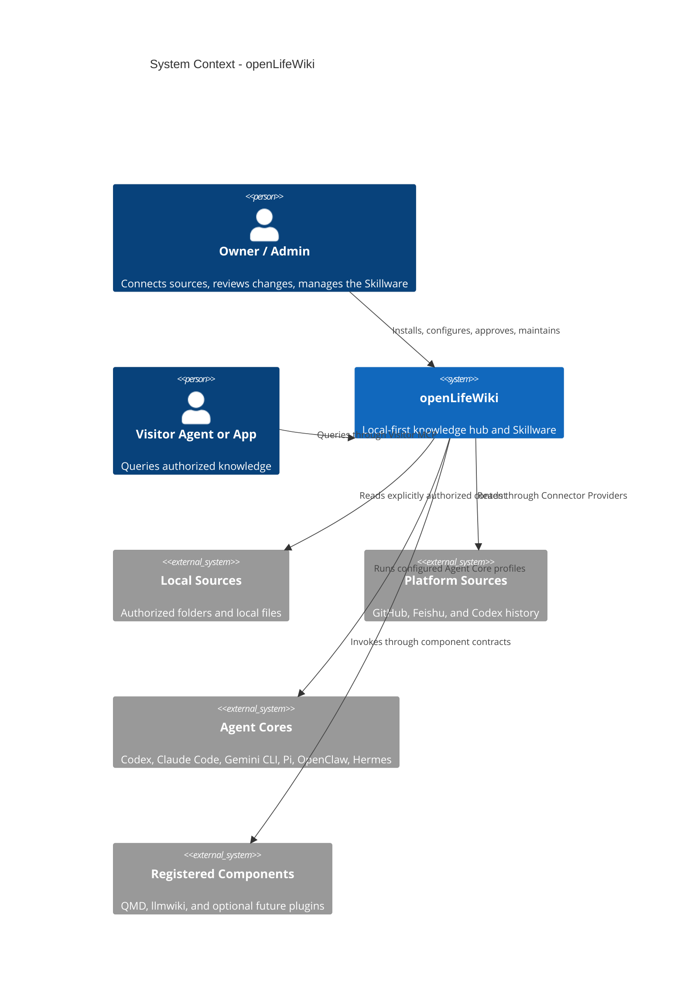
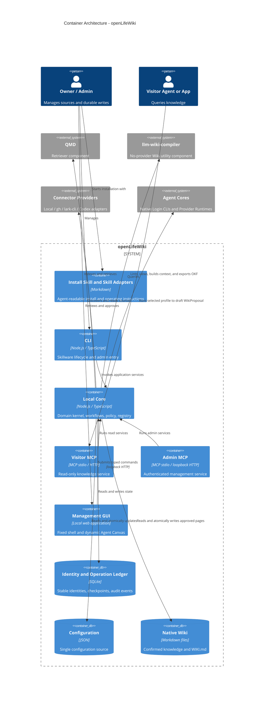

# openLifeWiki V1 Skillware Architecture Design

- Status: written specification approved by the user on 2026-07-18
- Date: 2026-07-18
- Audience: product owner, maintainers, implementation team, adapter authors
- Product: `openLifeWiki`
- CLI / MCP name: `openlifewiki`
- Default state root: `~/.openlifewiki/`

## 1. Executive Decision

openLifeWiki is a standalone, local-first personal knowledge hub. It lets people reuse historical information when writing, making decisions, and reviewing work. openLifeOS and other Agent systems consume it through MCP, Plugin, or CLI; they do not own its knowledge model or runtime.

The product has two equal architectural spines:

```text
openLifeWiki = Knowledge Core + Skillware Spine
```

- **Knowledge Core** connects authorized sources, preserves identity and provenance, retrieves evidence, compiles a native Wiki, and serves knowledge to Agents.
- **Skillware Spine** makes the capability installable, permissioned, evidence-backed, versioned, maintainable, and releasable through an Agent-readable Skill and machine-readable CLI.

The implementation is a local modular monolith with Hexagonal Architecture. Mature algorithms and platform clients are registered as replaceable components. openLifeWiki owns the domain model, identity ledger, workflow engine, trust boundaries, component contracts, and product lifecycle.

## 2. Goals and Success Criteria

### 2.1 Product goals

1. Reuse personal history across writing, decisions, and retrospectives through one common retrieval and evidence chain.
2. Keep original content in its authorized location wherever practical.
3. Preserve stable identities while files, pages, and platform objects move or change.
4. Produce a native Markdown Wiki that remains useful without openLifeWiki running.
5. Let multiple Agent hosts consume the same knowledge through a stable MCP contract.
6. Give the owner explicit control over source authorization, raw-content exposure, compilation, classification, and long-term writes.
7. Serve as the reference implementation of Skillware engineering discipline.

### 2.2 Completion standard for V1

V1 is complete only when a new user can install openLifeWiki through an Agent-readable Install Skill, connect each of the four supported Connector platforms, retrieve cited evidence through Visitor MCP, compile Candidate Wiki changes, approve them through Admin, recover from interrupted work, and maintain or uninstall the local runtime without losing the native Wiki.

## 3. Non-Negotiable Principles

1. **Registry First:** register existing CLI, MCP, or SDK capabilities before implementing equivalent algorithms.
2. **Minimum storage:** avoid persistent normalized source mirrors and duplicate file trees. The QMD index may store the current body as rebuildable derived data.
3. **No historical body archive:** retain Hash, timestamp, source version, movement, and deletion events; do not retain old source bodies.
4. **Stable identity:** `source_id` and `page_id` are independent from paths, filenames, titles, and slugs.
5. **Explicit authorization:** no default full-disk scan and no implicit platform-wide access.
6. **Human-gated durable writes:** compilation produces immutable Candidates; approval precedes formal Wiki writes and real file movement.
7. **Native Wiki:** Markdown, folders, YAML Frontmatter, `[[wikilinks]]`, stable page IDs, and a canonical `WIKI.md`.
8. **Local first:** local execution and local evidence are the default. Remote source content is read only after authorization.
9. **Replaceable components:** QMD, llmwiki, platform CLIs, Agent CLIs, and GUI surfaces remain outside the Knowledge Kernel.
10. **One configuration truth:** all openLifeWiki settings come from one host JSON file.

## 4. Skillware Conformance

The working Skillware definition is:

```text
Skillware = Skill + Engineering
Engineering = Install + Permissions + Evidence + Version + Feedback + Release
```

The openLifeWiki lifecycle is:

```text
discover
  -> install
  -> activate
  -> interact
  -> decide
  -> co-evolve
  -> maintain
  -> uninstall
```

V1 provides a local Feedback Draft contract. EvoZeus and other co-evolution systems may register later as optional `evolution` components. V1 has no EvoZeus dependency.

The Skillware surface must provide these executable commands:

```text
openlifewiki features --json
openlifewiki capabilities --json
openlifewiki doctor --json
openlifewiki status --json
openlifewiki update --dry-run --json
openlifewiki uninstall --dry-run --json
openlifewiki feedback draft --operation <id> --json
```

Reading the Install Skill performs no writes. Installation, dependency changes, authorization, network access, scanning, file movement, update, and uninstall each cross an explicit approval gate.

## 5. System Context



## 6. Container Architecture



The Local Core is started on demand. GUI sessions, shared QMD models, or MCP HTTP may keep it resident. A file lock guarantees one local writer for one configuration. `openlifewiki mcp` exposes stdio and connects to or starts the Local Core.

## 7. Truth Sources and Storage

| Concern | Authoritative source | Recovery behavior |
| --- | --- | --- |
| Product configuration | `~/.openlifewiki/config.json` | Validate, migrate, and atomically replace |
| Original content | Authorized local file or external platform | Re-read when available |
| Identity and operation history | openLifeWiki ledger | Back up; never infer all history from current paths |
| Confirmed knowledge | Native Wiki and `WIKI.md` | Restore from files or version control |
| Retrieval index | QMD SQLite | Rebuild from current sources and Wiki |
| Wiki utility caches and temporary state | llmwiki component state | Rebuild from the Formal Wiki |
| Component credentials | Component-native auth store or OS secure storage | Reference from config; never copy plaintext tokens into config |

The QMD index may contain the current normalized body in local plaintext SQLite. External exposure is controlled separately. openLifeWiki does not persist a second `sources/` mirror and does not retain historical source bodies.

## 8. Core Domain Model

### 8.1 Catalog and component model

- `ConnectorCategory`: one node in the product catalog hierarchy.
- `ConnectorDescriptor`: product metadata, category, expected modules, and availability.
- `ConnectorProvider`: runtime implementation registered through a Factory.
- `ConnectorInstance`: one user-authorized platform or folder configuration.
- `ComponentManifest`: component identity, kind, version range, capabilities, runtime transport, and health probe.

### 8.2 Knowledge model

- `SourceRecord`: stable `source_id`, Connector instance, canonical platform identity, current availability, and active location.
- `SourceSnapshot`: current Hash, source-native version, modification time, normalized type, and locator set.
- `PageRecord`: stable `page_id`, current path, title, aliases, and freshness state.
- `EvidenceRef`: `source_id + source_version + locator + content_hash`.
- `Candidate`: immutable proposed Wiki change with evidence, Diff, reason, and Candidate Hash.
- `Operation`: persistent command and workflow state with idempotency key, checkpoints, approvals, and typed result.

### 8.3 Invariants

1. A path change does not create a new source or page identity.
2. A matching content Hash alone never merges two sources automatically; duplicate files may be intentional.
3. Every compiled claim must resolve to at least one `EvidenceRef`.
4. Every durable write must reference an approved Candidate or typed Admin operation.
5. Candidate approval applies only to the exact Candidate Hash reviewed by the user.
6. Connector cursors advance only after ledger and retrieval-index updates succeed.
7. QMD and llmwiki state can be removed without losing configuration, source history, or confirmed Wiki knowledge.

UUIDv7 is the default ID format for `source_id`, `page_id`, Candidate IDs, and Operation IDs. Platform-native stable IDs remain recorded as canonical external identities.

## 9. Connector Catalog and V1 Providers

### 9.1 Catalog hierarchy

The catalog keeps six product categories from day one:

| Category | V1 Provider | Visible placeholders |
| --- | --- | --- |
| Local and Device | Local Folder | NAS, Obsidian, Local Git |
| Collaboration and Knowledge | Feishu | Notion, Confluence, Google Workspace, Microsoft 365 |
| Development Platforms | GitHub | GitLab, Bitbucket |
| AI and Agent Platforms | Codex History | ChatGPT, Claude, Cursor |
| Internet Sources | none | Web, RSS, Readwise |
| Custom Connections | none | Database, WebDAV, S3, Custom API |

User-defined knowledge grouping is outside the Connector Catalog. The catalog describes integration platforms; Wiki folders, Frontmatter, and Wikilinks express knowledge organization.

### 9.2 Descriptor and Provider separation

The Catalog uses Composite and Catalog patterns. Runtime creation uses Registry, Abstract Factory, and Adapter patterns.

```text
ConnectorDescriptor may exist without a Provider.
ConnectorInstance requires a registered Provider Factory.
```

Product availability states are:

```text
built_in | plugin_available | planned | deprecated
```

Runtime states are independent:

```text
ready | missing_dependency | incompatible | auth_required | offline | error
```

An unavailable placeholder returns `CONNECTOR_NOT_AVAILABLE` and cannot create configuration or request authorization. A later plugin may register a Provider under the same Descriptor ID without changing the Kernel or GUI taxonomy.

### 9.3 V1 read scope

- **Local Folder:** explicitly selected folders; Markdown, text, PDF, and common Office documents through registered extractors.
- **GitHub:** repository files, Issues, Pull Requests, Discussions, and Wiki through `gh` and normalized adapters.
- **Feishu:** one Feishu Connector with selectable modules for Docs, Wiki, Drive, Messages, Minutes, and Base through the official `lark-cli` / Node SDK.
- **Codex History:** projects, tasks, conversations, and output references through host-mediated APIs when available and a versioned local-session adapter as fallback.

All V1 platform Connectors are read-only. Local real-file movement is the only source-side mutation, and it requires Admin approval.

## 10. Component Registry

Component kinds are:

```text
connector | retriever | wiki-utility | agent | surface | evolution
```

A Manifest declares the capabilities and runtime for one component:

```json
{
  "id": "qmd",
  "kind": "retriever",
  "versionRange": ">=2.5.3 <3",
  "capabilities": [
    "knowledge.search",
    "document.read",
    "index.update",
    "health.check"
  ],
  "runtime": {
    "type": "mcp",
    "command": "qmd",
    "args": ["mcp"]
  }
}
```

The Registry discovers explicitly installed components, probes versions and capabilities, starts or stops processes, applies timeouts, normalizes structured results, and isolates failures. It never silently substitutes an unconfigured component.

V1 registers:

- QMD as the only retriever.
- llm-wiki-compiler as a contract-gated no-provider Wiki utility.
- Codex CLI, Claude Code, Gemini CLI, Pi, OpenClaw, and Hermes as Agent Core strategies when present and compatible.
- the fixed GUI shell and Visual Companion-style dynamic Canvas as surfaces.
- a local Feedback Draft provider under the `evolution` extension contract.

## 11. Configuration

The default configuration path is:

```text
~/.openlifewiki/config.json
```

`--config <path>` selects a complete alternative configuration for tests and portable deployments. No layered configuration or hidden QMD YAML becomes authoritative.

Representative structure:

```json
{
  "schemaVersion": 1,
  "wiki": {
    "root": "~/openLifeWiki"
  },
  "components": {
    "retriever": "qmd",
    "wikiUtility": "llmwiki"
  },
  "agentCore": {
    "defaultProfileId": null,
    "profiles": []
  },
  "connectorInstances": [],
  "exposure": {
    "defaultMode": "evidence",
    "allowRawContent": false
  },
  "mcp": {
    "visitor": {
      "exposure": "evidence"
    },
    "admin": {
      "remoteEnabled": false
    }
  }
}
```

GUI, CLI, Plugin, and MCP use the same config service. Updates use schema validation, a lock, a temporary file, fsync, and atomic replacement. Migrations are versioned, reversible when data permits, and tested against every released schema.

## 12. Retrieval, Compilation, and Wiki Manual

### 12.1 QMD

QMD is the sole retrieval index. openLifeWiki reuses keyword search, vector search, RRF, local reranking, line-aware reads, and MCP/SDK behavior. QMD's own standalone configuration is bypassed through inline or generated runtime configuration derived from the openLifeWiki JSON.

Remote Connector content is inserted as virtual documents into the QMD content-addressed store. The integration must expose a supported `upsert/remove` boundary; a pinned compatibility adapter is allowed until an upstream public API exists.

### 12.2 llm-wiki-compiler

After a public-surface contract passes, openLifeWiki reuses only no-provider status, lint, Viewer, context,
and OKF export through the upstream CLI or SDK. Provider-backed compile/search/query, the Candidate gate,
and the typed writer are not production surfaces. openLifeWiki does not patch or replace them.

The selected Agent Core uses QMD evidence and the canonical Skill to draft `WikiProposal`; openLifeWiki
owns deterministic evidence/freshness validation, human approval, and atomic CAS writes.

### 12.3 Native Wiki

The Wiki uses:

- folders for primary page ownership;
- Frontmatter and Wikilinks for multiple relationships;
- stable `page_id` in Frontmatter;
- aliases for renamed concepts;
- citations that resolve through `EvidenceRef`;
- Candidate review before generated writes.

All source types support virtual classification. A local source may be moved into a real folder only through an approved typed operation. V1 does not auto-move source files.

### 12.4 `WIKI.md`

`<wiki-root>/WIKI.md` is the only manual body. It records the Wiki map, major entry pages, vocabulary and aliases, retrieval routes, source reliability, citation rules, known gaps, and stale areas.

MCP exposes it as `openlifewiki://manual`. Agent-specific Skills only load the manual and route to MCP; they do not copy its body. Agent-proposed manual changes become Candidates and require review.

## 13. Agent Core

Two strategies share the same evidence and component contracts:

- `native-cli`: openLifeWiki launches an already logged-in Codex, Claude Code, or Gemini CLI and neither
  copies nor configures its account credentials.
- `provider-runtime`: openLifeWiki launches Pi, OpenClaw, or Hermes from a Host profile containing Base URL,
  Model, and a secure credential reference. The secret is resolved at runtime and is never stored in the
  Wiki, Source, QMD, Proposal, logs, or command arguments.

Adapters standardize invocation, task-scoped MCP/Skill injection, structured output, timeout, cancellation,
version probes, and log redaction. They retain the upstream Agent loop and do not become a third runtime.

The system provides one default profile and allows a task to select another configured profile. A missing or incompatible Agent profile produces a typed error and no silent substitution.

## 14. Permission and Exposure Model

### 14.1 Roles

V1 has two roles:

- **Visitor:** query-only access for daily Agent and application use.
- **Admin:** source, component, sync, compile, review, Agent Core, maintenance, and configuration management.

The same person may use Visitor in daily workflows and enter Admin only for maintenance.

Visitor MCP registers only:

```text
search_knowledge
read_knowledge
build_context
```

Visitor resources are:

```text
openlifewiki://manual
openlifewiki://page/{page_id}
openlifewiki://evidence/{evidence_id}
```

Admin MCP adds status, source sync, compile, Candidate list/read/decide, and managed Agent operations. Connector authorization and component installation use Admin CLI or GUI typed flows.

`openlifewiki mcp` starts Visitor by default. `openlifewiki mcp --admin` requires a distinct Admin identity. Visitor clients never discover Admin tools.

### 14.2 Exposure

Exposure and roles are independent dimensions:

```text
metadata | evidence | raw
```

The effective exposure is the most restrictive intersection of global config, Connector policy, caller policy, and request. `evidence` is the default. `raw` requires explicit Admin configuration. A denied `raw` request degrades to the allowed mode and reports the effective mode.

Admin defaults to local stdio or loopback. Remote Admin is disabled. Any remote MCP requires explicit enablement, authenticated caller profiles, and encrypted transport.

### 14.3 Durable-write gate

Admin authority permits management but does not bypass review. Candidate approval validates the immutable Candidate Hash. GUI, CLI, or an approved host Plugin issues the one-time approval used to commit the reviewed Candidate. Canvas events cannot write files directly.

## 15. Management GUI and Dynamic Canvas

The GUI follows a fixed shell plus Agent-generated Canvas model.

The fixed shell owns Sources, Wiki, Review, Components, and Health. It reads the same config and Local Core APIs as the CLI. The dynamic Canvas renders scan results, Diffs, conflicts, classification proposals, and approvals. Canvas actions emit typed commands to the operation broker.

Activation behavior:

- a human CLI/Plugin command opens the GUI directly;
- an Agent may decide a visual view would help and must tell the user when activating it;
- the GUI is optional for headless CLI and MCP use.

The Canvas cannot access the filesystem, component processes, or credentials directly.

## 16. Workflows

### 16.1 Source synchronization

```text
authorize instance
  -> discover items
  -> read metadata and current body
  -> normalize
  -> stage SourceSnapshot
  -> update Identity Ledger and QMD
  -> commit Connector cursor
```

Each item has an idempotency key. A body failure does not block unrelated items. The cursor advances only after the committed checkpoint. Offline sources enter `waiting_source`; rate limits enter `retry_scheduled` using the platform retry time.

### 16.2 Query

```text
authenticate Visitor or Admin
  -> load WIKI.md guidance
  -> query QMD
  -> resolve current evidence
  -> apply exposure policy
  -> return context and citations
```

### 16.3 Compilation and review

```text
select changed or stale sources
  -> selected Agent Core reads current evidence through task-scoped MCP
  -> Agent Core drafts a structured WikiProposal
  -> validate page_id, citations, schema, links
  -> create immutable Candidate
  -> Admin reviews Diff and Hash
  -> atomically commit approved Wiki files
  -> refresh QMD and freshness state
```

### 16.4 Real local classification

```text
Agent proposes move
  -> operation records expected path and Hash
  -> Admin reviews
  -> recheck preconditions
  -> atomic local move
  -> append movement event
  -> update location and index
```

## 17. Failure and Recovery

Persistent Operation states are:

```text
queued
  -> running
  -> waiting_source | waiting_approval | retry_scheduled
  -> succeeded | failed | cancelled
```

Rules:

1. Configuration writes are validated and atomic.
2. Operations resume from the last committed checkpoint after restart.
3. QMD failure leaves the previous usable index active when possible.
4. Compiler failure leaves the formal Wiki unchanged.
5. Candidate updates create a new Candidate ID and Hash.
6. Wiki writes use temporary files, validation, and atomic replacement.
7. Connector authentication loss marks the instance `auth_required`; existing Wiki pages remain and show freshness.
8. Component incompatibility disables only that component and surfaces a `doctor` action.
9. No unconfigured component fallback is allowed.

Stable errors contain `code`, user-readable `message`, `retryable`, `nextAction`, and `operationId`. Agents branch on the code rather than parsing message text.

Representative codes include:

```text
CONFIG_INVALID
COMPONENT_MISSING
COMPONENT_INCOMPATIBLE
AUTH_REQUIRED
PERMISSION_DENIED
CONNECTOR_NOT_AVAILABLE
SOURCE_OFFLINE
RATE_LIMITED
INDEX_UNAVAILABLE
COMPILE_FAILED
APPROVAL_REQUIRED
APPROVAL_STALE
OPERATION_CONFLICT
```

## 18. Design Patterns and Boundaries

| Boundary | Pattern | Purpose |
| --- | --- | --- |
| Kernel and external components | Hexagonal / Ports and Adapters | Keep algorithms and platforms replaceable |
| Component creation | Registry + Abstract Factory | Bind Manifest to runtime implementation |
| Retriever, compiler, Agent selection | Strategy | Select configured implementation |
| Connector hierarchy | Composite + Catalog | Preserve taxonomy and placeholders |
| Unsupported Connector | Descriptor + Optional Provider | Show catalog entry without fake runtime behavior |
| Sync and compile | Persisted State Machine + Process Manager | Resume multi-step work |
| Cross-component write | Saga | Commit in stages and compensate failures |
| Admin action | Command | Validate, audit, and retry typed operations |
| Candidate commit | Approval Gate + Optimistic Concurrency | Prevent stale approval |
| Visitor and Admin | Simple RBAC + logical CQRS | Separate query and command surfaces |
| Install, update, repair | Reconciler | Converge actual host state to desired config |
| Identity history | Repository + append-only audit log | Query current state while preserving history |
| Component failure | Bulkhead + Circuit Breaker + Retry | Isolate failures and bound retries |
| GUI and Canvas | Application Shell + Command Broker | Keep dynamic UI away from direct writes |
| Config evolution | Versioned Schema + Migration | Support upgrade and rollback |

The design does not introduce distributed microservices, a full Event Sourcing runtime, a generic workflow language, or more than two V1 roles.

## 19. Security and Privacy

1. Default MCP transport is local stdio or loopback.
2. Visitor discovers no Admin tools.
3. `raw` external exposure is disabled by default.
4. Source authorization is instance- and module-scoped.
5. Connector-origin content is treated as untrusted data and fenced from Agent instructions.
6. Logs omit source bodies and secrets by default.
7. Config stores credential references, not token values.
8. Candidate approval is Hash-pinned.
9. File writes and moves are path-confined and precondition-checked.
10. Public Feedback Drafts require separate redaction and approval; V1 drafts remain local.

## 20. V1 Scope

### 20.1 Included

- macOS and Linux.
- Native Markdown Wiki and `WIKI.md`.
- Local Folder, GitHub, Feishu, and Codex History Providers.
- Full six-category Connector Catalog with unavailable placeholders.
- QMD retriever and contract-verified llmwiki no-provider Wiki utilities.
- Native CLI and Provider Runtime Agent Core strategies.
- Codex, Claude Code, Gemini CLI, Pi, OpenClaw, and Hermes adapters when contract-verified.
- Visitor and Admin MCP.
- Fixed management shell and dynamic Canvas.
- stable identity, movement history, deletion events, stale detection, Candidate review, and crash recovery.
- Skillware install, capability, doctor, status, update-plan, uninstall-plan, Feedback Draft, version, and release surfaces.

### 20.2 Excluded from V1

- Working Providers for catalog placeholders.
- Write-back to GitHub, Feishu, or Codex.
- Automatic real-file classification or movement.
- Automatic Candidate approval.
- More than two roles or team-level RBAC.
- Cloud storage of source bodies.
- A shipped multi-device metadata synchronization transport. The state model remains device-aware and accepts later encrypted metadata-sync components.
- EvoZeus integration or automatic public feedback submission.
- Windows support.
- Connector marketplace and arbitrary third-party executable installation from the GUI.

## 21. Engineering Validation Gates

Before broad feature implementation, four bounded technical spikes must pass:

1. **QMD virtual documents:** prove incremental upsert, remove, search, and rebuild without a persistent source mirror. Pin the QMD version and contract-test any internal compatibility adapter.
2. **llmwiki safe surface:** prove no-provider status, lint, Viewer, context, OKF export, and declared-field
   preservation through public interfaces. A failed contract disables that utility; it does not authorize a patch.
3. **Codex current history:** prove one supported live host path and one versioned local/export fallback. Unsupported host versions fail closed.
4. **Stable page identity:** prove `page_id` survives rename and move across compiler output, Wikilinks, review, QMD, and export.

A failed spike stops dependent implementation and triggers an ADR revision. It does not get hidden behind a filesystem copy or silent compatibility fallback.

## 22. Testing and Acceptance

### 22.1 Test layers

- pure Kernel unit and invariant tests;
- one shared Component Adapter contract suite;
- redacted Golden Fixtures for all four Connector Providers;
- property tests for stable IDs, move history, deletion, and idempotency;
- fault-injection tests at sync, index, compile, approval, and atomic-write checkpoints;
- Visitor authorization, Admin approval, raw exposure, and prompt-injection tests;
- end-to-end Skillware install, update, maintenance, and uninstall flows;
- automated compatibility matrix for supported external component versions;
- Playwright coverage for fixed GUI and dynamic Canvas events.

### 22.2 Required end-to-end scenarios

1. Fresh Install Skill registration and dependency reconciliation.
2. Local folder scan, query, compile, review, and Wiki commit.
3. Local move preserving `source_id` and recording history.
4. Changed source marking dependent pages stale.
5. Deleted source recording a tombstone without retaining the old body.
6. Real authorization and incremental sync for GitHub, Feishu, and Codex.
7. Visitor tool discovery containing query tools only.
8. Admin management with Candidate Hash enforcement.
9. Evidence exposure by default and raw exposure only after configuration.
10. Process termination and recovery at every durable workflow stage.
11. Full QMD rebuild without losing source history or formal Wiki files.
12. Agent Core profile switching without changing evidence and Candidate contracts.
13. Placeholder Connector visibility with instantiation denied.
14. Missing or incompatible component isolated from unrelated workflows.
15. Update and uninstall dry runs that preserve the Wiki by default.

### 22.3 Initial performance targets

On Apple Silicon or an equivalent developer-class machine:

- at least 10,000 source items;
- at least 2 GB normalized current text;
- unchanged local scan of 10,000 files in under 60 seconds;
- warm BM25 query p95 under 1 second;
- warm hybrid query p95 under 8 seconds;
- paginated or virtualized GUI lists that never load every body;
- one failed source item does not block unrelated source synchronization.

Agent proposal latency depends on the configured model. It requires progress, cancellation, and recovery rather than a fixed duration SLA.

## 23. Reuse Baseline

V1 should reuse or adapt:

- [tobi/qmd](https://github.com/tobi/qmd) for retrieval;
- [atomicstrata/llm-wiki-compiler](https://github.com/atomicstrata/llm-wiki-compiler) for contract-verified no-provider status, lint, Viewer, context, and OKF export;
- official `lark-cli` / Lark Node SDK for Feishu authentication and APIs;
- `gh` for GitHub authentication and APIs;
- Agent CLI headless or structured modes;
- [obra/superpowers](https://github.com/obra/superpowers) Visual Companion patterns for dynamic Canvas;
- the official MCP TypeScript SDK for protocol transport.

All reused code and dependencies must retain their license notices. Composition is preferred. A fork or copied implementation requires an ADR explaining the missing extension point, version pin, upstream plan, and exit path.

## 24. Initial Repository Blueprint

Recommended implementation baseline:

- TypeScript on Node.js 24, matching the strictest reused runtime requirement;
- pnpm workspace;
- SQLite for the openLifeWiki ledger;
- Zod or JSON Schema/Ajv for contracts and configuration;
- Vitest for unit and contract tests;
- Playwright for GUI verification.

```text
openLifeWiki/
  apps/
    cli/                 openlifewiki command and Skillware lifecycle
    service/             Local Core process and loopback API
    gui/                 fixed management shell and Canvas host
  packages/
    core/                domain model, ledger ports, workflow, trust, config
    adapters/            Connector, QMD, llmwiki, Agent CLI, surface adapters
    mcp/                 Visitor and Admin MCP façades
    testkit/             adapter contract suites, fixtures, fault injection
  skills/
    openlifewiki/        root operating Skill
    openlifewiki-install/ Install Skill
  docs/
    adr/
    specs/
  tests/
    e2e/
```

Package boundaries may merge during the implementation plan if a package has no independent contract or test value. The Kernel must remain independent from concrete component packages.

## 25. Release and Governance

1. Use Semantic Versioning for the product and explicit schema versions for config and component contracts.
2. Every release includes Changelog, supported component matrix, migration notes, rollback path, and known limitations.
3. `doctor` reports desired versus actual host state and produces an actionable reconciliation plan.
4. `update --dry-run` resolves component and schema changes before any write.
5. `uninstall --dry-run` shows which runtime files, component state, credentials, and Wiki files will be retained or removed.
6. The default uninstall preserves the Wiki and removes rebuildable indexes only after approval.
7. Feedback Draft remains a local, reviewable artifact. Later evolution components consume the same contract without changing the Knowledge Kernel.

## 26. Final Architectural Test

The boundaries are correct when all of the following remain true:

- replacing QMD requires only a retriever adapter;
- replacing llmwiki requires only a Wiki utility adapter;
- adding Notion activates an existing Catalog Descriptor through a new Provider;
- changing Agent Core requires a profile or adapter, not a Knowledge Kernel change;
- moving or renaming sources and Wiki pages preserves identity and evidence;
- Visitor access can never discover or execute Admin commands;
- component caches can be deleted and rebuilt without losing configuration, history, or confirmed knowledge;
- the product can be installed, understood, maintained, upgraded, and uninstalled through its Skillware surface.
