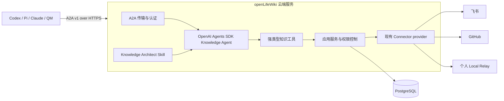

# openLifeWiki 云端 Knowledge Agent V2 设计

- 状态：已批准实施 V2
- 日期：2026-08-15
- 读者：产品负责人、架构负责人、实施团队和验收人员
- 范围：单组织、多人使用的云端知识中心
- 需求：[`requirements-v2.md`](../../requirements/requirements-v2.md)
- 架构：[`ARCHITECTURE.md`](../../../ARCHITECTURE.md)
- 兼容边界：本地兼容链路继续遵循当前 V1 权威文档
- 决策负责人：openLifeWiki Owner

## 一、核心决策

openLifeWiki V2 是部署在云端的单一 Knowledge Agent，也是知识查询、注册、存储和整理的唯一产品入口。外部 Agent 通过 A2A v1 与它通信。服务使用 OpenAI Agents SDK 执行 Agent loop，复用现有 openLifeWiki 领域合同和 Connector 合同控制知识访问，并以 PostgreSQL 作为唯一持久化数据库。

P0 运行时只包含三个组件：

1. 一个 Node.js `openLifeWiki` 云端服务；
2. 一个 PostgreSQL 实例；
3. 当用户注册仅存在于个人电脑的知识时，可选运行一个 `openlifewiki relay` 进程。

P0 不增加 MCP、Codex SDK、Pi、Redis、独立 Worker、对象存储、向量数据库、云端 QMD 或独立管理后台。引入这些组件前，必须达到本文定义的量化触发条件。

## 二、问题与目标结果

### 2.1 当前问题

当前产品以本地为先，围绕单一 Owner、本地文件配置与扫描状态、本地认证的 Codex CLI、QMD stdio MCP 和已批准的 Formal Wiki 组织。这个形态无法为多人和多个 Agent 提供统一的云端知识注册中心。

### 2.2 产品目标

一个组织只需注册一次知识，已授权的用户和 Agent 就能通过同一个 Knowledge Agent 查找、获取、存储和整理知识。注册的知识可以继续保留在飞书、GitHub 或个人电脑中，也可以成为由 openLifeWiki 保存的托管 Markdown。

中央 Registry 必须回答：

- 这项知识是什么；
- 已知副本或原始来源分别在哪里；
- 谁拥有它，谁可以使用它；
- 它如何产生，当前版本是哪一个；
- 最近一次核验是什么时间；
- 仅存在于个人电脑的位置当前是否可访问。

### 2.3 用户与角色

| 角色 | 职责 |
| --- | --- |
| 组织 Owner | 初始化部署、管理成员并批准高影响变更 |
| 成员 | 在授权范围内注册、查询和管理知识 |
| 外部 Agent | 通过有边界的委托和 A2A 代表成员执行操作 |
| Knowledge Agent | 提供唯一的查询、注册、存储和整理入口 |
| Local Relay | 声明设备在线，并获取明确授权的本地知识 |

## 三、设计原则

1. 单一公共 Agent 入口：A2A 只进入 Knowledge Agent，任何调用方都不能直接访问 Connector、数据库或索引。
2. Registry 优先：知识身份与知识位置分开记录。
3. 位置独立：同一个逻辑知识可以有多个位置。
4. 最小权限：每次操作都取用户、Agent 和委托权限的交集。
5. 持久语义变更前先形成草案：组织结构调整和覆盖操作生成不可变提案，并要求绑定 hash 的精确审批。
6. 来源和时效属于产品核心数据，不能降级为可选搜索元数据。
7. 保留已验证的 V1 控制：精确 Source 授权、规范 hash、receipt、compare-and-swap 和 fail-closed 行为继续有效。
8. 只有达到量化上限后才增加基础设施。

## 四、范围

### 4.1 P0 范围

- 每个部署对应一个组织；
- 多位用户和多个受托外部 Agent；
- 基于 HTTPS 的 A2A v1，并提供流式任务更新；
- OpenAI Agents SDK 作为唯一 Agent runtime；
- PostgreSQL 保存 Registry、Markdown、权限、会话、任务和审计；
- 支持托管 Markdown、飞书、GitHub 和个人本地位置；
- 支持查询、注册、存储和整理四项能力；
- Knowledge Architect Skill 提供 bootstrap 和 refactor 两种模式；
- 应用服务之后复用当前 openLifeWiki Connector 合同；
- CLI 提供初始化、token 管理和 Local Relay 操作；
- 当前 V1 本地链路作为兼容路径继续保留。

### 4.2 P0 不做的事项

- 多组织 SaaS；
- 公共 MCP 访问；
- 首个版本支持多个 Agent runtime；
- 无人审批的自动删除或发布；
- 二进制资产管理；
- 实时协同编辑；
- 把语义向量检索设为完成前提；
- 将 QMD 迁移到云端；
- 新建 Web 管理产品；
- 服务横向扩展；
- 自动复制现有外部或本地 Source 正文。

## 五、目标架构



### 5.1 运行时边界

Node.js 进程负责 HTTP、A2A 处理、认证、Agents SDK run loop、工具分发、Connector 编排和进程内持久任务执行器。任务开始前必须先把状态写入 PostgreSQL。尽管 P0 只部署一个进程，仍使用 PostgreSQL advisory lock 防止两个进程实例领取同一任务。

TLS 终止由托管平台提供，属于部署基础设施，不计作 openLifeWiki 应用组件。

## 六、公共 A2A 接口

P0 固定使用 `@a2a-js/sdk` `1.0.1`，通过 HTTPS 提供 JSON-RPC 和 SSE 流式传输。Agent Card 声明四项能力：

| A2A skill | 产品行为 |
| --- | --- |
| `knowledge.query` | 返回有证据支撑的答案、引用和明确缺口 |
| `knowledge.register` | 注册一个逻辑知识及其一个或多个位置 |
| `knowledge.store` | 创建托管 Markdown 草案或新的已批准版本 |
| `knowledge.organize` | 提出知识架构变更，或执行已批准变更 |

A2A 接受自然语言消息。确定性客户端也可以携带 `openlifewiki.operation/v1` 结构化 data part。两种入口最终调用同一组强类型应用操作。

A2A task state 与产品状态映射如下：

| 产品状态 | A2A state |
| --- | --- |
| 已接受但尚未执行 | `submitted` |
| Agent 或工具正在执行 | `working` |
| 等待精确审批或本地 Owner 响应 | `input-required` |
| 最终 Artifact 已持久化 | `completed` |
| 已确认的终止性失败 | `failed` |
| 调用方取消已处理完毕 | `canceled` |

最终 Artifact 携带带版本的 openLifeWiki 结果对象。可以同时提供自然语言摘要，但机器合同以结构化对象为准。

## 七、Agent Harness

P0 固定使用 `@openai/agents` `0.16.0`。SDK 负责 Agent loop、重复工具调用、流式输出、可恢复状态、审批暂停和 tracing。openLifeWiki 负责全部领域工具、权限判断和持久业务状态。

部署模型 ID 必须通过 `OPENLIFEWIKI_MODEL` 提供；缺失时启动失败。模型选择属于部署配置，与公共 A2A 合同和知识合同相互独立。

Knowledge Agent 只接收以下工具：

| 工具 | 权限边界 |
| --- | --- |
| `knowledge_search` | 在权限过滤后搜索 Registry 和托管正文 |
| `knowledge_get` | 带引用获取一个已授权位置或版本 |
| `knowledge_register` | 在 actor 授权范围内注册元数据和位置 |
| `knowledge_store_draft` | 持久化有大小限制的托管 Markdown 草案 |
| `knowledge_list_locations` | 查看已授权位置和可用状态 |
| `knowledge_request_local` | 为在线或离线 Local Relay 创建请求 |
| `knowledge_propose_architecture` | 创建不可变的组织结构提案 |
| `knowledge_apply_approved_plan` | 通过 CAS 执行精确获批提案 |

任何 Agent 工具都不得接收 SQL、任意进程命令、无限制路径或原始 Connector 请求。工具实现必须携带 `AccessContext`，不能向 Agent 暴露无 scope 的 repository 方法。

P0 不安装 Codex SDK。未来的 Codex 专项 Agent 必须先满足第十七节的扩展触发条件，而且只能操作临时 staging workspace。

## 八、Knowledge Architect Skill

规范 Skill 路径为：

```text
skills/openlifewiki-knowledge-architect/SKILL.md
```

它提供两种明确模式：

### 8.1 Bootstrap 模式

基于已授权知识集合，提出初始文件夹或 taxonomy 模型、标签、别名、索引、来源规则和时效要求。结果只形成提案，生成期间不执行任何持久组织结构变更。

### 8.2 Refactor 模式

基于已有架构和已授权证据，提出移动、合并、拆分、标签规范化、过期知识处理和索引调整。每个动作都必须声明来源 item/version 和预期当前 revision。

两种模式都输出 `openlifewiki.knowledge-architecture-proposal/v1`。应用提案前必须取得绑定 `proposalHash` 和 `baseRegistryRevision` 的 approval receipt。

## 九、身份、委托与权限

P0 每个部署只创建一条 organization 记录，但所有所属记录都保存 `org_id`，使未来多组织版本无需替换合同。

### 9.1 Principal

Principal 类型包括 `user`、`agent` 和 `relay`。组织角色包括 `owner` 和 `member`；Agent 与 Relay 通过 grant 和 delegation 获得能力。

每次已认证 A2A 操作都解析以下上下文：

```json
{
  "orgId": "org_default",
  "actorAgentId": "principal_agent_123",
  "onBehalfOfUserId": "principal_user_456",
  "delegationId": "delegation_789",
  "taskId": "task_abc"
}
```

实际权限取以下三者交集：

1. 人类用户的资源 grant；
2. Agent principal 的操作 grant；
3. 有效 delegation 的操作、资源和有效期边界。

上下文缺失或过期时拒绝操作。工具不能扩大该上下文。

### 9.2 认证

CLI 初始化第一位 Owner。P0 向用户、Agent 和 Relay 签发随机 256 bit bearer token。token 只显示一次；PostgreSQL 只保存使用部署密钥计算的 HMAC-SHA-256 摘要。A2A Agent Card 声明 HTTP Bearer 认证。

Agent token 必须具有指向某个人类用户的 delegation。Relay token 绑定一位用户和一个已注册设备。token 轮换或撤销必须在下一次操作前生效。

### 9.3 默认可见范围

新知识默认仅 Owner 可见。组织级读取需要明确 grant。外部位置授权不会自动产生组织可见权限。

## 十、PostgreSQL 数据模型

P0 采用 PostgreSQL 17，通过 `pg` 和有序 SQL migration 管理数据库，不引入 ORM。部署启用 `pg_trgm`；它是 PostgreSQL extension，不是额外服务。

| 表 | 用途 |
| --- | --- |
| `organizations` | 当前部署对应的单一组织 |
| `principals` | 用户、外部 Agent 和 Local Relay |
| `principal_tokens` | 可撤销的 bearer-token 摘要和有效期 |
| `delegations` | Agent 到用户的权限、scope 和有效期 |
| `connector_instances` | 已配置的飞书、GitHub 和 Local Relay 实例 |
| `source_authorizations` | 精确获批的 Connector scope 和 approval receipt |
| `knowledge_items` | 稳定逻辑知识身份、Owner、标题和状态 |
| `knowledge_locations` | 一个知识对应的一个或多个托管或外部位置 |
| `knowledge_versions` | 版本、正文 hash、来源、时效和可选 Markdown 正文 |
| `tags` | 组织受控标签定义 |
| `knowledge_tags` | 可感知版本的知识与标签关系 |
| `resource_grants` | principal 对 item、Source 和 tag scope 的权限 |
| `presence_leases` | Local Relay 心跳、能力和有效期 |
| `agent_sessions` | Agents SDK 续接和 replay 状态 |
| `agent_tasks` | A2A/产品任务状态、revision、输入和输出引用 |
| `audit_events` | 追加式 actor、action、target、decision 和 receipt 元数据 |

### 10.1 知识与位置

`knowledge_items` 标识概念上稳定的知识，`knowledge_locations` 记录它存在的位置。同一知识可以有多个位置，位置角色包括 `canonical`、`original`、`managed-copy` 或 `reference`。

位置类型包括：

- `managed-markdown`；
- `feishu`；
- `github`；
- `person-local`。

位置保存安全 locator、Connector 引用、Owner principal、访问模式、已观察的平台版本和可用状态。个人本地位置还要记录必需的 Relay principal。

### 10.2 托管 Markdown

托管 Markdown 存储在 `knowledge_versions.body_markdown`。P0 单版本最多接受 1 MiB UTF-8 Markdown。更大的内容继续留在外部，通过位置完成注册。每个版本都保存 SHA-256 正文 hash 和不可变来源信息。

### 10.3 搜索

搜索必须先在 SQL 中执行权限过滤，再返回候选结果。搜索组合：

- item ID、locator、标签和别名精确匹配；
- PostgreSQL 全文搜索处理分词文本；
- `pg_trgm` 处理标题和多语言 Markdown 的相似度；
- 时效和可用状态过滤。

搜索结果仍然只是候选证据。Agent 必须返回与精确 item、location 和 version ID 对应的引用。查询结果合同以现有 `openlifewiki.agent-query-result/v1` 语义为起点。

### 10.4 并发

可变记录携带单调递增 `revision`。写入使用 `UPDATE ... WHERE revision = $expected`；没有记录发生变化时返回 `REVISION_CONFLICT`。任务领取使用 PostgreSQL advisory lock。审计记录和已批准提案 Artifact 只允许追加。

## 十一、Connector 边界

现有 `ProgressiveConnectorProvider` 合同继续作为长期 Connector 边界。云端 P0 首先复用 provider 探测和已批准正文读取；核心云端查询与注册链路通过验收后，再迁移 progressive scan。

Connector 继续遵循以下规则：

- 只有已批准的 Source scope 才能被探测或读取；
- provider 凭据只能是部署密钥引用，不能保存为 Registry 值；
- 外部正文按需读取，注册时不复制；
- 每份返回正文都必须绑定 Source、node、provider version 和授权记录；
- 本地知识必须同时具备有效 Relay 和 Owner 精确批准的 scope。

## 十二、Local Relay

现有 CLI 增加：

```text
openlifewiki relay register
openlifewiki relay run
openlifewiki relay status
openlifewiki relay revoke
```

Relay 主动向云端发起 HTTPS，因此家庭网络无需开放入站端口。它持续续期有时限的 `presence_leases` 记录，并轮询发给自身 principal 的请求。每个请求都携带精确获批的 Source、node/version 目标和任务绑定能力。

Relay 离线时，任务进入 `input-required`，原因为 `LOCAL_SOURCE_OFFLINE`，并持久保留到自身过期。Relay 恢复后领取请求，执行现有 body-read gate，并返回绑定 hash 的 Artifact。云端服务随后恢复同一个 Agents SDK run。

## 十三、核心工作流

### 13.1 查询

```text
A2A message
-> authenticate and resolve delegation
-> persist task
-> Agents SDK run
-> knowledge_search
-> permission-filtered candidates
-> knowledge_get for selected evidence
-> Connector or managed body read
-> validated cited answer artifact
-> completed task
```

没有证据时返回明确的无证据结果。缺少权限时只报告缺口，不泄露隐藏 item 元数据。本地证据离线时，任务持久化为 `input-required`；如果调用方允许部分结果，也可以返回部分证据答案。

### 13.2 注册

注册操作创建或关联一个逻辑知识和位置。除非请求另行授权 ingest，否则注册过程不读取正文。重复 locator 解析为现有位置。疑似重复的 item 作为冲突候选返回，合并身份前必须由用户选择。

### 13.3 存储

Store 创建托管 Markdown 草案。获授权写入者可以提交新 item。替换现有稳定版本需要精确预览和 CAS。语义层面的组织结构变更交给 Organize 处理。

### 13.4 整理

Knowledge Architect Skill 只读取已授权 item，创建不可变提案，然后暂停任务等待审批。审批绑定 proposal hash 和基础 Registry revision。Apply 执行确定性校验，并在一个数据库事务内完成应用。

## 十四、错误与恢复模型

稳定错误码包括：

| 错误码 | 含义 |
| --- | --- |
| `AUTHENTICATION_REQUIRED` | token 缺失、无效、过期或已撤销 |
| `DELEGATION_DENIED` | 用户、Agent 与 delegation 的权限交集不允许该操作 |
| `SOURCE_AUTHORIZATION_REQUIRED` | Connector scope 未覆盖请求位置 |
| `LOCAL_SOURCE_OFFLINE` | 必需 Relay 没有有效 presence lease |
| `REVISION_CONFLICT` | 可变状态在预览后已发生变化 |
| `APPROVAL_REQUIRED` | 精确提案或写入预览等待人工决策 |
| `BODY_TOO_LARGE` | 托管 Markdown 超过 P0 的 1 MiB 上限 |
| `CONNECTOR_UNAVAILABLE` | provider 缺失、未认证或失败 |
| `AGENT_RUN_FAILED` | 模型、工具 loop 或输出校验失败 |
| `TASK_INTERRUPTED` | 进程退出且没有可续接的 Agents SDK 状态 |

每个错误都要记录审计事件，且不得泄露凭据或正文。可重试任务保留输入和最近一次已提交状态。启动时扫描 `submitted`、`working` 和 `input-required` 任务：可恢复任务继续执行；无法恢复的中断任务以 `TASK_INTERRUPTED` 进入失败终态。Artifact 和审计事件必须在同一事务提交后，操作才能报告完成。

## 十五、代码改动地图

### 15.1 新增

```text
apps/knowledge-server/
  package.json
  src/main.ts
  src/a2a-server.ts
  src/authentication.ts
  src/task-runner.ts

packages/knowledge-agent/
  package.json
  src/agent.ts
  src/context.ts
  src/tools.ts
  src/operations/query.ts
  src/operations/register.ts
  src/operations/store.ts
  src/operations/organize.ts

packages/adapters/migrations/
packages/adapters/src/postgres/
  database.ts
  migration-runner.ts
  repositories.ts

packages/protocol/src/identity.ts
packages/protocol/src/knowledge.ts
packages/protocol/src/operation.ts

skills/openlifewiki-knowledge-architect/SKILL.md
```

### 15.2 修改

| 现有路径 | 改动 |
| --- | --- |
| `packages/protocol/src/index.ts` | 导出 V2 身份、知识和操作合同 |
| `packages/core/src/access-policy.ts` | 增加独立于 MCP role 的资源与操作权限判断 |
| `packages/core/src/index.ts` | 导出 V2 纯策略函数 |
| `packages/adapters/src/connectors/index.ts` | 按 Connector 类型解析 progressive provider |
| `packages/adapters/src/source-authorization-service.ts` | 将授权决策与文件配置持久化分离 |
| `packages/adapters/src/index.ts` | 导出 PostgreSQL 和云端服务 adapter |
| `apps/cli/src/main.ts` | 增加云端初始化、token 和 Relay 命令 |
| 根目录 `package.json` | 增加 server、migration 和云端验证命令 |

### 15.3 P0 期间保留

`config-store.ts`、`scan-store.ts`、`scan-service.ts`、`mcp-launcher.ts` 和 `packages/companion` 继续服务 V1 本地链路。首个垂直切片不迁移这些模块。

## 十六、交付切片与门禁

### Slice 0：恢复可信基线

当前工作区有 22 个 adapter 测试失败和 adapter 类型错误，主要原因是扫描测试 fixture 缺少新必填的 `layout` 参数，另有一个 GitHub 错误码不匹配。只有保留的 V1 行为通过 `pnpm typecheck` 和 `pnpm test` 后，才能开始 V2 实现。

### Slice 1：先实现无 Agent 的云端 Registry

- 增加身份、知识和操作合同；
- 增加 PostgreSQL migration 和 repository；
- 初始化一个组织、Owner 和 Agent token；
- 通过强类型应用操作注册并获取一个托管 Markdown item。

门禁：repository 集成测试必须证明 revision CAS、默认私有、跨用户拒绝和追加式审计正确。

### Slice 2：A2A 查询

- 增加 A2A Agent Card 和已认证 server；
- 使用 OpenAI Agents SDK，并只增加 `knowledge_search` 和 `knowledge_get`；
- 流式返回任务状态，并输出通过校验、带引用的 Artifact。

门禁：真实 A2A 客户端能够查询一个托管 item；未授权客户端得不到任何 item 元数据；取消任务最终进入 `canceled` 终态。

### Slice 3：注册与存储

- 暴露注册和托管 Markdown 草案工具；
- 强制执行正文大小、grant、预览和 CAS 规则；
- 支持注册飞书和 GitHub 位置，且不自动复制正文。

门禁：两位用户可以按照精确权限行为注册私有和共享 item，过期 revision 无法覆盖当前内容。

### Slice 4：知识架构

- 增加双模式 Knowledge Architect Skill；
- 创建、审阅并应用结构提案；
- 校验 proposal/base revision hash 和事务回滚。

门禁：bootstrap 和 refactor 场景都能生成可审阅提案；被修改或已过期的提案无法应用。

### Slice 5：个人 Local Relay

- 增加 CLI Relay 注册、在线状态和请求轮询；
- 将本地读取绑定到现有 body-read 控制；
- Source 恢复在线后继续同一个 A2A 任务。

门禁：离线、在线、已撤销和设备过期场景都产生声明的任务与审计结果。

### Slice 6：导入本地状态

- 预览导入现有 config/v2 Source 注册信息；
- 默认只导入元数据和 locator；
- 复制任何托管 Markdown 正文前都要求明确审批。

门禁：导入操作幂等且绑定 hash，同时 V1 本地链路继续可用。

## 十七、扩展触发条件

下列组件不能仅凭偏好引入。

| 组件 | 必须达到的触发条件 |
| --- | --- |
| 对象存储 | 托管 Markdown 总量超过 10 GiB，或 PostgreSQL 备份/恢复超出已接受时间窗口 |
| 独立 Worker | 长任务影响 A2A 请求处理，或重启恢复无法满足已接受的任务持久性 |
| Redis | 拆分 Worker 后，实测 PostgreSQL 协调成为瓶颈 |
| 向量/搜索服务 | PostgreSQL 搜索无法在既定多语言检索 benchmark 上达到 recall 目标 |
| 云端 QMD | QMD 在同一检索 benchmark 上胜出，且能够通过公共接口形成可运维的云端生命周期 |
| Codex SDK 专项 Agent | staging-workspace 重构 benchmark 显著优于 Agents SDK 提案链路 |
| Pi 或其他 runtime | 当前 Agents SDK provider 能力无法满足明确的提供商、成本、主权或质量要求 |
| 管理后台 | CLI 和 A2A 审批流程无法通过 Owner 可用性验收旅程 |
| 横向扩展 | 实测可用性或吞吐要求超过单一服务进程能力 |

引入任何达到触发条件的组件，都必须新增 ADR，记录量化证据、运维成本、回滚和退出路径。

## 十八、验收标准

只有同一个部署候选通过以下全部场景，P0 才算完成：

1. 两位用户和两个受托 Agent 可以独立认证；
2. 私有知识对另一位用户及其 Agent 完全不可见；
3. 明确共享的知识可以通过 A2A 查询，并返回可解析引用；
4. 托管 Markdown、飞书、GitHub 和个人本地位置均可注册；
5. 单独执行注册不会复制任何外部或本地 Source 正文；
6. 查询离线本地知识时任务如实暂停，Relay 恢复后继续；
7. bootstrap 和 refactor 组织提案都要求精确审批和 CAS；
8. 重启恢复不产生虚假完成或重复持久化写入；
9. 每次变更和拒绝尝试都有脱敏审计事件；
10. V1 本地链路继续可用；
11. 仓库 typecheck、单元测试、集成测试和 A2A 合同测试全部通过；
12. PostgreSQL 备份恢复到隔离环境后，验收查询仍然解析到相同 item/version 引用。

## 十九、备选方案评估

### A. OpenAI Agents SDK + A2A + PostgreSQL

已采用。它提供直接的强类型 Function Tool 和 Agent loop，同时维持一个应用服务和一个数据库。

### B. Codex SDK 作为主 Harness

P0 未采用。当前 TypeScript SDK 面向编程场景的本地 Codex thread，且不暴露直接的应用 function-tool 回调。动态知识工具还需要增加内部 MCP bridge，或依赖更底层的 app-server 合同。

### C. Pi 作为主 Harness

P0 未采用。Pi 是成熟的通用 Agent runtime，但在需求得到证明前与 OpenAI 技术栈并存，会增加 runtime 和 provider 决策。

### D. 原始 OpenAI Responses API

P0 未采用。其 function calling 足够完成工具调用，但 openLifeWiki 需要自行实现 Agents SDK 已提供的重复工具 loop、流式输出、可恢复审批和会话行为。

### E. 以 QM 为产品基础

未采用。QM 展示了有价值的 Store interface、PostgreSQL 持久化、scope-aware identity 和部署接线方式；其 sandbox、Slack 接口、scheduler 和 plugin system 超出 openLifeWiki P0 需求。本设计只借鉴相关模式，不采用 QM runtime。

## 二十、风险与控制

| 风险 | 控制措施 |
| --- | --- |
| Agent 虚构操作或越权调用工具 | 严格 Zod schema、AccessContext、领域权限和审计 |
| 外部知识中的 prompt injection | 来源标签、不可信正文边界，且不能从正文内容推导任何权限 |
| 跨用户泄露 | 候选检索前执行权限过滤，并增加反向集成测试 |
| Local Relay 冒充 | 设备绑定 token、短期 presence lease、撤销机制和精确 Source receipt |
| 重启丢失长任务 | PostgreSQL 任务状态和 Agents SDK 可恢复状态；无法恢复时明确报告中断失败 |
| Markdown 版本导致 PostgreSQL 增长 | 单版本 1 MiB 上限、可见 retention 状态和对象存储触发条件 |
| provider 锁定 | A2A 和知识合同保持 provider 独立；领域工具是普通 TypeScript 函数 |
| V1 与 V2 权威冲突 | 已接受的 V2 文档管理云端工作；V1 明确管理本地兼容链路 |

## 二十一、治理记录

书面评审于 2026-08-15 通过。在修改应用代码前，下列文档共同建立 V2 权威：

1. [`requirements-v2.md`](../../requirements/requirements-v2.md) 接管云端场景目标，并保留 V1 作为兼容路径；
2. [`ARCHITECTURE.md`](../../../ARCHITECTURE.md) 记录已接受的 V2 目标架构；
3. ADR 0005 至 ADR 0008 分别记录 A2A、Agents SDK、PostgreSQL 和最小部署边界决策；
4. 本评审设计处于活动状态；
5. 实施计划定义每个切片的文件地图、首个失败测试、migration/回滚步骤和验证门禁。

## 二十二、参考资料

- OpenAI Agents SDK：<https://developers.openai.com/api/docs/guides/agents>
- OpenAI Agents SDK quickstart：<https://developers.openai.com/api/docs/guides/agents/quickstart>
- OpenAI function calling：<https://developers.openai.com/api/docs/guides/function-calling>
- OpenAI Codex SDK：<https://developers.openai.com/codex/sdk>
- A2A 协议：<https://a2a-protocol.org/v1.0.0/specification/>
- A2A JavaScript SDK：<https://github.com/a2aproject/a2a-js>
- QM 架构对标：<https://github.com/yc-software/QM>
