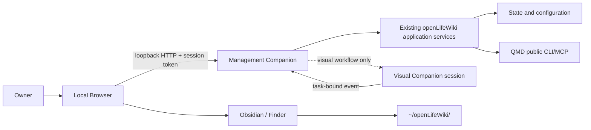

# Design v0.3: Local Management Companion

- Status: owner-approved; V0.3-A/B implementation active
- Audience: product owner and implementation team
- Purpose: deliver the missing fixed local product-management GUI
- Depends on: `design_doc-v0.2-default-workspace-and-mcp.md`
- Requirement: `docs/requirements/requirements-v0.2.md`

## 1. Core Judgment

openLifeWiki currently has a working management engine and no product management surface:

```text
CLI lifecycle + QMD + MCP: implemented
Product Web GUI: missing
Visual Companion workflow: missing
Obsidian/Finder: external file-management fallback only
```

The missing product capability contains two different surfaces:

| Surface | Responsibility | Availability |
| --- | --- | --- |
| Management Companion | Fixed local Web shell for lifecycle, Source, health and Agent connection management | Always available when openLifeWiki is installed |
| Visual Companion | Dynamic, task-bound Canvas for visual comparison, review and approval | Started only by a workflow that benefits from visual interaction |

The Management Companion is the next required surface. The Visual Companion cannot replace it.

## 2. Benchmark And Reuse Decision

| Candidate | Reusable capability | Gap against openLifeWiki management |
| --- | --- | --- |
| Obsidian | Mature Markdown file editing | Cannot manage lifecycle state, QMD isolation, activation or MCP registration |
| QMD `mcp --http` | Local retrieval protocol over HTTP | Exposes no management GUI or openLifeWiki authorization workflow |
| Superpowers Visual Companion | Browser screen delivery and task-state event round trip | Ephemeral brainstorming session, generated HTML screens and inactivity shutdown; no durable product dashboard |
| New thin Management Companion | Exact openLifeWiki lifecycle and policy surface | Small owned shell is required because no upstream project covers this contract |

Reuse rule:

1. keep Obsidian as the recommended content editor;
2. continue invoking QMD only through its public CLI/MCP;
3. reuse the Visual Companion interaction protocol and human-gated workflow pattern;
4. do not copy Superpowers scripts or server source into this repository;
5. use an official installable Visual Companion component if one becomes available and passes a pinned contract test.

## 3. User Outcome

The owner opens one local page and can immediately answer:

- What state is openLifeWiki in?
- Where are my Source and Wiki folders?
- What must I do next?
- Is QMD installed and healthy?
- Has the default Source been authorized and indexed?
- Is the Codex MCP connection ready?
- What will change before I approve an operation?

The first supported journey is:

```text
open local Management Companion
→ see INITIALIZED and the default Source path
→ open the Source folder
→ add at least one Markdown file in Obsidian or Finder
→ preview activation
→ explicitly approve activation
→ see ACTIVE and a successful retrieval check
→ see the exact Codex MCP registration command
```

## 4. Scope

### 4.1 V0.3-A: Read-Only Management

- current lifecycle state and next action;
- runtime, Source and Wiki paths;
- component versions and health;
- Source authorization and indexed-file summary;
- MCP readiness and expected tools;
- open Source/Wiki folders through an explicit local action;
- refresh health without changing configuration.

### 4.2 V0.3-B: Gated Operations

- initialization preview and approved execution;
- activation preview and approved execution;
- operation progress, stable result and actionable failure;
- exact Codex registration command with copy action;
- no automatic change to Codex configuration in this phase.

### 4.3 V0.3-C: Visual Companion

- workflow opens a task-bound Canvas only when visual judgment is useful;
- Agent publishes a typed screen descriptor or generated local HTML;
- owner selection is bound to one task and one screen revision;
- workflow validates the returned event before continuing;
- Canvas expiry or closure returns control to the fixed Management Companion.

## 5. Non-Goals

- Markdown editor, file explorer or knowledge graph replacement;
- chat interface or new Agent runtime;
- custom search, embedding or reranking implementation;
- remote access, team accounts or multi-user permissions;
- desktop packaging, tray process or background daemon;
- arbitrary Source paths beyond the current P0 default;
- automatic Codex configuration mutation;
- Visual Companion for text-only decisions.

## 6. Product Model

The Web shell exposes existing product state. It does not introduce a second state machine.

| Stable state | Primary screen | Allowed operation |
| --- | --- | --- |
| `INSTALLED` | Setup required | preview and approve initialization |
| `INITIALIZED` | Add and activate Source | open Source, preview and approve activation |
| `ACTIVE` | Ready for Agent use | health refresh, MCP registration guidance |
| `DEGRADED` | Contract failure | inspect failure and approved repair path |

Every state-changing action follows:

```text
request preview
→ receive plan + plan digest
→ owner confirms the same digest
→ execute existing application service
→ publish operation result
→ refresh stable state
```

## 7. Architecture



### Ownership

| Concern | Owner |
| --- | --- |
| lifecycle rules, authorization and plan execution | existing core/adapters |
| local HTTP session and browser assets | Management Companion |
| retrieval and MCP tools | QMD |
| Markdown editing | Obsidian or user's chosen editor |
| dynamic visual screen and task event | Visual Companion |

The Companion calls the same application services as the CLI. It must not spawn the CLI and parse its human output, duplicate lifecycle rules or read the QMD database.

## 8. Local Server Contract

Proposed commands:

```text
openlifewiki companion --open
openlifewiki companion --no-open --json
openlifewiki companion status --json
openlifewiki companion stop --json
```

Default behavior:

- bind only to `127.0.0.1` on a random available port;
- open the system browser only after the server is ready;
- write PID, port and redacted session metadata under `<runtime>/runtime/companion/`;
- allow one active management server per runtime root;
- stop after an inactivity window when no operation is running;
- never expose QMD HTTP MCP as the browser backend.

Minimal internal routes:

| Route | Method | Behavior |
| --- | --- | --- |
| `/api/status` | GET | lifecycle, paths, component health and next action |
| `/api/operations/init/preview` | POST | read-only initialization plan |
| `/api/operations/init/execute` | POST | execute matching approved plan digest |
| `/api/operations/activate/preview` | POST | read-only activation plan |
| `/api/operations/activate/execute` | POST | execute matching approved plan digest |
| `/api/actions/open-workspace` | POST | open the fixed workspace path locally |
| `/api/mcp/codex-config` | GET | return registration command and readiness |
| `/api/events` | GET | operation progress stream |

## 9. Security Contract

- loopback binding only; no `0.0.0.0` option in V0.3;
- random 256-bit session token delivered in the URL fragment and sent as an API header;
- no CORS and strict Origin validation;
- restrictive Content Security Policy with no remote scripts, fonts or images;
- every mutation requires a current plan digest and explicit confirmation;
- no arbitrary command, path, URL or HTML input from the browser;
- Source contents remain unread before activation approval;
- logs exclude Source bodies, tokens and complete browser events;
- Visual Companion events include task ID, screen revision, event type and timestamp;
- expired or mismatched visual events cannot resume a workflow.

## 10. UI Information Architecture

The first screen is the actual management workspace, with no marketing page.

```text
Header: openLifeWiki | stable state | health
Left navigation:
  Overview
  Source
  Agent Connection
  Health

Overview:
  current stage
  next required action
  runtime / Source / Wiki paths
  QMD version and health

Source:
  authorization boundary
  Open Folder action
  activation preview
  approved Activate action

Agent Connection:
  MCP readiness
  Codex registration command
  expected QMD tools

Health:
  doctor results
  component contracts
  last operation result
```

Buttons use clear icons for refresh, open folder, copy and stop. State labels are text-first and never rely on color alone. Compact operational panels use restrained typography and no nested cards.

## 11. Visual Companion Contract

The fixed shell owns the durable session and workflow state. A visual session receives only the data required for its screen.

```json
{
  "schema": "openlifewiki.visual-screen/v1",
  "taskId": "task-id",
  "revision": 1,
  "title": "Review source organization",
  "kind": "single-choice",
  "options": []
}
```

Returned event:

```json
{
  "schema": "openlifewiki.visual-event/v1",
  "taskId": "task-id",
  "revision": 1,
  "type": "choice",
  "choice": "option-id",
  "timestamp": "ISO-8601"
}
```

The Web Management Companion can operate fully without a Visual Companion session. This keeps management deterministic and makes the dynamic surface optional.

## 12. Delivery Stages

| Stage | Deliverable | Exit condition |
| --- | --- | --- |
| 0. Source review | frozen upstream Visual Companion evidence, license and callable contract | reuse decision recorded; no copied source |
| 1. Read-only shell | Overview, Source, Agent Connection and Health | current real runtime renders correctly |
| 2. Gated activation | preview digest, confirmation, progress and stable result | empty Source remains INITIALIZED; fixture Source reaches ACTIVE |
| 3. Codex guidance | readiness and exact registration command | owner can register without editing config files manually |
| 4. Visual workflow | one task-bound visual choice round trip | stale/mismatched event is rejected; valid event resumes only its task |

Each stage is independently releasable. Stage 4 cannot block the fixed management journey.

## 13. Acceptance

### Functional

- `INSTALLED`, `INITIALIZED`, `ACTIVE` and `DEGRADED` render from existing contracts;
- initialization and activation previews match the CLI plans exactly;
- no mutation occurs without approval of the current plan digest;
- opening the Source uses only the configured default workspace;
- activation with no searchable Markdown remains `INITIALIZED`;
- successful activation displays `ACTIVE` and the MCP tools;
- server stop leaves no listening process or stale lock.

### Security

- non-loopback connections fail;
- missing, invalid and expired session tokens fail;
- foreign Origin and arbitrary path requests fail;
- manually added QMD collection blocks MCP readiness;
- browser assets require no internet access;
- Source content and session tokens never appear in logs.

### Experience

- first viewport shows current state and next action;
- all supported actions are reachable without terminal knowledge;
- layout works at 1440x900 and 390x844 without overlap;
- Playwright screenshots and operation-flow tests pass on both viewports;
- keyboard focus, labels and error recovery are usable without color cues.

### Reuse

- QMD and Visual Companion upstream boundaries are source-driven and pinned;
- no upstream project source is copied into the repository;
- any installed upstream component is invoked through its public contract;
- openLifeWiki-owned code is limited to the missing lifecycle management surface.

## 14. Open Decisions

Owner approval is required for:

1. product name: `Management Companion` as the fixed shell and `Visual Companion` as the dynamic surface;
2. whether V0.3-B may write Agent registration automatically or remain guidance-only;
3. inactivity timeout for the fixed local server;
4. whether the first Visual Companion journey reviews Source organization or future Wiki proposals;
5. requirement update moving local GUI out of the non-goal list.

## 15. Implementation Gate

V0.3-A/B implementation is authorized. Dynamic Visual Companion code remains gated until:

1. the upstream Visual Companion source/release contract is frozen;
2. its task-state journey is selected;
3. architecture and security review pass;
4. an execution plan defines file map, tests, milestones and rollback.
