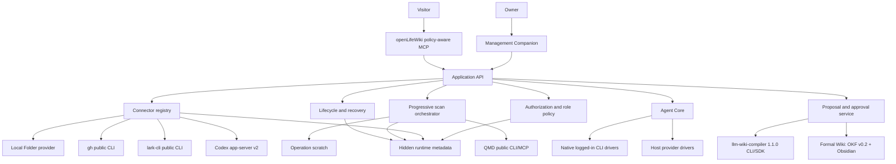
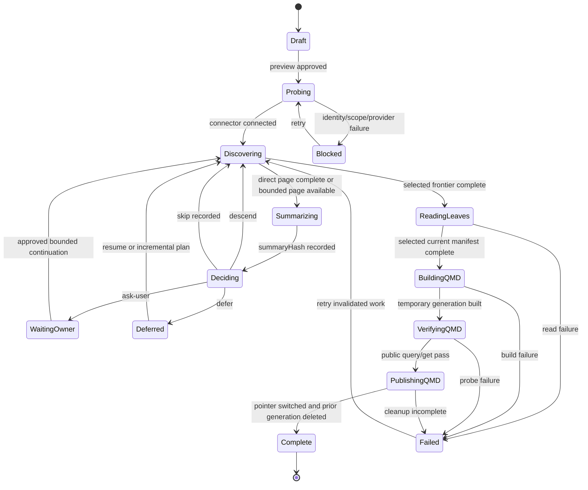

# Design V1: Progressive Scan And Formal Wiki

- Status: canonical V1 design; implementation pending
- Date: 2026-07-26
- Requirement: [`requirements-v1.md`](../../requirements/requirements-v1.md)
- Decisions: [ADR 0003](../../decisions/ADR-0003-progressive-scan-control-plane.md), [ADR 0004](../../decisions/ADR-0004-okf-v0.2-and-obsidian-profile.md)
- Acceptance: [`v1-journeys-and-oracles.md`](../../acceptance/v1-journeys-and-oracles.md)
- Delivery plan: [`2026-07-26-v1-progressive-scan-delivery.md`](../../development/plans/2026-07-26-v1-progressive-scan-delivery.md)

## 1. Design Goal And Completion Boundary

V1 must let the Owner connect real Sources, understand what will be read, watch truthful progressive coverage, retrieve current evidence, approve a synthesized taxonomy and open the approved Wiki directly in Obsidian.

The implementation has two durable poles:

```text
Source Skeleton                              Formal Wiki
authorized, metadata-only                    approved, synthesized Concepts
platform-shaped hierarchy                    owner-shaped taxonomy
scan and coverage truth                      long-term reusable knowledge
```

Layer Summary is disposable scan scratch between those poles. QMD is the rebuildable current-evidence index. Neither becomes another durable Source mirror.

V1 remains incomplete until the Owner passes the real Full Journey. `ACTIVE`, a component probe, a finished scan, a proposal, an open page or an architecture review cannot substitute for that result.

## 2. Reuse Baseline

External projects enter through official releases and documented public CLI, MCP or SDK surfaces. openLifeWiki stores release receipts and contract-test results; it does not copy project source.

| Project | Official project/download URL | V1 use |
| --- | --- | --- |
| Codex | [openai/codex](https://github.com/openai/codex) | logged-in native Agent CLI; version-pinned `app-server` v2 history source |
| Claude Code | [anthropics/claude-code](https://github.com/anthropics/claude-code) | logged-in native Agent CLI |
| Gemini CLI | [google-gemini/gemini-cli](https://github.com/google-gemini/gemini-cli) | logged-in native Agent CLI |
| Pi | [earendil-works/pi](https://github.com/earendil-works/pi) | provider-runtime Agent |
| OpenClaw | [openclaw/openclaw](https://github.com/openclaw/openclaw) | provider-runtime Agent |
| Hermes Agent | [NousResearch/hermes-agent](https://github.com/NousResearch/hermes-agent) | provider-runtime Agent |
| GitHub CLI | [cli/cli](https://github.com/cli/cli) | existing login, repository identity/skeleton/body access |
| Lark CLI | [larksuite/cli](https://github.com/larksuite/cli) | selected Feishu profile, identity/skeleton/body access |
| QMD | [tobi/qmd](https://github.com/tobi/qmd) | current-source index, query and retrieval |
| llm-wiki-compiler | [atomicstrata/llm-wiki-compiler](https://github.com/atomicstrata/llm-wiki-compiler) | candidate review queue, incremental state, quality checks and OKF v0.1 exchange |

Pinned versions belong in the component release manifest. V1 begins with QMD `2.5.3` and llm-wiki-compiler `1.1.0`; any change requires public-contract tests and a reviewed release-manifest change.

## 3. System Architecture



### 3.1 Ownership

| Concern | Owner |
| --- | --- |
| Source authorization, roles and budgets | openLifeWiki core |
| Connector capability schema and normalized skeleton contract | openLifeWiki protocol/core |
| Platform invocation and pagination | Connector provider adapter through public surfaces |
| Scan plan, decision inputs, progress and recovery | openLifeWiki scan control plane |
| Layer descend reasoning | Selected Agent through canonical Skill |
| Source retrieval/indexing | QMD public CLI/MCP |
| Wiki proposal semantics | Selected Agent through one of the six normalized drivers |
| Candidate queue, incremental state, citation/freshness/link/lint/eval and OKF v0.1 exchange | llm-wiki-compiler public CLI/SDK |
| Exact proposal hash, base Wiki compare-and-swap and authorization | openLifeWiki approval service |
| OKF v0.1-to-v0.2 upgrade and Formal Wiki validation | openLifeWiki compatibility adapter + OKF v0.2/Obsidian Profile |
| Credentials and model-provider secrets | selected native CLI or host credential store |

### 3.2 Roles

The Visitor MCP registers exactly one `query` tool. Retrieval, citation resolution and generation checks remain internal to that query pipeline. The Admin MCP and Owner GUI add Connector authorization, scan operations, Agent configuration, proposal generation and lifecycle operations. Every Admin mutation uses preview plus matching plan digest. Formal Wiki writes additionally require Owner approval of exact `proposalHash` against `baseWikiHash`.

No API, CLI, MCP tool or GUI route exposes an unrestricted provider call, raw QMD storage or approval bypass.

## 4. Runtime And Workspace Layout

```text
<platform application-data>/openLifeWiki/
  config.json                 authorization, connector and host references
  state.json                  stable lifecycle receipts
  components/                 pinned official releases
  data/
    skeletons/                node metadata and versioned coverage only
    scans/                    plan, decisions, checkpoints and counters
    qmd/
      active.json             active generation pointer and receipt
      generations/<id>/       one active rebuildable current-source index
    proposals/                immutable candidate manifests and review evidence
  runtime/
    operations/<id>/          locks and disposable scratch
    companion/                loopback session state
  logs/                       redacted operational events

~/openLifeWiki/
  sources/                    owner-visible Local Folder Source
  wiki/                       Owner-approved Formal Wiki / Obsidian Vault
    .obsidian/                optional removable display configuration
```

No Connector credential value, Agent token, persistent Layer Summary, normalized remote Source, raw Source history or bulk Source copy belongs in either root. Host config stores credential references that resolve through the host provider at invocation time.

Operation scratch is owner-only and disposable. If a public component requires temporary filesystem input, that input exists only for the active operation, is excluded from pause receipts and is removed before success publication. Startup recovery removes orphan body-bearing scratch before resuming metadata checkpoints.

## 5. Public Data Contracts

All JSON contracts include `schema`, `id`, `createdAt` or `observedAt` where applicable. Unknown additive fields are tolerated. Hashes use a declared canonical JSON serialization and SHA-256.

### 5.1 Connector Descriptor

```json
{
  "schema": "openlifewiki.connector-descriptor/v1",
  "connectorType": "feishu",
  "displayName": "Feishu",
  "provider": {
    "project": "larksuite/cli",
    "publicSurface": "lark-cli",
    "versionCommand": ["lark-cli", "version"]
  },
  "capabilities": {
    "hierarchy": true,
    "pagination": "cursor",
    "modifiedVersion": "provider-version",
    "representativeMetadata": true,
    "leafBodies": true
  },
  "scopeSchema": "openlifewiki.scope/feishu/v1"
}
```

Descriptor registration is code/release controlled. Runtime configuration selects a descriptor and provides approved scope; it cannot add executable arguments or redefine capabilities.

### 5.2 Connector Status

```json
{
  "schema": "openlifewiki.connector-status/v1",
  "sourceId": "src_feishu_01",
  "connectorType": "feishu",
  "providerName": "lark-cli",
  "providerVersion": "x.y.z",
  "identity": { "profile": "work", "display": "a***@example.com", "tenant": "t***7" },
  "authorizedScope": { "spaces": ["spc_123"], "include": ["/**"], "exclude": ["/HR/**"] },
  "status": "connected",
  "lastProbe": "2026-07-26T10:00:00Z",
  "lastScan": "2026-07-26T09:00:00Z",
  "changedItems": 3,
  "blocking": null
}
```

`status` is exactly `connected | auth-required | missing | blocked`. `blocking` carries stable code and safe remediation. Feishu status includes the selected profile and effective scope probe. No token-shaped field is permitted.

### 5.3 Authorized Source

```json
{
  "schema": "openlifewiki.authorized-source/v1",
  "sourceId": "src_github_01",
  "connectorType": "github",
  "identityFingerprint": "sha256:...",
  "scope": { "repositories": ["owner/repo"], "refs": ["main"], "paths": ["docs/**"] },
  "include": ["docs/**"],
  "exclude": ["docs/private/**"],
  "sensitivity": { "default": "normal", "rules": [{ "match": "**/finance/**", "level": "sensitive" }] },
  "budget": { "maxNodes": 10000, "maxBodyBytes": 2147483648, "maxAgentCalls": 500 },
  "approvedBy": "human:owner",
  "approvedAt": "2026-07-26T10:00:00Z",
  "authorizationHash": "sha256:..."
}
```

Scope expansion creates a new preview and approval. `WIKI.md` and Skills can only reduce effective scope, budget or sensitivity permissions.

### 5.4 Skeleton Node And Page

```json
{
  "schema": "openlifewiki.skeleton-node/v1",
  "sourceId": "src_github_01",
  "nodeId": "github:repo:tree:stable-id",
  "parentId": "github:repo:root",
  "kind": "directory",
  "title": "Design documents",
  "locator": "github://owner/repo/main/docs/design",
  "childCount": { "value": 12, "kind": "known" },
  "modifiedRange": { "from": "2026-05-01T00:00:00Z", "to": "2026-07-25T23:00:00Z" },
  "permission": "readable",
  "scanability": "metadata-and-body",
  "page": { "cursor": null, "hasMore": false },
  "sizeEstimate": { "bytes": 840000, "kind": "estimated" },
  "nodeVersion": "provider-version-or-content-hash"
}
```

`childCount.kind` is `known | estimated | unknown`. Permission is `readable | approval-required | denied | unknown`. A `SkeletonPage` includes direct children only, request scope hash, next cursor, `pageComplete`, provider observation time and a `skeletonVersion` derived from ordered page receipts. Node IDs stay stable across title changes when the provider offers stable identity; otherwise the provider declares the fallback and move oracle expectations.

### 5.5 Scan Plan And Decision

```json
{
  "schema": "openlifewiki.scan-plan/v1",
  "scanId": "scan_01",
  "sourceIds": ["src_local_01"],
  "authorizationHashes": ["sha256:..."],
  "skeletonVersion": "sha256:...",
  "agentProfileId": "agent_codex_native",
  "skillHash": "sha256:...",
  "scanIntent": "Build a reusable current knowledge Wiki for writing, decisions and retrospectives.",
  "priorityDocumentRefs": ["source://src_local_01/product/strategy.md"],
  "policy": {
    "include": ["/**"],
    "exclude": ["/private/**"],
    "sensitivity": "normal",
    "budget": {},
    "indexing": { "default": "qmd-current", "rules": [{ "match": "/archive/**", "disposition": "metadata-only" }] }
  },
  "scanPlanHash": "sha256:..."
}
```

```json
{
  "schema": "openlifewiki.agent-scan-result/v1",
  "operationId": "op_01",
  "scanId": "scan_01",
  "scanPlanHash": "sha256:...",
  "skeletonVersion": "sha256:...",
  "skillHash": "sha256:...",
  "inputSetHash": "sha256:...",
  "agent": { "id": "agent_codex_native", "runtime": "codex", "mode": "native-cli", "driverContractVersion": "v1" },
  "layer": {
    "sourceId": "src_local_01",
    "parentNodeId": "local:root",
    "parentNodeVersion": "v3",
    "summaryHash": "sha256:...",
    "childSetHash": "sha256:...",
    "decisionTargetSetHash": "sha256:...",
    "coverage": { "directChildrenEnumerated": 3, "pageComplete": true, "openCursor": false, "unknownChildCount": false },
    "systemOutcomes": [{ "targetNodeId": "local:private", "outcome": "blocked", "code": "PERMISSION_DENIED" }]
  },
  "childOutcomes": [
    {
      "target": { "nodeId": "local:product", "parentId": "local:root", "nodeVersion": "v2", "kind": "container" },
      "outcome": "descend",
      "reason": "Current product material matches the approved scan intent.",
      "estimatedCost": { "nodes": 12, "bodyBytes": 0, "agentCalls": 1 },
      "revisitCondition": null,
      "question": null
    },
    {
      "target": { "nodeId": "local:archive", "parentId": "local:root", "nodeVersion": "v1", "kind": "container" },
      "outcome": "skip",
      "reason": "Archived duplicate material is excluded by current policy.",
      "estimatedCost": { "nodes": 0, "bodyBytes": 0, "agentCalls": 0 },
      "revisitCondition": null,
      "question": null
    }
  ],
  "status": "decision-ready"
}
```

One Agent call covers one layer. `childSetHash` binds the complete ordered direct-child metadata set after pagination closes. `decisionTargetSetHash` binds the decision-eligible subset. Agent `childOutcomes` must match that target set exactly; Control Plane `systemOutcomes` cover permission/system exclusions, and the two sets together must equal the child set with no omission, duplicate or extra node. `inputSetHash` covers layer metadata, both set hashes, provider descriptions, bounded metadata sample, canonical Skill hash, narrowing `WIKI.md` hash, Host policy hash, scan intent, indexing rules and current budget.

The Control Plane derives Connector actions only after validation. `descend + container` creates an `EnumerationIntent` and lists the target child, never the completed parent again. `descend + leaf` atomically persists the target DecisionReceipt and LeafSelectionReceipt before deriving `getVersion` and `readApprovedLeafBody`. Agent output never invents a receipt hash.

Representative summary input cannot include a leaf body before a persisted `descend` decision receipt. Provider descriptions, titles, timestamps, MIME/type, size and explicitly public metadata fields are allowed. A later deeper layer may use already approved and processed evidence within its budget.

### 5.5.1 Codex History Contract

Codex History uses the executable's public `app-server` v2 JSON-RPC protocol. Initialization runs `codex app-server generate-json-schema` and pins the resulting contract hash to the probed Codex version. Metadata discovery calls `thread/list` with an exact approved `cwd` filter, opaque cursor, bounded limit and `useStateDbOnly: true`. The adapter allowlists thread ID, authorized cwd fingerprint, source kind, user-facing thread name, created/updated timestamps and status; the thread name is metadata needed for layer relevance and is allowed only inside the exact authorized project scope. It discards preview and turns. A selected thread body is fetched only through `thread/read { threadId, includeTurns: true }` after matching target-bound DecisionReceipt and LeafSelectionReceipt. If the generated schema lacks the required methods, cwd filter, cursor, thread ID or empty-turn list behavior, the Connector reports `blocked`. Direct reads of Codex rollout, session or state files are forbidden.

### 5.6 Checkpoint And Progress

```json
{
  "schema": "openlifewiki.scan-checkpoint/v1",
  "scanId": "scan_01",
  "scanPlanHash": "sha256:...",
  "skeletonVersion": "sha256:...",
  "nodeId": "local:node:leaf-1",
  "nodeVersion": "sha256:...",
  "phase": "qmd-committed",
  "inputSetHash": "sha256:...",
  "qmdGenerationId": "qmdgen_01",
  "receiptHash": "sha256:..."
}
```

```json
{
  "schema": "openlifewiki.scan-progress/v1",
  "scanId": "scan_01",
  "scanPlanHash": "sha256:...",
  "skeletonVersion": "sha256:...",
  "sourceIds": ["src_local_01"],
  "discovery": { "enumeratedNodes": 41, "plannedNodes": 55, "unknownIntents": 2, "openPages": 1 },
  "summarization": { "summarizedLayers": 8, "enumerationIntents": 10 },
  "selectedScan": { "completed": 23, "selected": 29 },
  "committedIndex": { "completed": 23, "processed": 23, "generation": "qmdgen_01" },
  "outcomes": { "skipped": 7, "deferred": 2, "blocked": 1, "failed": 0, "unknown": 2 },
  "current": { "path": ["root", "product", "strategy"], "summaryHash": "sha256:...", "decision": "descend", "reason": "..." },
  "denominatorChanges": [{ "at": "2026-07-26T10:05:00Z", "dimension": "discovery", "from": 42, "to": 55, "reason": "next page enumerated" }]
}
```

### 5.7 QMD Generation Receipt

```json
{
  "schema": "openlifewiki.qmd-generation/v1",
  "generationId": "qmdgen_01",
  "scanPlanHash": "sha256:...",
  "selectedLeafManifestHash": "sha256:...",
  "itemCount": 23,
  "builtAt": "2026-07-26T10:15:00Z",
  "publicProbe": { "queryPassed": true, "getPassed": true, "removedFixtureAbsent": true },
  "activePath": "data/qmd/generations/qmdgen_01",
  "previousGenerationDeleted": true
}
```

Every committed index is a full build from the current selected-leaf manifest in a temporary isolated QMD runtime using public CLI commands. Publication order is build, public query/get verification, atomic active-pointer switch, whole-directory deletion of the prior generation, then durable success receipt. Failure before the pointer switch leaves the old generation active. Failure after the switch resumes deletion before declaring success. No private QMD SQLite file or table is read or modified. An in-place partial update cannot satisfy current-only physical removal.

### 5.8 Host Config And Agent Result

The host `config.json` is the single configuration truth. V1 uses a revisioned envelope:

```json
{
  "schema": "openlifewiki.config/v2",
  "revision": 4,
  "sources": [],
  "hostConfig": null,
  "compatibility": { "p0Sources": [], "agentBindings": [] }
}
```

`sources` contains only exact Owner-approved `AuthorizedSourceV1` records. `hostConfig` is either `null` or the Agent structure below. The compatibility block temporarily preserves P0 activation/MCP state and grants no V1 authorization; Task 3 removes its runtime role when the V1 scan/QMD path replaces P0. Existing `config/v1` files are read without mutation and move to v2 only through a byte/hash-bound migration preview plus Owner approval. Every write uses revision compare-and-swap. A second Source authorization or Agent configuration file is forbidden.

The nested Host config is hidden runtime configuration and the only Agent invocation truth:

```json
{
  "schema": "openlifewiki.host-config/v1",
  "selectedAgentId": "agent_openclaw_hosted",
  "agents": [
    { "id": "agent_codex_native", "runtime": "codex", "mode": "native-cli" },
    {
      "id": "agent_openclaw_hosted",
      "runtime": "openclaw",
      "mode": "provider-runtime",
      "provider": { "baseUrl": "https://provider.example/v1", "credentialRef": "keychain://openlifewiki/provider-a", "model": "approved-model" }
    }
  ]
}
```

`selectedAgentId` is required and resolves to exactly one declared entry; scan, query and proposal receipts record that same selection. Native entries reject `baseUrl`, `credentialRef`, `model`, `provider` and token fields. Provider-runtime entries accept a BaseURL, credential reference and model; the resolved credential never enters child arguments, logs, proposal evidence or the knowledge workspace. Agent output includes runtime, mode, model observation where public, input hash, decision/result and structured failure.

### 5.9 WikiProposal And Approval

```json
{
  "schema": "openlifewiki.wiki-proposal/v1",
  "proposalId": "proposal_01",
  "baseWikiHash": "sha256:...",
  "evidenceManifestHash": "sha256:...",
  "compiler": { "project": "atomicstrata/llm-wiki-compiler", "version": "1.1.0", "receiptHash": "sha256:..." },
  "taxonomy": { "folders": [], "tags": [], "aliases": [] },
  "directoryDiff": [],
  "fileDiff": [],
  "tagDiff": [],
  "linkChanges": [],
  "quality": { "citation": {}, "freshness": {}, "links": {}, "lint": {}, "eval": {}, "knownGaps": [] },
  "proposalHash": "sha256:..."
}
```

`proposalHash` covers the canonical manifest, all displayed diffs, Evidence manifest and compiler receipts. Approval stores proposal hash, base Wiki hash, Owner actor and time. Execution revalidates both hashes and compatibility, writes to a sibling staging Vault, runs quality and Obsidian profile checks, atomically publishes the Vault and removes the old staging/backup according to retention policy. Rejection and failed compare-and-swap publish nothing.

## 6. Progressive Scan State Machine



Any running state can enter `PAUSED`, `CANCEL_REQUESTED` or `FAILED`. Pause finishes or safely aborts the current atomic unit, removes body-bearing scratch and publishes a resume receipt. Cancel prevents new work, removes scratch and records incomplete outcomes; completed QMD generation remains valid. Resume requires matching authorization and Host config hashes or creates a new scan plan.

## 7. Scan Sequence

```mermaid
sequenceDiagram
    actor Owner
    participant GUI as Sources scan workspace
    participant Scan as Scan Control Plane
    participant Conn as Connector Provider
    participant Agent as Selected Agent
    participant QMD as QMD Public CLI

    Owner->>GUI: approve scanPlanHash
    GUI->>Scan: start matching plan
    Scan->>Conn: probe identity and authorized scope
    Conn-->>Scan: redacted status
    Scan->>Conn: enumerate(root, cursor=null)
    Conn-->>Scan: metadata-only direct children
    Note over Conn: leaf body reads = 0
    Scan->>Scan: build scratch Layer Summary and inputSetHash
    Scan->>Agent: canonical Skill + narrowed policy + summary metadata
    Agent-->>Scan: decision, reason, cost
    alt descend
        Scan->>Conn: enumerate(selected child)
    else ask-user
        Scan-->>GUI: approval question with scope/cost
        Owner->>GUI: approve or narrow
    else skip or defer
        Scan->>Scan: record coverage outcome
    end
    Scan->>Conn: read selected current leaves
    Conn-->>Scan: version-bound body stream
    Scan->>QMD: full build in temporary isolated runtime
    Scan->>QMD: public query/get probes
    QMD-->>Scan: verified current results
    Scan->>Scan: atomic generation switch; delete prior directory
    Scan-->>GUI: committed receipt and truthful coverage
```

## 8. Dynamic Progress Rules

Each dimension is displayed independently for the all-Source rollup and for each Connector. A per-Connector view filters by the exact authorized `sourceIds` belonging to Local Folder, GitHub, Feishu or Codex History before computing the numerator and denominator. The UI may calculate a percentage only when its denominator is currently knowable:

```text
Discovery       = complete-page metadata nodes / (those nodes + known unenumerated child slots of EnumerationIntents)
Summarization   = valid summaryHash+childSetHash layers / EnumerationIntent layers
Selected Scan   = version-bound body-processed leaves / valid LeafSelectionReceipt leaves
Committed Index = matching leaves in published active QMD manifest / processed qmd-current leaves
```

Rules:

1. Every value is labeled with `scanPlanHash` and `skeletonVersion` short IDs.
2. `EnumerationIntent` is created only for an authorized root or validated container `descend`; skip/defer creates no intent and unknown descendants outside an intent never enter the denominator.
3. Enumeration of a new page or a changed known child count updates the denominator and appends a visible denominator-change event.
4. An unknown child count, estimated count that has not converged, open cursor/page, blocked enumeration or pending layer decision makes Discovery explicitly open-ended; it cannot display 100%.
5. `blocked`, `failed` and unresolved `ask-user` items remain separate and prevent overall Scan completion even when a phase ratio is complete.
6. `deferred` and `skipped` are visible outcomes; they create no hidden descendant work and do not count as scanned or committed.
7. A zero denominator displays `0/0 - no selected work`, never 100%.
8. Committed Index reaches 100% only after current-generation publication, public probes and prior-generation deletion complete.
9. The UI has no single blended percentage that can hide a weak dimension.
10. Snapshot/event ordering uses monotonic sequence numbers so reconnecting sessions cannot move progress backward without a displayed plan/version change.
11. The rollup and per-Connector snapshots are derived independently from the same exact sets. Global values use their union, never the average of Connector percentages.

Worked example: a root has four known children across two pages. Page one returns two nodes, so Discovery is `2/4`. Closing page two returns all four; Agent descends into container A, skips B and selects leaf C/D. A has two known children, so the new EnumerationIntent changes Discovery to `4/6`, Summarization to `1/2` and Selected Scan to `0/2`. If A later reveals a third child, Discovery denominator changes `6 -> 7` with a visible event. A blocked D can leave Discovery and Committed Index ratios complete while the overall Scan remains incomplete.

## 9. Recovery And Incremental Scan

### 9.1 Checkpoint Validity

A checkpoint is reusable only when all of these still match:

- Source authorization hash and identity fingerprint;
- node stable ID and `nodeVersion`;
- `scanPlanHash` and relevant `skeletonVersion` branch;
- canonical Skill, Host policy and priority document input hashes;
- Selected Agent driver contract version;
- for committed leaves, active QMD generation receipt.

A mismatch invalidates that node and its dependent ancestors/descendants only. Unchanged sibling branches retain checkpoints.

### 9.2 Kill Recovery

| Kill point | Startup behavior |
| --- | --- |
| discovery | discard incomplete page, resume from last provider cursor receipt, deduplicate stable node IDs |
| summarization | delete summary scratch, recompute summary, retain previously complete decisions |
| decision | ignore decision without durable input hash/receipt; invoke once on resume |
| leaf read | remove body-bearing scratch, reread only incomplete leaf |
| QMD build | delete failed temporary generation, retain active generation, rebuild from the current selected manifest; rematerialize required bodies after version/hash validation and record separate physical-I/O counters |
| after QMD pointer switch | complete prior-generation directory deletion, run public probes, then publish receipt |
| proposal compilation | discard incomplete candidate, retain Formal Wiki and evidence manifest |
| Wiki publication | compare staging, active and receipt hashes; finish atomic publish or restore last approved Vault |

### 9.3 Incremental Rules

Provider changes create a new `skeletonVersion`. The planner compares stable IDs and node versions, invalidates changed branches, records deletions and rebuilds QMD from the complete new selected manifest. It does not re-enumerate, re-summarize, re-decide, re-count or recommit unchanged branches. If minimum-storage cleanup removed a failed temporary generation and its body scratch, the rebuild may stream unchanged selected bodies after current version/hash validation; `rematerializedItems` and `rematerializedBytes` record that physical I/O without changing logical completed counters. Taxonomy changes remain proposals even when Source evidence update is small.

## 10. Agent Core: Two Invocation Modes

The six Agent choices share one input/result schema, canonical Progressive Scan Skill and failure taxonomy. They have exactly two execution modes.

### 10.1 Logged-In Native CLI

| Agent | Driver |
| --- | --- |
| Codex | existing authenticated `codex` CLI |
| Claude Code | existing authenticated Claude Code CLI |
| Gemini | existing authenticated Gemini CLI |

openLifeWiki invokes the native public CLI and relies on its existing login. The UI and config expose no BaseURL, API token or credential-reference field for these drivers. A missing CLI, logged-out session, incompatible version or structured-output failure returns its actual status and blocks the dependent operation.

### 10.2 Host Provider

| Agent | Driver |
| --- | --- |
| Pi | host-configured provider running Pi |
| OpenClaw | host-configured provider running OpenClaw |
| Hermes | host-configured provider running Hermes Agent |

Host config JSON may declare BaseURL, credential reference and model. The host provider resolves the reference and runs the selected runtime. The knowledge space, Source, Wiki, proposal and logs never contain credentials. A runtime cannot inherit another runtime's provider configuration implicitly.

### 10.3 Shared Rules

- Selected Agent identity and mode are recorded in each decision/proposal receipt.
- Inputs are constrained to current authorized metadata/evidence and the canonical Skill.
- Agent timeout, invalid output, model refusal and provider failure are distinct failures.
- There is no automatic substitution between Agents, modes, BaseURLs or models.
- Retry uses the same input hash unless the Owner approves a changed plan.

## 11. Canonical Progressive Scan Skill

[`skills/openlifewiki-progressive-scan/SKILL.md`](../../../skills/openlifewiki-progressive-scan/SKILL.md) is the one behavioral procedure used by all six Agent drivers. It defines input order, skeleton-first rules, decision enum, reason requirements, ambiguity escalation, budget behavior and output schema.

Instruction precedence is:

```text
core red lines
-> approved Source authorization
-> canonical Progressive Scan Skill
-> Host config policy and priority document references
-> WIKI.md narrowing rules
```

Lower levels may narrow include/exclude, sensitivity or budget. They cannot grant scope, permit credentials, suppress progress gaps or authorize a Wiki write.

## 12. QMD Current-Only Generation

The QMD adapter implements a generation swap using public commands:

1. Freeze the current selected-leaf manifest and hash it.
2. Create a new isolated temporary QMD runtime.
3. Stream or operation-stage each selected current body with version checks; no body remains in a successful or paused scratch state.
4. Build the complete generation through QMD's public CLI.
5. Prove current content is retrievable with public query/get.
6. Prove a known removed/replaced fixture is absent through public query/get.
7. Atomically replace `active.json` with the new generation receipt.
8. Delete the entire prior generation directory.
9. Publish committed checkpoints and progress only after deletion succeeds.

The adapter treats QMD config/index/database content as opaque. A local incremental QMD update may be an optimization inside a temporary generation, but it cannot replace full-generation construction and directory deletion as the current-only oracle.

## 13. Wiki Compilation And Approval

### 13.1 Candidate Creation

The proposal service freezes the current Evidence manifest and invokes the Selected Agent through the same normalized driver used for layer decisions and agentic query. The Agent returns Concepts, folder taxonomy, tags, aliases, links, indexes, provenance, freshness, known gaps and moves in the canonical WikiProposal schema.

The proposal service then invokes llm-wiki-compiler `1.1.0` through supported public surfaces for infrastructure work:

- `review list/show/approve/reject` for compiler review records coordinated by openLifeWiki;
- incremental state and refresh paths that do not activate an unselected model;
- citation, freshness, link, lint and eval checks;
- SDK `createWiki` where the reviewed public SDK contract is preferable;
- OKF v0.1 exchange for the openLifeWiki compatibility adapter.

Provider-dependent compiler commands are disabled unless a contract test proves they use the same Selected Agent runtime. V1 never supplies llm-wiki-compiler with a second BaseURL, credential or model, and never asks it to crawl Sources directly.

The openLifeWiki compatibility adapter upgrades the verified v0.1 exchange shape to v0.2 without inventing trust. It maps legacy `timestamp` only when `generated` is absent, preserves unknown frontmatter and stable `page_uid`, emits standard Markdown links and validates the full ADR 0004 Obsidian Profile. Contract fixtures include nested unknown properties, wikilink input, broken links, aliases, hierarchical tags and a no-op round trip.

### 13.2 Review

The Review page shows:

- proposed folder tree and primary classifications;
- directory and file create/update/move/delete diffs;
- controlled tag and alias changes;
- link additions/removals and resulting graph/orphan report;
- citation/freshness/lint/eval results;
- Evidence for each material change;
- `proposalHash`, `baseWikiHash`, Agent, compiler version and known gaps.

Reject records reason and leaves Formal Wiki byte-identical. Approval binds the Owner to the exact candidate. A changed base Wiki, proposal, compiler output or Evidence manifest fails compare-and-swap and returns to Review.

### 13.3 Publication

Publication writes a complete sibling Vault, preserves unknown frontmatter and stable `page_uid`, regenerates every affected `index.md`, runs OKF/Obsidian validation and atomically swaps it into the Formal Wiki path. The active Vault is the sole durable Wiki truth. Optional `.obsidian/` display settings are merged only when they contain no unique knowledge.

## 14. Management Companion: Seven Pages

The first view is the operational product. Progressive Scan lives inside Sources and is not a separate page or general workflow engine. Review remains separate because exact proposal judgment is a distinct Owner responsibility. Canvas remains a task-bound dynamic screen/event surface and cannot replace the durable product pages.

| Page | Owner-visible contract |
| --- | --- |
| Query | Visitor-safe query, cited evidence, current-generation label, no/partial/conflict result and explicit raw-exposure controls; includes lifecycle overview, journey position, next action and blockers |
| Sources | four Connector rows with project/provider/version, redacted profile identity, approved scope, exact status, last probe/scan and changed items; preview/approve scope; embedded Progressive Scan tree, four progress dimensions, denominator changes, outcomes, current summary/decision and Pause/Resume/Cancel/retry/incremental controls |
| Wiki | Formal Wiki health, approved taxonomy, Concepts, freshness/gap reports, compile/refresh entry and Obsidian open action |
| Review | immutable directory/file/tag/link/Evidence diffs, quality reports, proposal/base hashes and approve/reject actions |
| Agent | six Agent choices, mode-specific configuration, native login probes or hosted provider references, Selected Agent and no-fallback failures |
| Canvas | one task-bound dynamic screen at a time, with validated screen revision and owner event; expiry returns control to the originating durable page |
| Health | component/version contracts, active generation, locks/sessions, storage audit, recovery, update/uninstall and downloadable redacted receipts |

Admin-only controls are hidden and rejected server-side for Visitor sessions. State labels use text plus icon and never rely on color. Desktop `1440x900` and mobile `390x844` expose the same content without overlap; dense tables become labeled rows, and plan/hash details remain inspectable.

### 14.1 Canvas Contract

Canvas reuses the Superpowers-style task-bound screen/event pattern through an official callable boundary; no upstream source is copied. A screen contains `taskId`, monotonic `revision`, title, typed content and allowed events. A returned event contains the same `taskId` and `revision`, event type, payload and timestamp. Expired, replayed, mismatched or unknown events fail closed. Canvas holds no durable lifecycle, scan or proposal truth and may receive only the minimum redacted data needed for the current visual judgment.

### 14.2 Session And Concurrency

- loopback-only session security from the current Companion remains;
- role and operation capabilities are server-derived;
- one mutation lease exists per runtime and one proposal approval lease per `baseWikiHash`;
- a second Admin may observe but cannot execute a conflicting plan;
- stale browser tabs fail hash and lease checks, refresh truth and never replay approval;
- progress events are replayable from monotonic cursor without carrying Source bodies or credentials.

## 15. Policy-Aware MCP Surface

The V1 MCP surface composes product contracts and QMD retrieval. Visitor tool discovery must reveal only `query`; Admin tool discovery may reveal the management capabilities below.

| Group | Visitor | Admin |
| --- | --- | --- |
| `query` | invoke | invoke |
| `status`, Connector summaries, active generation | absent | read |
| evidence and Wiki reads used by query | internal, no separate tool | authorized read |
| scan preview/status/progress | absent | read |
| Connector authorization, scan start/pause/resume/cancel/retry | denied | preview/hash-gated |
| WikiProposal create/show | absent | preview/hash-gated |
| WikiProposal approve/reject/publish | denied | exact Owner approval + CAS |
| raw provider, arbitrary path, QMD private access | absent | absent |

The exact tool schema is frozen in the protocol implementation task. ADR 0003 prohibits falling back to a transparent unrestricted QMD MCP.

## 16. Security And Privacy

1. Provider commands are constructed from typed scope fields; no arbitrary shell argument enters from GUI or Source content.
2. Executable resolution and version are probed before each operation receipt.
3. Redaction tests cover environment, command arguments, logs, errors, progress events and proposal evidence.
4. Body reads require authorization hash, node selection and expected version.
5. Sensitivity boundaries force `ask-user`; denial is durable metadata without a body sample.
6. Codex History rejects account-wide, unbounded and path-inferred scope.
7. Feishu errors retain selected profile/identity/scope evidence so the Owner can fix the correct profile.
8. Optional raw exposure is a policy-checked mode inside `query`; it never creates a separate Visitor read tool and is never included in diagnostic downloads.
9. Formal Wiki writes are confined to a staging sibling and verified target path; symlink escapes fail.
10. Default uninstall preserves the visible Formal Wiki and reports retained paths.

## 17. Observability And Failure Taxonomy

Every operation emits redacted events with operation ID, plan/hash, state transition, connector/agent/component version, safe counters, stable error code and remediation. Required failure families:

- `IDENTITY_*`, `AUTH_*`, `SCOPE_*`;
- `CONNECTOR_MISSING`, `CONNECTOR_BLOCKED`, `PAGINATION_INCOMPLETE`;
- `AGENT_MISSING`, `AGENT_AUTH_REQUIRED`, `AGENT_PROVIDER_FAILED`, `AGENT_OUTPUT_INVALID`;
- `SCAN_BUDGET_EXCEEDED`, `SCAN_BODY_READ_DENIED`, `SCAN_INPUT_CHANGED`;
- `QMD_BUILD_FAILED`, `QMD_PROBE_FAILED`, `QMD_OLD_GENERATION_REMAINS`;
- `PROPOSAL_STALE`, `PROPOSAL_HASH_MISMATCH`, `WIKI_CAS_FAILED`, `OKF_INVALID`, `OBSIDIAN_PROFILE_INVALID`;
- `OPERATION_LOCKED`, `RECOVERY_REQUIRED`, `LIFECYCLE_CONTRACT_FAILED`.

No structured failure may be converted to success by switching Connector, Agent, model or path.

## 18. Validation Strategy

### Core Automated

- protocol schemas and hash canonicalization;
- Connector contract tests with body-read counters and pagination;
- four provider probes with safe fixtures plus opt-in live tests;
- scan state-machine property tests, dynamic denominator and checkpoint invalidation;
- pause, normal restart/resume and one temporary-QMD failure/retry;
- QMD temporary-generation build, public query/get current-only proof and old-directory deletion;
- six-row Agent registry/link/status checks plus the native Codex driver contract, config rejection and no-fallback failures;
- llm-wiki-compiler `1.1.0` public CLI/SDK contract tests;
- owned OKF v0.1-to-v0.2/Profile fixtures covering round-trip, unknown frontmatter, stable `page_uid`, indexes, links and Obsidian lint;
- Visitor/Admin authorization, proposal hash/CAS and one mutation lock;
- Playwright desktop/mobile journeys and accessibility checks.

### Core Manual

- correct real `gh`, `lark-cli`, Local Folder and Codex History identity/scope display;
- `Core-UAT-01` with the recorded Owner-selected Source inputs;
- direct Obsidian Vault open, Properties, tags, aliases, backlinks and graph review;
- raw exposure review and sensitive `ask-user` behavior.

### Release Certification

- remaining five live Agent driver equivalence runs;
- full kill matrix at discovery, summary, leaf, QMD build/switch, proposal and Wiki publish;
- exhaustive session concurrency, update and uninstall recovery;
- 10,000-item / exact-2-GB bounded-corpus performance and storage audit;
- external acceptance signatures and the complete 17/35/11 catalog.

All results use `pass | fail | blocked | not-run`. Only `pass` counts. A result blocks only the tier that declares it required. Core Goal completion requires exactly `CORE-AV-01..06`, `CORE-EC-01..10` and `Core-UAT-01`.

## 19. Rollback

- Connector authorization changes are versioned; rollback can restore an earlier narrow scope only with fresh Owner approval.
- A failed scan retains the last active QMD generation and completed metadata checkpoints.
- A failed generation build deletes temporary data and leaves the active pointer unchanged.
- A failed proposal or publication leaves the last approved Formal Wiki active.
- Component downgrade follows a reviewed update plan and must pass the same current journeys.
- Default uninstall removes components, runtime metadata and derived QMD generations while preserving the visible Formal Wiki and original Local Source.

## 20. Implementation Gate

Implementation proceeds only through the vertical tasks in the V1 delivery plan. A task exits when its specified executable tests pass and its predecessor contracts remain green. No task may mark the Goal complete; only the Core verification inventory and Owner `Core-UAT-01` can do so. Release Certification follows Core acceptance.
