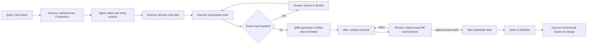

# openLifeWiki V1 Product Wireframes

- Status: executable product and interaction specification
- Date: 2026-07-27
- Audience: product, frontend, application-service and acceptance teams
- Requirements: [`requirements-v1.md`](../../requirements/requirements-v1.md)
- System design: [`design_doc-v1-progressive-scan-and-wiki.md`](design_doc-v1-progressive-scan-and-wiki.md)
- Red lines: [`core-red-lines.md`](../../product/core-red-lines.md)
- Acceptance: [`v1-journeys-and-oracles.md`](../../acceptance/v1-journeys-and-oracles.md)

## 1. Product Outcome

The Management Companion gives one Owner a calm, inspectable path from four bounded knowledge Sources to one approved Obsidian-compatible Wiki:

```text
see and authorize four real Connectors
-> choose an Agent
-> approve a bounded progressive scan
-> inspect Skeleton, Layer Summary and every child outcome
-> commit selected current evidence
-> review the proposed knowledge organization
-> approve the exact proposal
-> open the Formal Wiki in Obsidian
-> rescan only changed branches
```

The screen must answer four questions without requiring the Owner to understand protocol internals:

1. What can openLifeWiki access now?
2. How much of each approved Source has been discovered, understood, selected and committed?
3. Why did the Agent descend, skip, defer or request a decision at each layer?
4. What exact folders, pages, tags, links and Evidence will the next approval change?

A connected badge, a completed Agent call, a scan event or a proposal preview is intermediate state. The visible result is a useful approved Vault with navigable categories, controlled tags, links, provenance, freshness and known gaps.

## 2. Experience Principles

1. **Truth before polish.** Every status and ratio comes from the same application services used by the CLI and MCP. Fixture rows and UI-only estimates cannot appear in a live runtime.
2. **Progressive disclosure.** Show the current decision and next action first. Put hashes, provider receipts and diagnostics behind labeled details.
3. **One durable home per responsibility.** Source authorization and scanning live in Sources; exact Wiki approval lives in Review; dynamic visual judgment lives in Canvas.
4. **Human control at durable boundaries.** Authorization, scan-plan expansion and Wiki publication always show a concrete preview before an Owner confirmation.
5. **Minimum exposure.** Identity is redacted, Source bodies stay out of management screens, and credentials never render. Evidence previews show locators and concise permitted snippets only in Review.
6. **Recoverable work.** Pause, retry and resume state the checkpoint that will be reused. A failure never silently changes provider, Agent, scope, model or plan.
7. **Quiet utility.** Use dense labeled rows, restrained surfaces, 8px-or-less radii and familiar icons. Avoid a landing page, oversized headings, decorative cards and cards inside cards.
8. **Same truth at every width.** Mobile changes arrangement and navigation density. It never removes status, reason, approval hash access or a required recovery action.

## 3. Owner Journey



### Journey Position

Query carries the compact lifecycle overview because it is the default operational page. It displays one primary next action selected from this ordered list:

1. initialize;
2. resolve a blocked Connector;
3. authorize a missing Source scope;
4. verify or select an Agent;
5. review and start a scan plan;
6. answer a pending scan question;
7. recover or resume an interrupted scan;
8. compile a proposal;
9. review an exact proposal;
10. open the approved Wiki or run an incremental rescan.

The next-action label links to the durable page and focused object. It never executes approval directly.

## 4. Information Architecture

The fixed Companion has seven pages in this order:

| Page | Primary job | Primary action |
| --- | --- | --- |
| Query | Ask grounded questions and see journey position | Ask |
| Sources | Authorize Sources and run Progressive Scan | Review scan plan / Resume |
| Wiki | Inspect the active Vault and start compilation | Compile update / Open in Obsidian |
| Review | Judge one immutable WikiProposal | Approve exact proposal |
| Agent | Select and verify one Agent Core | Use this Agent |
| Canvas | Complete one task-bound visual judgment | Submit choice |
| Health | Diagnose components, storage, locks and recovery | Run check / Recover |

### Global Shell

- Header: product name; lifecycle state; health label; active operation indicator; refresh icon.
- Desktop navigation: persistent 216-228px left rail with icon and text for all seven pages.
- Mobile navigation: horizontally scrollable icon-and-text tab row under the 64-66px header. At 390px, icon labels remain visible; the row scrolls rather than shrinking text or overlapping controls.
- Main content: maximum 1180px, fluid width, one page heading, one contextual primary action.
- Global operation strip: appears under the header during a scan, compilation, publication or recovery. It shows operation name, state, elapsed time and a link to the owning page. It contains no Source body or model prompt.
- Notifications: short transient confirmation plus a persistent inline state at the affected object. A toast alone never represents success or failure.

### Desktop Shell Wireframe, 1440 x 900

```text
+--------------------------------------------------------------------------------------+
| openLifeWiki     ACTIVE | Health: attention     Scanning Feishu 38%          [refresh]|
+---------------+----------------------------------------------------------------------+
| Query         | Page title                                      [context action]      |
| Sources       | Optional status / next-action band                                    |
| Wiki          |----------------------------------------------------------------------|
| Review   (1)  |                                                                      |
| Agent         |                    PAGE WORKSPACE                                    |
| Canvas        |             max 1180px, scrolls vertically                           |
| Health        |                                                                      |
|               |                                                                      |
| v1.x          |                                                                      |
+---------------+----------------------------------------------------------------------+
```

### Mobile Shell Wireframe, 390 x 844

```text
+------------------------------------------+
| openLifeWiki    SCANNING        [refresh]|
+------------------------------------------+
| Query Sources Wiki Review Agent Canvas > |  horizontal scroll; text remains visible
+------------------------------------------+
| Page title                    [icon action]|
|------------------------------------------|
| Current status / next action             |
|------------------------------------------|
|                                          |
| Labeled single-column content            |
|                                          |
|------------------------------------------|
| [secondary]            [primary action]  |  sticky only for active approval/control
+------------------------------------------+
```

At 390px, page actions with familiar icons may collapse to icon-only buttons with tooltips and accessible labels. Approval, Start, Pause, Resume and Cancel retain visible text.

## 5. Sources Page

Sources is one workspace with three full-width bands: Connector truth, scan scope/progress, and Skeleton inspection. Progressive Scan does not add an eighth page.

### 5.1 Desktop Sources Wireframe, 1440 x 900

```text
+--------------------------------------------------------------------------------------+
| Knowledge Sources                                  [Check connections] [Review scan]  |
| 4 / 4 connected · Scope changes require approval · Revision 12                       |
+--------------------------------------------------------------------------------------+
| CONNECTORS                                                                            |
| Local Folder | connected | ~/Knowledge/**         | checked 2m | [scope] [details]   |
| GitHub       | connected | org/repo · main/docs   | checked 2m | [scope] [details]   |
| Feishu       | connected | profile · tenant · 8   | checked 1m | [scope] [details]   |
| Codex History| connected | 2 roots · 12 tasks     | checked 1m | [scope] [details]   |
+--------------------------------------------------------------------------------------+
| PROGRESS  Plan a91c · Skeleton b77d                       [Pause] [Cancel] [events]   |
| Scope          Discovery       Summaries       Selected scan       Committed index    |
| All Sources    480/620 77%     31/44 70%       86/120 72%          64/86 74%           |
| Local Folder   210/240 88%     14/16 88%       35/40 88%           35/35 100%          |
| GitHub         150/180 83%     9/12 75%        26/30 87%           20/26 77%           |
| Feishu         80/? open       5/9 56%         18/30 60%           9/18 50%            |
| Codex History  40/120 33%      3/7 43%         7/20 35%            0/7 0%              |
| Outcomes: skipped 18 · deferred 4 · blocked 1 · failed 0 · questions 1              |
+---------------------------------------+----------------------------------------------+
| SOURCE SKELETON                        | LAYER INSPECTOR                              |
| [All] [Local] [GitHub] [Feishu] [Codex]| Product strategy · Feishu                   |
| v Knowledge Sources                    | Direct children 8 · page complete           |
|   v Feishu                             | Summary                                      |
|     v Product strategy  [question 1]   | Documents cover roadmap, research and OKRs.  |
|       > Roadmaps       [descend]       |                                              |
|       - Old reports    [skip]          | Child outcomes                               |
|       - Private notes  [ask user]      | Roadmaps: descend · relevant to scan goal    |
|   > GitHub              [scanning]      | Old reports: skip · archived duplicate        |
|   > Codex History       [queued]        | Private notes: ask user · sensitive scope     |
|                                        | [Review question]                            |
+---------------------------------------+----------------------------------------------+
```

The four values in one Connector row are independent. The interface has no blended completion percentage. A header operation indicator may show the current Connector's active phase percentage and must name that phase, for example `Feishu discovery 38%`.

### 5.2 Connector Truth Band

The four rows always render in this stable order: Local Folder, GitHub, Feishu, Codex History. A missing provider remains visible.

Each row contains:

- Connector icon and product label;
- provider name and version;
- status icon plus `Connected | Login required | Missing | Blocked`;
- redacted identity/profile and, when relevant, tenant or account label;
- human-readable approved scope summary;
- last successful probe, last scan and changed-item count;
- `Set scope` or `Change scope`, `Revoke`, and `Details` actions as allowed.

`Details` opens a side sheet containing safe provider observations, authorization time, scope filters, sensitivity rules and the last blocking code. Provider commands, tokens, session values and raw error output never render.

#### Connector-Specific Scope Forms

| Connector | Required visible fields | Never shown |
| --- | --- | --- |
| Local Folder | selected root, include/exclude, symlink policy, sensitivity and budget | file bodies during preview |
| GitHub | host, owner/repository, ref, path filters, sensitivity and budget | `gh` token or auth-store path |
| Feishu | selected `lark-cli` profile, redacted user, tenant, selected document/wiki/base objects, sensitivity and budget | token, implicit shell profile or unrelated objects |
| Codex History | project roots and explicitly selected tasks, sensitivity and budget | account-wide history, local private state or login secret |

Submitting a scope form opens an exact preview dialog. The dialog presents old scope, new scope, removed access, added access, provider identity, estimated reconciliation impact and a short approval identifier. Added scope receives the strongest visual emphasis. The Owner then selects `Approve scope`. Revocation names the Source and states that new reads stop immediately and current evidence reconciliation will be queued.

### 5.3 Scan Scope And Control

With no plan, this band shows scan intent, Connector selection, per-branch indexing disposition, sensitivity and budgets. `Review scan plan` creates a preview with:

- exact four Connector scopes and Source IDs;
- selected Agent and invocation mode;
- scan intent;
- maximum nodes, body bytes and Agent calls;
- `qmd-current | metadata-only | excluded` disposition per eligible branch;
- known sensitive or ambiguous roots;
- plan identifier and input version.

`Start scan` becomes available only after exact Owner approval and successful Connector/Agent probes.

During a plan, the control row contains:

- `Pause`: stops scheduling after the current atomic unit, removes body-bearing scratch and retains reusable checkpoints;
- `Resume`: previews any changed authorization, version or plan input before continuing;
- `Cancel`: states which completed commits remain valid and which work will stay incomplete;
- `Retry failed`: names failed items and uses the same plan/input unless a new plan is approved;
- `Incremental scan`: appears after provider changes are detected and previews only invalidated branches;
- `Events`: opens monotonic progress events and denominator changes in a side sheet.

Controls show an in-button spinner during their own request. The rest of the page stays readable. Only the affected conflicting mutations are disabled.

### 5.4 Four-Dimension Progress

The first row is `All Sources`; four following rows show the four Connectors. Each row contains these columns:

1. Discovery;
2. Layer summaries;
3. Selected scan;
4. Committed index.

Every cell includes `numerator / denominator`, an optional percentage, a 4px progress bar and a text state. Percentages appear only when the denominator is known and nonzero.

| Condition | Required rendering |
| --- | --- |
| Known denominator | `42 / 60 · 70%` plus progress bar |
| Unknown/open denominator | `42 / ? · still discovering`, animated neutral track, no percentage |
| Zero denominator | `0 / 0 · no selected work`, empty track, no percentage |
| Complete ratio with blocker | `60 / 60 · complete` plus adjacent `1 blocked`; overall remains incomplete |
| Denominator changed | new count plus `+12 discovered` event linked to Events |
| New plan/version | reset affected cells with `Plan changed`; old ratio remains in receipt history only |

Below the matrix, always show counts for Skipped, Deferred, Blocked, Failed, Unknown and Questions. Clicking a count filters the Skeleton tree. The plan and Skeleton short identifiers are inspectable in `Details`; the primary surface says `Current scan plan` and `Source map version`.

### 5.5 Skeleton Tree

The left pane is a metadata-only tree. It supports keyboard navigation, Connector tabs, outcome filters and locator search. Rows have stable height and contain:

- disclosure chevron for an enumerated or selectable container;
- type icon;
- title;
- body-free metadata such as child count, modified range or page-open marker;
- text-and-icon outcome: `Queued`, `Discovering`, `Descend`, `Skip`, `Defer`, `Needs decision`, `Blocked`, `Failed`, `Selected`, `Indexed`;
- retry icon only for a retryable failed node.

Expanding an unvisited container does not trigger an unauthorized read. When the current plan allows enumeration, the row displays `Discover this level`; selecting it creates the bounded action through the scan control plane. Skipped or deferred rows do not reveal invented children.

Pagination is explicit. A partially enumerated container ends with `Load next metadata page`; the row stays open-ended until the provider reports page completion.

### 5.6 Layer Inspector

Selecting a container opens the right pane with:

- Source and breadcrumb;
- current metadata coverage and page state;
- concise Layer Summary, labeled `Temporary summary` while active;
- one visible outcome for every direct child;
- Agent name, reason and estimated cost for each Agent outcome;
- separate system outcomes for permission-blocked children;
- summary, child-set and input identifiers under `Technical details`;
- pending Owner question or recovery action.

Durable history can show the Layer Summary's hash and the decision reasons. After scratch deletion it displays `Summary text removed after decision` and never reconstructs text from a log.

### 5.7 Ask-User Interaction

A pending question appears in three places: the page heading count, the affected tree row and the Layer Inspector. Opening it shows:

- what exact child is affected;
- why the Agent cannot continue;
- whether the issue is scope, sensitivity, budget or ambiguity;
- estimated additional nodes, bytes and Agent calls;
- safe choices such as `Allow this child`, `Keep excluded`, `Defer`, or a bounded category selection;
- the resulting scope/plan change and new approval identifier.

The choice uses radios, checkboxes, a segmented control or bounded numeric input according to the decision type. Free-form text can clarify intent but cannot grant authorization. Dismissing leaves the item unresolved and the scan incomplete.

### 5.8 Mobile Sources Wireframe, 390 x 844

```text
+------------------------------------------+
| Knowledge Sources              [refresh] |
| 4 / 4 connected · Scan running           |
+------------------------------------------+
| [Connections] [Progress] [Skeleton]      | sticky segmented view selector
+------------------------------------------+
| PROGRESS · All Sources                   |
| Discovery        480 / 620 · 77%         |
| [======================-------]          |
| Layer summaries   31 / 44 · 70%          |
| [=====================--------]          |
| Selected scan     86 / 120 · 72%         |
| [=====================--------]          |
| Committed index   64 / 86 · 74%          |
| [======================-------]          |
| Skipped 18 · Deferred 4 · Blocked 1      |
| Questions 1                               |
|------------------------------------------|
| Connector [All Sources              v]   |
| Current: Feishu / Product strategy       |
| Summary: Roadmaps, research and OKRs...  |
|------------------------------------------|
| v Product strategy        Needs decision |
|   > Roadmaps              Descend        |
|   - Old reports           Skip           |
|   ! Private notes         Needs decision |
+------------------------------------------+
| [Pause]                         [Cancel]  |
+------------------------------------------+
```

At 390px, Connections, Progress and Skeleton are views of the same live workspace. They preserve selection and filters when switching. Connector progress uses a selector and one four-cell vertical stack; horizontal tables are forbidden. A selected tree row opens the Layer Inspector as a full-height sheet with a visible close button and sticky question actions.

## 6. Wiki Page

Wiki presents the approved durable result. It never renders current Source bodies or an unapproved candidate as active knowledge.

### Desktop Wiki Wireframe

```text
+--------------------------------------------------------------------------------------+
| Wiki                                      [Compile update] [Open in Obsidian]          |
| Published 27 Jul 2026 · 86 Concepts · Vault healthy · Generation qmd-018             |
+---------------------------+----------------------------------------------------------+
| VAULT DIRECTORY           | OVERVIEW                                                 |
| v Business                | 2 top-level domains · 7 subcategories                   |
|   v Strategy              | 14 controlled tags · 96 links · 3 known gaps            |
|     index.md              | Provenance: Local · GitHub · Feishu · Codex              |
|     Decision principles   |                                                          |
| v Product                 | FRESHNESS                                                 |
|   v Research              | Fresh 73 · Due soon 8 · Stale 5                         |
|     index.md              |                                                          |
|                           | GRAPH HEALTH                                             |
|                           | Linked 82 · Orphans 4 · Broken 0 [Open graph report]      |
+---------------------------+----------------------------------------------------------+
```

### Required Areas

- **Vault header:** path, publication time, active Evidence generation, Concept count, validation status and `Open in Obsidian`.
- **Directory browser:** approved primary folders, subfolders, `index.md` and Concepts. Selecting a Concept shows title, description, controlled tags, aliases, freshness, links and provenance locators.
- **Tag browser:** hierarchical controlled tags grouped by `domain/`, `source/`, `status/` and approved extensions. Selecting a tag filters Concepts without moving files.
- **Graph health:** link/backlink counts, cross-Connector relationships, orphan count and broken-link report. A lightweight graph preview may live in Canvas; the durable report stays on Wiki.
- **Provenance:** coverage for all four Connector types, freshness and known gaps. Locators are resolvable through authorized product actions and redact provider secrets.
- **Compile entry:** previews frozen generation, selected Agent and candidate scope before starting. Existing Formal Wiki remains active throughout compilation.

Empty Wiki state shows the required previous step: `Commit selected evidence before compiling a Wiki`. It links to Sources and displays no decorative empty-state illustration.

On mobile, the directory becomes a full-width list; Concept details open in a sheet. Summary metrics wrap into two labeled columns. `Open in Obsidian` and `Compile update` remain visible without overlapping the page title.

## 7. Review Page

Review is an immutable judgment surface for one proposal. It cannot edit the candidate inline. Any semantic correction returns to proposal generation with the Owner's rejection reason.

### Desktop Review Wireframe

```text
+--------------------------------------------------------------------------------------+
| Review proposal #18                  Evidence gen qmd-018 · Agent Codex · checks pass |
| Base Wiki 7c31 · Proposal a81f                              [Reject] [Approve exact]   |
+--------------------------------------------------------------------------------------+
| [Directory 12] [Files 34] [Tags 8] [Links 6] [Evidence] [Quality]                    |
+---------------------------------------+----------------------------------------------+
| CHANGE LIST                           | EXACT DIFF / EVIDENCE                         |
| + Business/Strategy/                  | Move Product notes                           |
| + Business/Strategy/index.md          | from Inbox/product-notes.md                  |
| > Product notes                       | to   Business/Strategy/product-notes.md       |
| ~ domain/product -> domain/strategy   |                                              |
| + link: Product roadmap               | - old line                                   |
|                                       | + approved line [1]                          |
|                                       | Evidence                                     |
|                                       | [1] Feishu · Roadmap · current · open        |
+---------------------------------------+----------------------------------------------+
| 0 broken links · 4 orphans · 3 known gaps        [Reject] [Approve exact proposal]   |
+--------------------------------------------------------------------------------------+
```

### Review Modes

| Tab | Required content |
| --- | --- |
| Directory | folders and `index.md` create/update/move/delete; before/after tree |
| Files | Concept create/update/move/delete; stable `page_uid`; frontmatter and body line diff |
| Tags | added/removed/renamed controlled tags and affected Concepts |
| Links | added/removed links, backlink impact, cross-Connector relationships, orphan/broken-link report |
| Evidence | every material change mapped to current authorized provenance, freshness and known gaps |
| Quality | citation, freshness, link, lint, eval, OKF v0.2 and Obsidian Profile results |

Change lists use icons plus `Create`, `Update`, `Move`, `Delete`; color is secondary. Evidence previews default to locator, title, freshness and supported claim. A permitted minimal snippet is collapsed and labeled. There is no prompt, token, full Source body or provider raw output.

### Exact Approval

The sticky approval footer shows:

- change counts and unresolved quality gaps;
- human labels for current Evidence generation, base Wiki and proposal;
- inspectable full hashes under `Technical details`;
- `Reject` and `Approve exact proposal`.

`Approve exact proposal` opens a final dialog that repeats changed folder/file/tag/link counts, known gaps and the short proposal/base identifiers. The action is disabled while required checks fail. Approval rechecks both hashes and the Owner lease server-side.

Failure behavior:

- changed Formal Wiki: `Wiki changed since review`; refresh creates a new base comparison;
- changed proposal/Evidence: `Proposal changed`; prior approval cannot replay;
- second session lease: page remains readable; approval says who/when the lease began without exposing secrets;
- publication failure: Formal Wiki stays byte-identical; Review links to recovery status;
- rejection: reason is required, candidate closes, Formal Wiki stays byte-identical.

On mobile, tabs scroll horizontally and the list/detail split becomes list then full-height detail sheet. The approval footer uses two equal-width buttons and never covers the last diff row; content receives matching bottom padding.

## 8. Agent Page

The page presents six compatible Agent choices in two clearly separated runtime groups.

### Agent Selection Wireframe

```text
+--------------------------------------------------------------------------------------+
| Agent Core                                             Selected: Codex · Native CLI  |
| One Agent handles scan decisions, query and Wiki semantics. No automatic fallback.   |
+--------------------------------------------------------------------------------------+
| LOGGED-IN COMMAND LINE                                                            |
| (*) Codex       connected · v... · existing login             [Check] [Use]          |
| ( ) Claude Code login required                                 [How to install]       |
| ( ) Gemini      connected · v...                               [Check] [Use]          |
| No Base URL or token fields appear in this group.                                    |
+--------------------------------------------------------------------------------------+
| HOSTED RUNTIME                                                                        |
| ( ) Pi          installed · provider profile: local-default     [Check] [Use]          |
| ( ) OpenClaw    missing                                      [How to install]          |
| ( ) Hermes      provider blocked                             [View diagnosis]          |
| Provider, model and credential reference come from host config.json.                 |
+--------------------------------------------------------------------------------------+
| Last validation: canonical Skill + shared schemas passed · [View safe receipt]        |
+--------------------------------------------------------------------------------------+
```

### Runtime Boundaries

| Mode | Agents | Configuration visible in knowledge workspace | Probe |
| --- | --- | --- | --- |
| Native CLI | Codex, Claude Code, Gemini | binary/version and redacted login state only | invoke installed public CLI using its existing login |
| Hosted runtime | Pi, OpenClaw, Hermes | provider profile name, BaseURL host, model and credential-reference name from host config | resolve credential through host store and probe selected runtime |

Native rows never show BaseURL, API token or credential-reference fields. Hosted rows link to `Host settings`, an Owner-only sheet backed by the single host `config.json`; the credential value remains outside openLifeWiki and cannot be viewed or pasted here.

Each row includes official install/help URL, installed version, status, last probe and exact failure class. `Use this Agent` previews the mode, driver version and impact on pending plans. Changing Agent invalidates affected unstarted or incompatible plan inputs and never falls back silently.

Mobile renders one full-width row per Agent. Mode boundaries remain headings, and actions wrap below status with 40px minimum height.

## 9. Query, Canvas And Health Supporting Pages

### Query

- lifecycle position and one next action;
- question composer with optional raw-exposure toggle off by default;
- evidence mode label: Grounded, No evidence, Partial evidence or Conflicting evidence;
- material claims with resolvable citations and active-generation label;
- explicit inference, freshness and coverage gaps;
- Visitor sees only query controls and results; Admin journey controls link to durable pages.

### Canvas

- one originating task, title and revision;
- minimum redacted visual payload for that judgment;
- only the allowed events for the current screen;
- submit returns to the originating durable page;
- expired, replayed or mismatched events show `This visual task expired` and a return action;
- no lifecycle state, Source body, proposal truth or authorization persists only in Canvas.

This follows the Superpowers Visual Companion interaction principle: use a temporary browser surface when spatial comparison helps, record the bounded human choice, then return control to the fixed product page. Text-only scope and approval flows stay on their durable pages.

### Health

- component name, expected/actual version and public-contract status;
- active QMD generation and last positive/negative probes;
- storage audit: active generation, temporary scratch, prior-generation deletion and Wiki path;
- session and mutation leases;
- recovery-required actions with preview;
- update and uninstall previews; default uninstall explicitly preserves the Formal Wiki;
- downloadable redacted receipts, never raw commands, errors, credentials, prompts or Source bodies.

## 10. Common States And Recovery

Every workspace section implements the following states locally. A full-page blocking layer is reserved for startup session validation and atomic final publication.

| State | Visible behavior | Available action |
| --- | --- | --- |
| Loading | existing layout skeleton with stable dimensions; section label says what is loading | Cancel only when a cancellable operation exists |
| Empty | factual reason plus prerequisite | one link to the required previous step |
| Connected/ready | timestamped status and allowed next action | context action |
| Waiting for Owner | named question, exact affected object and cost/scope impact | answer, keep excluded or defer |
| Paused | checkpoint time, retained progress and changed-input warning | Resume or Cancel |
| Blocked | safe blocking reason and affected scope; unrelated Sources remain usable | Fix scope/login, retry probe or view diagnosis |
| Failed | failed atomic unit, preserved stable state and retry boundary | Retry same input, or review a new plan |
| Cancelled | retained commits, discarded scratch and remaining incomplete work | Start incremental/new plan |
| Recovery required | last proven stable hash/state and recovery preview | Review recovery plan |
| Stale browser | current action rejected; refreshed truth replaces stale controls | Review current state |

Errors follow these display rules:

1. use a human heading and a stable safe code;
2. state which Source, phase or proposal is affected;
3. state what remained unchanged;
4. provide the next bounded action;
5. put provider-safe metadata under details;
6. omit raw error text when it may contain content, credentials or command arguments.

## 11. Component And Interaction Specification

| Component | Contract |
| --- | --- |
| Status label | icon + text + optional safe reason; never color alone |
| Progress cell | fixed label/count/bar/state height; unknown and `0/0` have explicit text |
| Connector row | one semantic row per provider; dense desktop grid, labeled mobile stack |
| Tree row | stable indentation and row height; chevron changes disclosure only; selection opens inspector |
| Outcome label | one of Descend, Skip, Defer, Needs decision, Blocked, Failed, Selected, Indexed with icon and reason access |
| Side sheet | details or bounded editing; traps focus; Escape closes only when no approval is in flight |
| Preview dialog | immutable action list, exact scope/diff and approval identifier; confirm action requires current digest |
| Approval footer | sticky within Review/ask-user sheet; reserves content space; remains keyboard reachable |
| Segmented control | switches modes or mobile subviews; never represents a command |
| Icon button | familiar icon, 38-40px target, tooltip and accessible label |
| Event list | monotonic sequence, time, Source, phase and body-free fact; reconnect resumes from cursor |

### Interaction Rules

- Refresh preserves current page, filters, expanded tree nodes and selected object when those IDs still exist.
- Deep links use page plus safe object ID, for example Sources focused on one pending question or Review focused on one file diff.
- Browser Back closes a sheet before leaving the page.
- Destructive actions use explicit text and a preview. Undo is offered only when a real inverse operation exists.
- Search and filters never alter scan scope; they alter display only.
- Tree expansion and detail selection are visually distinct from `Discover this level` and `Descend` operations.
- Timestamps show relative time with exact local time in tooltip/details.
- Long paths, repository names, Feishu titles and tags wrap at natural boundaries; middle truncation requires a tooltip and copy action.

## 12. Responsive And Accessibility Contract

### Breakpoints

- `>= 1024px`: persistent rail; Sources and Review use a 38/62 or 42/58 resizable split with minimum 320px panes.
- `821-1023px`: compact rail; split panes remain when each can retain 300px.
- `<= 820px`: top scroll navigation; one content column; split detail becomes a sheet.
- `<= 470px`: 14px page gutters; actions stack or use icon-only form where specified; approval commands retain text.

### No-Overlap Rules

1. No fixed-width data column may force horizontal page scrolling at 390px.
2. Sticky header, navigation and approval footer heights contribute to scroll padding.
3. Dialogs use at most `calc(100vh - 24px)` with an independently scrolling body and fixed actions.
4. Progress labels and values wrap within their own rows; bars retain fixed width constraints.
5. Tree depth beyond the mobile indentation budget collapses earlier ancestors into a breadcrumb.
6. Long unbroken locators use `overflow-wrap:anywhere`; hashes use middle truncation plus full copy access.
7. Loading labels and status changes cannot resize primary controls.

### Accessibility

- keyboard order follows visual order;
- tree implements tree/treeitem semantics, arrow navigation and expanded state;
- tabs and segmented controls expose selected state;
- live progress announces phase transitions and questions, not every counter tick;
- focus moves to a new blocking question, failed action or opened sheet heading;
- status, diff and outcome meaning always use text plus icon;
- touch targets are at least 40px; body text remains at least 12px in compact operational areas and 14px for reading content;
- reduced-motion mode disables indeterminate shimmer and uses a static `still discovering` label.

## 13. Privacy And Permission Presentation

The UI may display:

- provider and version;
- redacted identity/profile and tenant/account label;
- approved roots, repositories, refs, paths, Feishu object counts/labels and explicit Codex project/task scope;
- Source metadata, body-free Layer Summary while scratch exists, decisions, reasons, ratios, hashes and redacted receipts;
- approved Wiki synthesis and permitted minimal Evidence snippets in Review.

The UI must never display or include in DOM, browser storage, URLs, downloads or telemetry:

- tokens, cookies, session secrets, credential values or credential-store locations;
- full prompts, Agent private reasoning or raw tool/provider output;
- Source body in Skeleton, progress, diagnostics, events or Connector details;
- unapproved sensitive snippets;
- account-wide Codex history or Feishu objects outside approved scope.

Visitor sessions hide Admin navigation actions and receive server-side denial for direct mutation requests. Admin sessions can manage plans and candidates. Durable Wiki publication still requires the exact Owner approval.

## 14. Implementation Order

1. Extend the current shell to seven routes while retaining its visual tokens and loopback session model.
2. Keep the existing four-Connector authorization UI and add deep-linked safe details.
3. Add Sources scan-plan preview, four-dimensional progress model and event replay.
4. Add Skeleton tree, Layer Inspector, ask-user sheet and pause/resume/cancel/retry controls.
5. Add Agent selection with native and hosted runtime groups.
6. Add Wiki browser and health reports over the published Vault contract.
7. Add immutable Review tabs, exact approval and stale-hash recovery.
8. Add Query journey position and Canvas handoff.
9. Verify desktop and mobile against real application state and the full Owner journey.

This order reuses the existing Companion shell, authorization dialogs, application services, Lucide-style icon assets, session/origin controls and preview/execute interaction. New owned UI remains limited to scan truth, Agent selection, Wiki browsing and exact proposal review where no upstream product surface satisfies the openLifeWiki contracts.

## 15. Product Acceptance Checklist

The implementation is ready for full local acceptance only when all answers below are yes:

- Can the Owner see Local Folder, GitHub, Feishu and Codex History together with real provider, version, redacted identity, exact scope and status?
- Can the Owner preview, approve, narrow and revoke every Connector without exposing a credential?
- Does initial discovery show direct-child metadata while selected-leaf body counters remain zero?
- Does every visited layer show a temporary summary or its durable hash, plus one explainable outcome per direct child?
- Can the Owner resolve scope, sensitivity, budget and ambiguity questions without hidden expansion?
- Do all-Source and per-Connector views independently show Discovery, Layer summaries, Selected scan and Committed index with truthful unknown and `0/0` states?
- Can the Owner Pause, Resume, Cancel and Retry while seeing exactly what will be reused or discarded?
- Does the Wiki show useful folders, subfolders, `index.md`, controlled hierarchical tags, standard links, all-four provenance, freshness and known gaps?
- Does Review show directory, file, tag, link and Evidence diffs plus quality results before exact approval?
- Does rejection or stale approval leave the Formal Wiki byte-identical?
- Can the Owner open the published folder directly in Obsidian and use Properties, tags, aliases, backlinks and Graph without a required plugin?
- Do native Agent rows use existing CLI login with no BaseURL/token field, while hosted runtimes use only host-configured provider references?
- Do loading, empty, blocked, failed, cancelled, stale-session and recovery states keep the last stable truth visible and offer one bounded next action?
- At 1440x900 and 390x844, is all required content readable and operable with no overlap, clipped command or hidden approval state?

These checks complement the executable business journeys. They do not replace the real live-Connector, no-reset, recovery and Obsidian-human acceptance suites.
