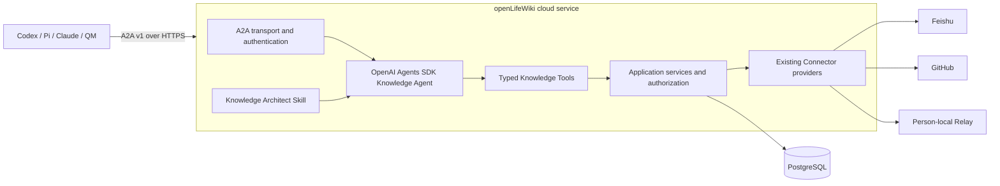

# openLifeWiki Cloud Knowledge Agent V2 Design

- Status: proposed; no implementation authority until written review is approved
- Date: 2026-08-15
- Audience: product owner, architecture owner, implementation team and acceptance reviewers
- Scope: single-organization, multi-user cloud knowledge center
- Current authority retained: `requirements-v1.md`, `ARCHITECTURE.md` and the active V1 design
- Decision owner: openLifeWiki Owner

## 1. Executive Decision

openLifeWiki V2 is one cloud-hosted Knowledge Agent that is the sole product entry for
querying, registering, storing and organizing knowledge. External agents communicate
with it through A2A v1. The service uses OpenAI Agents SDK for the agent loop, the
existing openLifeWiki domain and Connector contracts for controlled knowledge access,
and PostgreSQL as its only durable database.

The P0 runtime has three components:

1. one Node.js `openLifeWiki` cloud service;
2. one PostgreSQL instance;
3. an optional `openlifewiki relay` process on a person's computer when that person
   registers local-only knowledge.

P0 does not add MCP, Codex SDK, Pi, Redis, a separate worker, object storage, a vector
database, cloud QMD or a separate administration UI. Those components require a
measured trigger defined in this document before introduction.

## 2. Problem And Outcome

### 2.1 Problem

The current product is local-first and organized around one local Owner, file-backed
configuration and scan state, a locally authenticated Codex CLI, QMD stdio MCP and an
approved Formal Wiki. That shape cannot provide one cloud knowledge registry to many
users and agents.

### 2.2 Product Outcome

One organization can register knowledge once and let authorized users and agents find,
retrieve, store and organize it through one Knowledge Agent. A registered item may
remain in Feishu, GitHub or a person's computer, or it may be managed Markdown stored
by openLifeWiki.

The central registry answers all of the following:

- what the knowledge item is;
- where every known copy or origin is located;
- who owns it and who may use it;
- how it was produced and which version is current;
- when it was last verified;
- whether a local-only location is currently reachable.

### 2.3 Users

| Actor | Responsibility |
| --- | --- |
| Organization Owner | bootstraps the deployment, manages membership and approves high-impact changes |
| Member | registers, queries and manages knowledge within granted scopes |
| External Agent | acts for a Member through a bounded delegation and A2A |
| Knowledge Agent | provides the only query/register/store/organize product entry |
| Local Relay | advertises presence and retrieves explicitly authorized local knowledge |

## 3. Design Principles

1. One public agent entry: A2A reaches the Knowledge Agent and no caller reaches a
   Connector, database or index directly.
2. Registry first: knowledge identity and location are separate records.
3. Location independence: one logical knowledge item can have multiple locations.
4. Least authority: user, agent and delegation permissions are intersected for every
   operation.
5. Draft before durable semantic change: organization and overwrite operations produce
   immutable proposals and require hash-bound approval.
6. Provenance and freshness are product data, not optional search metadata.
7. Preserve proven V1 controls: exact Source authorization, canonical hashes, receipts,
   compare-and-swap and fail-closed behavior remain.
8. Add infrastructure only after a measured limit is reached.

## 4. Scope

### 4.1 P0 Scope

- one organization per deployment;
- multiple human users and delegated external agents;
- A2A v1 over HTTPS with streaming task updates;
- OpenAI Agents SDK as the only agent runtime;
- PostgreSQL registry, Markdown storage, permissions, sessions, tasks and audit;
- managed Markdown, Feishu, GitHub and person-local locations;
- query, register, store and organize capabilities;
- Knowledge Architect Skill in bootstrap and refactor modes;
- current openLifeWiki Connector contracts reused behind application services;
- CLI bootstrap, token management and local relay operation;
- current V1 local path retained as a compatibility path.

### 4.2 Non-Goals

- multi-organization SaaS;
- public MCP access;
- multiple agent runtimes in the first release;
- direct autonomous deletion or publication;
- binary asset management;
- real-time collaborative editing;
- semantic vector search as a completion requirement;
- cloud migration of QMD;
- a new web administration product;
- horizontal service scaling;
- automatic copying of existing external or local Source bodies.

## 5. Target Architecture



### 5.1 Runtime Boundary

The Node.js process owns HTTP, A2A handling, authentication, the Agents SDK run loop,
tool dispatch, Connector orchestration and an in-process durable task runner. Task state
is persisted in PostgreSQL before work begins. PostgreSQL advisory locks prevent two
process instances from claiming the same task, even though P0 deploys one process.

The hosting platform supplies TLS termination. It is deployment infrastructure and not
an openLifeWiki application component.

## 6. Public A2A Surface

P0 pins `@a2a-js/sdk` `1.0.1` and exposes JSON-RPC over HTTPS plus SSE streaming. The
Agent Card advertises four skills:

| A2A skill | Product behavior |
| --- | --- |
| `knowledge.query` | return a grounded answer, citations and explicit gaps |
| `knowledge.register` | register a logical item and one or more locations |
| `knowledge.store` | create a managed Markdown draft or a new approved version |
| `knowledge.organize` | propose or apply an approved knowledge architecture change |

Natural-language A2A messages are accepted. Deterministic clients may include an
`openlifewiki.operation/v1` structured data part. Both routes call the same typed
application operations.

A2A task states map to product states as follows:

| Product condition | A2A state |
| --- | --- |
| accepted but not executing | submitted |
| agent or tool execution active | working |
| exact approval or local Owner response required | input-required |
| final artifact persisted | completed |
| terminal validated failure | failed |
| caller cancellation settled | canceled |

The final Artifact carries a versioned openLifeWiki result object. A natural-language
summary may accompany it, but it is not the machine contract.

## 7. Agent Harness

P0 pins `@openai/agents` `0.16.0`. The SDK owns the agent loop, repeated tool calls,
streaming, resumable state, approval pauses and tracing. openLifeWiki owns all domain
tools, authorization and durable business state.

The deployed model ID is required through `OPENLIFEWIKI_MODEL`. Startup fails when it
is absent. Model choice is deployment configuration and is independent of the public
A2A and knowledge contracts.

The Knowledge Agent receives only these tools:

| Tool | Authority |
| --- | --- |
| `knowledge_search` | permission-filtered Registry and managed-body search |
| `knowledge_get` | retrieve one authorized location/version with citations |
| `knowledge_register` | register metadata and locations within the actor's grant |
| `knowledge_store_draft` | persist a bounded managed-Markdown draft |
| `knowledge_list_locations` | inspect authorized locations and availability |
| `knowledge_request_local` | create a request for an online or offline Local Relay |
| `knowledge_propose_architecture` | create an immutable organization proposal |
| `knowledge_apply_approved_plan` | apply an exact approved proposal by CAS |

No Agent tool accepts SQL, an arbitrary process command, an unrestricted path or a raw
Connector request. Tool implementations require an `AccessContext`; there are no
unscoped repository methods exposed to the Agent.

P0 does not install Codex SDK. A future Codex specialist must meet an expansion trigger
in Section 17 and operate only on a temporary staging workspace.

## 8. Knowledge Architect Skill

The canonical Skill lives at:

```text
skills/openlifewiki-knowledge-architect/SKILL.md
```

It has two explicit modes:

### 8.1 Bootstrap Mode

Given an authorized set of knowledge, propose an initial folder/taxonomy model, tags,
aliases, indexes, provenance rules and freshness expectations. The result is a proposal;
no durable organization change occurs during generation.

### 8.2 Refactor Mode

Given an existing architecture and authorized evidence, propose moves, merges, splits,
tag normalization, stale-item handling and index changes. Every action names its source
item/version and expected current revision.

Both modes emit `openlifewiki.knowledge-architecture-proposal/v1`. Application requires
an approval receipt bound to `proposalHash` and `baseRegistryRevision` before applying
the plan.

## 9. Identity, Delegation And Authorization

P0 uses one organization row but stores `org_id` on every owned record so a later
multi-organization version does not require contract replacement.

### 9.1 Principals

Principal types are `user`, `agent` and `relay`. Organization roles are `owner` and
`member`; agents and relays receive capabilities through grants and delegation.

Every authenticated A2A operation resolves this context:

```json
{
  "orgId": "org_default",
  "actorAgentId": "principal_agent_123",
  "onBehalfOfUserId": "principal_user_456",
  "delegationId": "delegation_789",
  "taskId": "task_abc"
}
```

Effective permission is the intersection of:

1. the human user's resource grant;
2. the agent principal's operation grant;
3. the active delegation's operation, resource and expiry bounds.

Missing or expired context denies the operation. A tool cannot expand this context.

### 9.2 Authentication

The CLI bootstraps the first Owner. P0 issues random 256-bit bearer tokens to users,
agents and relays. A token is displayed once; PostgreSQL stores only an HMAC-SHA-256
digest using a deployment secret. The A2A Agent Card declares HTTP Bearer
authentication.

Agent tokens require a delegation to a human user. Relay tokens are bound to one user
and one registered device. Token rotation and revocation take effect before the next
operation.

### 9.3 Default Visibility

New knowledge is Owner-only by default. Organization read access requires an explicit
grant. External location authorization never implies organization visibility.

## 10. PostgreSQL Data Model

P0 targets PostgreSQL 17 and uses `pg` plus ordered SQL migrations. It introduces no
ORM. The deployment enables `pg_trgm`; this is a PostgreSQL extension, not another
service.

| Table | Purpose |
| --- | --- |
| `organizations` | one deployment organization |
| `principals` | users, external agents and Local Relays |
| `principal_tokens` | revocable bearer-token digests and expiry |
| `delegations` | agent-to-user authority, scopes and expiry |
| `connector_instances` | configured Feishu, GitHub and Local Relay instances |
| `source_authorizations` | exact approved Connector scopes and approval receipts |
| `knowledge_items` | stable logical knowledge identity, owner, title and status |
| `knowledge_locations` | one or more managed or external locations for an item |
| `knowledge_versions` | version, body hash, provenance, freshness and optional Markdown body |
| `tags` | controlled organization tag definitions |
| `knowledge_tags` | version-aware item/tag membership |
| `resource_grants` | principal permission on items, sources and tag scopes |
| `presence_leases` | Local Relay heartbeat, capability and expiry |
| `agent_sessions` | Agents SDK continuation and replay state |
| `agent_tasks` | A2A/product task state, revision, input and output references |
| `audit_events` | append-only actor, action, target, decision and receipt metadata |

### 10.1 Knowledge And Location

`knowledge_items` identifies a conceptually stable item. `knowledge_locations` answers
where it exists. One item may have multiple locations with roles `canonical`,
`original`, `managed-copy` or `reference`.

Location kinds are:

- `managed-markdown`;
- `feishu`;
- `github`;
- `person-local`.

A location stores a safe locator, Connector reference, owner principal, access mode,
observed provider version and availability. A person-local location also stores the
required Relay principal.

### 10.2 Managed Markdown

Managed Markdown is stored in `knowledge_versions.body_markdown`. P0 accepts at most
1 MiB of UTF-8 Markdown per version. Larger content remains external and is registered
by location. Each version stores its SHA-256 body hash and immutable provenance.

### 10.3 Search

Search applies permission filters in SQL before returning candidates. It combines:

- exact item IDs, locators, tags and aliases;
- PostgreSQL full-text search for tokenized text;
- `pg_trgm` similarity for titles and multilingual Markdown;
- freshness and availability filters.

The result remains candidate evidence. The Agent must return citations matching exact
item, location and version IDs. Existing `openlifewiki.agent-query-result/v1` semantics
remain the starting query-result contract.

### 10.4 Concurrency

Mutable records carry a monotonic `revision`. Writes use `UPDATE ... WHERE revision =
$expected` and fail with `REVISION_CONFLICT` when no row changes. Task claims use
PostgreSQL advisory locks. Audit rows and approved proposal artifacts are append-only.

## 11. Connector Boundaries

The existing `ProgressiveConnectorProvider` contract remains the long-term Connector
boundary. Cloud P0 first reuses provider probing and approved body reads. Progressive
scan migration follows after the core cloud query/register path passes acceptance.

Connector rules remain:

- only approved Source scopes may be probed or read;
- provider credentials are deployment secret references, never Registry values;
- external bodies are fetched on demand and are not copied by registration;
- every returned body is bound to Source, node, provider version and authorization;
- local knowledge requires an active Relay plus exact Owner-approved scope.

## 12. Local Relay

The existing CLI gains:

```text
openlifewiki relay register
openlifewiki relay run
openlifewiki relay status
openlifewiki relay revoke
```

The Relay initiates outbound HTTPS to the cloud, so no inbound home-network port is
required. It renews a bounded `presence_leases` row and polls for requests addressed to
its principal. A request includes the exact authorized Source, node/version target and
task-bound capability.

When the Relay is offline, the task enters `input-required` with reason
`LOCAL_SOURCE_OFFLINE`. It remains durable until its expiry. When the Relay returns, it
claims the request, performs the existing body-read gate and returns a hash-bound
artifact. The cloud service then resumes the same Agents SDK run.

## 13. Core Workflows

### 13.1 Query

```text
A2A message
-> authenticate and resolve delegation
-> persist task
-> Agents SDK run
-> knowledge_search
-> permission-filtered candidates
-> knowledge_get for selected evidence
-> Connector or managed body read
-> validated cited answer artifact
-> completed task
```

No evidence produces an explicit no-evidence result. Missing authorization produces a
gap without revealing hidden item metadata. Offline local evidence produces a durable
input-required task or a partial-evidence answer when the caller allows partial results.

### 13.2 Register

Registration creates or links a logical item and location. It does not read the body
unless the request separately authorizes ingestion. Duplicate locators resolve to the
existing location. A suspected duplicate item is returned as a conflict candidate and
requires a user choice before merging identities.

### 13.3 Store

Store creates a managed Markdown draft. A new item may be committed by an authorized
writer. Replacing an existing stable version requires an exact preview and CAS. Semantic
organization changes are handled through Organize.

### 13.4 Organize

The Knowledge Architect Skill reads only authorized items, creates an immutable
proposal and pauses the task for approval. Approval binds the proposal hash and base
Registry revision. Apply runs deterministic validation and one database transaction.

## 14. Error And Recovery Model

Stable error codes include:

| Code | Meaning |
| --- | --- |
| `AUTHENTICATION_REQUIRED` | token missing, invalid, expired or revoked |
| `DELEGATION_DENIED` | user/agent/delegation intersection does not permit the operation |
| `SOURCE_AUTHORIZATION_REQUIRED` | Connector scope does not cover the requested location |
| `LOCAL_SOURCE_OFFLINE` | required Relay has no active presence lease |
| `REVISION_CONFLICT` | mutable state changed after preview |
| `APPROVAL_REQUIRED` | exact proposal or write preview awaits a human decision |
| `BODY_TOO_LARGE` | managed Markdown exceeds the P0 1 MiB limit |
| `CONNECTOR_UNAVAILABLE` | provider is missing, unauthenticated or failed |
| `AGENT_RUN_FAILED` | model, tool loop or output validation failed |
| `TASK_INTERRUPTED` | process exited without resumable Agents SDK state |

Every error records an audit event without credential or body leakage. Retriable tasks
retain their input and last committed state. Startup scans `submitted`, `working` and
`input-required` tasks: resumable tasks continue; non-resumable interrupted tasks become
failed with `TASK_INTERRUPTED`. No operation reports completion before its artifact and
audit event commit in the same transaction.

## 15. Codebase Change Map

### 15.1 Add

```text
apps/knowledge-server/
  package.json
  src/main.ts
  src/a2a-server.ts
  src/authentication.ts
  src/task-runner.ts

packages/knowledge-agent/
  package.json
  src/agent.ts
  src/context.ts
  src/tools.ts
  src/operations/query.ts
  src/operations/register.ts
  src/operations/store.ts
  src/operations/organize.ts

packages/adapters/migrations/
packages/adapters/src/postgres/
  database.ts
  migration-runner.ts
  repositories.ts

packages/protocol/src/identity.ts
packages/protocol/src/knowledge.ts
packages/protocol/src/operation.ts

skills/openlifewiki-knowledge-architect/SKILL.md
```

### 15.2 Modify

| Existing path | Change |
| --- | --- |
| `packages/protocol/src/index.ts` | export V2 identity, knowledge and operation contracts |
| `packages/core/src/access-policy.ts` | add resource/operation authorization independent of MCP roles |
| `packages/core/src/index.ts` | export V2 pure policies |
| `packages/adapters/src/connectors/index.ts` | resolve progressive provider by Connector type |
| `packages/adapters/src/source-authorization-service.ts` | separate authorization decisions from file config persistence |
| `packages/adapters/src/index.ts` | export PostgreSQL and cloud service adapters |
| `apps/cli/src/main.ts` | add cloud bootstrap, token and Relay commands |
| root `package.json` | add server, migration and cloud verification commands |

### 15.3 Preserve During P0

`config-store.ts`, `scan-store.ts`, `scan-service.ts`, `mcp-launcher.ts` and
`packages/companion` continue to serve the V1 local path. Their cloud migration is not
part of the first vertical slice.

## 16. Delivery Slices And Gates

### Slice 0: Restore A Trustworthy Baseline

The current worktree has 22 adapter test failures and adapter type errors, primarily
from newly required `layout` arguments missing in scan test fixtures, plus one GitHub
error-code mismatch. V2 implementation does not begin until `pnpm typecheck` and
`pnpm test` pass on the retained V1 behavior.

### Slice 1: Cloud Registry Without An Agent

- add identity, knowledge and operation contracts;
- add PostgreSQL migrations and repositories;
- bootstrap one organization, Owner and agent token;
- register and retrieve one managed Markdown item through typed application operations.

Gate: repository integration tests prove revision CAS, default-private access,
cross-user denial and append-only audit.

### Slice 2: A2A Query

- add the A2A Agent Card and authenticated server;
- add OpenAI Agents SDK with `knowledge_search` and `knowledge_get`;
- stream task status and return a validated cited artifact.

Gate: a real A2A client queries one managed item; an unauthorized client receives no
item metadata; cancellation reaches a terminal canceled task.

### Slice 3: Register And Store

- expose register and managed-Markdown draft tools;
- enforce body size, grants, preview and CAS;
- add Feishu and GitHub location registration without automatic body copy.

Gate: two users can register private and shared items with exact authorization behavior,
and stale revisions cannot overwrite current content.

### Slice 4: Knowledge Architecture

- add the two-mode Knowledge Architect Skill;
- create, review and apply a structure proposal;
- verify proposal/base revision hashes and transaction rollback.

Gate: bootstrap and refactor scenarios both produce reviewable proposals; an altered or
stale proposal cannot apply.

### Slice 5: Person-Local Relay

- add CLI Relay registration, presence and request polling;
- bind local reads to existing body-read controls;
- resume an A2A task after the source returns online.

Gate: offline, online, revoked and expired-device scenarios all produce the declared
task and audit outcomes.

### Slice 6: Local-State Import

- preview import of existing config/v2 Source registrations;
- import metadata and locators only by default;
- require explicit approval before copying any managed Markdown body.

Gate: import is idempotent, hash-bound and leaves the V1 local path usable.

## 17. Expansion Triggers

No component below may be introduced from preference alone.

| Component | Required trigger |
| --- | --- |
| Object storage | managed Markdown exceeds 10 GiB total or PostgreSQL backup/restore misses its accepted window |
| Separate Worker | long tasks delay A2A request handling or restart recovery cannot meet accepted task durability |
| Redis | PostgreSQL coordination is measured as a bottleneck after Worker separation |
| Vector/search service | the accepted multilingual retrieval benchmark cannot meet its recall target with PostgreSQL search |
| Cloud QMD | QMD wins the same retrieval benchmark and has an operable cloud lifecycle through public interfaces |
| Codex SDK specialist | a staging-workspace refactor benchmark materially outperforms the Agents SDK proposal path |
| Pi or another runtime | an explicit provider, cost, sovereignty or quality requirement cannot be met through the current Agents SDK provider surface |
| Administration UI | CLI and A2A approval workflows fail the Owner usability acceptance journey |
| Horizontal scaling | measured availability or throughput requires more than one service process |

Introducing any triggered component requires an ADR with measured evidence, operating
cost, rollback and exit path.

## 18. Acceptance

P0 is complete only when all of the following pass against one deployed candidate:

1. two users and two delegated agents authenticate independently;
2. private knowledge is invisible to the other user and agent;
3. explicitly shared knowledge is queryable through A2A with resolvable citations;
4. managed Markdown, Feishu, GitHub and person-local locations can be registered;
5. registration alone copies no external or local Source body;
6. an offline local query pauses truthfully and resumes after the Relay returns;
7. bootstrap and refactor organization proposals require exact approval and CAS;
8. restart recovery produces no false completion and no duplicate durable write;
9. every mutation and denied attempt has a redacted audit event;
10. the V1 local path remains usable;
11. repository typecheck, unit, integration and A2A contract tests pass;
12. a PostgreSQL backup is restored into an isolated environment and the acceptance
    query still resolves the same item/version citation.

## 19. Alternatives Considered

### A. OpenAI Agents SDK + A2A + PostgreSQL

Selected. It provides direct typed Function Tools and the agent loop while keeping one
application service and one database.

### B. Codex SDK As The Main Harness

Rejected for P0. The current TypeScript SDK is optimized for coding-focused local Codex
threads and does not expose direct application function-tool callbacks. Dynamic knowledge
tools would add an internal MCP bridge or depend on a lower-level app-server contract.

### C. Pi As The Main Harness

Rejected for P0. Pi is a capable general agent runtime, but adding it beside the OpenAI
stack increases runtime and provider decisions before a demonstrated requirement.

### D. Raw OpenAI Responses API

Rejected for P0. Function calling is sufficient, but openLifeWiki would own the repeated
tool loop, streaming, resumable approvals and session behavior supplied by Agents SDK.

### E. QM As The Product Base

Rejected as a base. QM demonstrates valuable Store interfaces, PostgreSQL persistence,
scope-aware identity and deployment wiring. Its sandboxes, Slack surfaces, scheduler and
plugin system exceed the openLifeWiki P0 requirement. The design borrows patterns, not
the product runtime.

## 20. Risks And Controls

| Risk | Control |
| --- | --- |
| Agent invents or overreaches a tool operation | strict Zod schemas, AccessContext, domain authorization and audit |
| Prompt injection from external knowledge | provenance labels, untrusted body framing and no authority derived from body text |
| Cross-user disclosure | permission filtering before candidate retrieval plus negative integration tests |
| Local Relay impersonation | device-bound token, short presence lease, revocation and exact Source receipt |
| Long task lost on restart | PostgreSQL task state and Agents SDK resumable state; explicit interrupted failure otherwise |
| PostgreSQL grows from Markdown versions | 1 MiB per-version limit, retention visibility and object-storage trigger |
| Provider lock-in | A2A and knowledge contracts remain provider-independent; domain tools are ordinary TypeScript functions |
| V1 and V2 authority conflict | this proposal grants no implementation authority until V2 requirements, architecture and ADRs are accepted |

## 21. Required Governance Before Implementation

After written review approval and before application code changes:

1. create an approved V2 requirement that supersedes the single-Owner Formal Wiki
   outcome for cloud work;
2. update `ARCHITECTURE.md` with the accepted V2 target while retaining V1 history;
3. add ADRs for A2A as the public agent protocol, Agents SDK as the P0 harness,
   PostgreSQL as the durable truth and the intentionally minimal component set;
4. move the reviewed design into `docs/design/active/`;
5. create an implementation plan with per-slice file maps, first failing tests,
   migration/rollback steps and verification gates.

## 22. References

- OpenAI Agents SDK: <https://developers.openai.com/api/docs/guides/agents>
- OpenAI Agents SDK quickstart: <https://developers.openai.com/api/docs/guides/agents/quickstart>
- OpenAI function calling: <https://developers.openai.com/api/docs/guides/function-calling>
- OpenAI Codex SDK: <https://developers.openai.com/codex/sdk>
- A2A protocol: <https://a2a-protocol.org/v1.0.0/specification/>
- A2A JavaScript SDK: <https://github.com/a2aproject/a2a-js>
- QM architecture benchmark: <https://github.com/yc-software/QM>
