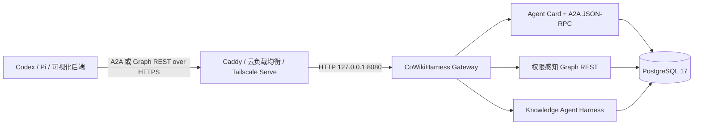

# CoWikiHarness Hermes 风格 Gateway 部署设计

- 状态：已实现并完成 macOS/自动化门禁；待首台 Linux 服务器真实 systemd 验收
- 日期：2026-08-17
- 读者：Owner、实施人员、运维人员
- 范围：单机云端试运行的 Gateway 监听边界、Linux 常驻服务和 HTTPS 接入
- 需求依据：[`requirements-v2.md`](../../requirements/requirements-v2.md)
- 架构依据：[`2026-08-15-cloud-knowledge-agent-v2-design.md`](../../design/active/2026-08-15-cloud-knowledge-agent-v2-design.md)
- 相关决策：[`ADR-0005`](../../decisions/ADR-0005-a2a-v1-public-agent-protocol.md)、[`ADR-0009`](../../decisions/ADR-0009-authorized-graph-projection-api.md)

## 一、目标与成功标准

将当前 Knowledge Server 收敛为 Hermes 风格的常驻 Gateway：一个 Node.js 进程同时承载 A2A、Agent Card、健康检查和只读 Graph REST，默认只监听本机 HTTP，由操作系统负责进程守护，由部署边缘负责公网 HTTPS。

完成后，Owner 可以在一台 Linux 服务器上安装、启动、查看状态和升级 CoWikiHarness；外部 Codex 或其他 Agent 通过一个 HTTPS 地址使用知识中枢；PostgreSQL、应用端口和 bearer token 均不直接暴露到公网。

验收必须同时满足：

1. 未配置监听地址时只绑定 `127.0.0.1`；
2. 公网只开放 `443`，应用端口 `8080` 无法从公网直连；
3. Agent Card 发布 HTTPS 公共地址；
4. systemd 在进程异常退出后自动重启，并能通过标准命令查看状态和日志；
5. 本地 macOS 安装链路和现有 A2A、Graph REST 合同保持兼容；
6. 远程客户端继续拒绝明文 HTTP bearer 传输；
7. 不新增 npm 运行时依赖，不新增第二个应用 Gateway 进程。

## 二、现状与主要差距

当前 `apps/knowledge-server` 已经具备完整的 Gateway 功能，但监听函数固定绑定 `0.0.0.0`。这会让安装者在防火墙配置疏漏时直接暴露应用端口。`OPENLIFEWIKI_PUBLIC_URL` 同时承担 Agent Card 对外地址，却没有独立的监听地址配置，运行边界不够清晰。

当前仓库已有 macOS LaunchAgent 安装脚本，还缺少 Linux systemd 单元、生产环境文件约定、HTTPS 边缘示例和服务器部署验收脚本。客户端已经实现远程 HTTPS 或回环 HTTP 的 fail-closed 校验，这一保护应继续保留。

## 三、Hermes 对标结论

Hermes Gateway 的可借鉴点有三项：

1. API Server 默认监听 `127.0.0.1`，本机调用使用 HTTP；
2. Gateway 是常驻进程及生命周期边界，消息适配器和可选 API Server共享同一 Agent core；
3. 公共传输安全由部署环境处理，应用层保留明确的 bearer 认证和 CORS 边界。

参考：

- [Hermes API Server](https://github.com/NousResearch/hermes-agent/blob/main/website/docs/user-guide/features/api-server.md)
- [Hermes Programmatic Integration](https://github.com/NousResearch/hermes-agent/blob/main/website/docs/developer-guide/programmatic-integration.md)
- [Hermes CLI Commands](https://github.com/NousResearch/hermes-agent/blob/main/website/docs/reference/cli-commands.md)

CoWikiHarness 比 Hermes 多一个中央多人知识权限边界，并使用可撤销的用户和 Agent bearer token。公网明文 HTTP 会暴露 token 与知识数据，因此只借鉴它的进程与监听模型，公网访问继续遵循 V2 已批准的 HTTPS 要求。

## 四、方案比较

### 方案 A：现有进程成为 Gateway，系统服务加边缘 TLS

采用。`apps/knowledge-server` 继续作为唯一 Node.js 服务，增加独立 bind host 配置，Linux 使用 systemd，HTTPS 使用 Caddy、云负载均衡器或 Tailscale Serve。应用与 PostgreSQL 合同不变。

优点：改动小、没有第二套路由和认证、符合奥卡姆剃刀原则。退出成本低，边缘实现可替换。

### 方案 B：增加独立 Node.js Gateway 代理

不采用。独立进程需要重复处理认证、流式响应、错误映射、健康状态和关闭顺序，还会增加部署与故障定位成本。当前不存在需要拆分传输层的量化证据。

### 方案 C：直接在公网开放 `0.0.0.0:8080` HTTP

不采用。Bearer token 和知识响应会以明文跨网络传输，也违反 `R-V2-01` 与既有客户端安全合同。API key 只能决定调用者身份，无法提供链路机密性。

## 五、目标架构



“Gateway”是现有 Knowledge Server 的部署与生命周期名称。协议层仍保留 A2A 和 Graph REST 两个已经批准的公共合同，代码包和 `@openlifewiki/*` 兼容 namespace 暂不迁移。

## 六、配置合同

新增：

```text
OPENLIFEWIKI_BIND_HOST=127.0.0.1
PORT=8080
OPENLIFEWIKI_PUBLIC_URL=https://knowledge.example.com
```

语义：

- `OPENLIFEWIKI_BIND_HOST` 决定 Node.js 实际监听地址，默认 `127.0.0.1`；
- `PORT` 决定内部监听端口；
- `OPENLIFEWIKI_PUBLIC_URL` 是 Agent Card 和外部调用方看到的规范地址；
- 公共地址使用远程主机时必须是 HTTPS；回环地址可以使用 HTTP；
- 容器部署只有在应用端口未发布到公网、且前方已有 HTTPS 边缘时，才显式绑定 `0.0.0.0`；
- CORS 继续使用精确 Origin 白名单，默认关闭。

启动日志分别显示内部监听地址和公共地址，且不得打印数据库密码、模型密钥、bearer token 或 HMAC secret。

## 七、Linux 运行与文件边界

采用系统原生生命周期，暂不复制 Hermes 的跨平台服务管理 CLI。

```text
/opt/cowikiharness/                 只读应用源码与构建产物
/etc/cowikiharness/gateway.env      运行配置与 secret，root:cowikiharness，0640
/etc/systemd/system/cowikiharness-gateway.service
/var/lib/cowikiharness/             需要时保存非数据库运行状态
journald                             标准输出与错误日志
```

systemd 单元要求：

- 使用无登录权限的 `cowikiharness` 用户运行；
- 从固定环境文件读取配置，不把 secret 写入命令参数；
- `Restart=on-failure`；
- 启动前不执行破坏性动作；
- 终止时发送 `SIGTERM`，复用现有优雅关闭逻辑；
- PostgreSQL migration 继续由 Gateway 启动流程幂等执行；
- 服务只依赖网络和数据库可用性，不把 Caddy 设为应用启动前提。

安装脚本只负责校验环境、安装依赖、构建、放置 systemd 单元和启动服务。组织 bootstrap、token 创建和数据导入保持显式命令，避免安装失败产生部分业务状态。

## 八、HTTPS 边缘

仓库提供 Caddy 示例，不把 Caddy 变成应用依赖：

```caddyfile
knowledge.example.com {
    reverse_proxy 127.0.0.1:8080
}
```

Caddy 负责证书申请、续期和 TLS 终止。已有云负载均衡器或 Tailscale Serve 时直接替换 Caddy，Gateway 配置与代码无需变化。

防火墙只允许 SSH 和 HTTPS 入站。PostgreSQL 端口与 Gateway 内部端口不得向公网开放。

## 九、数据流与错误处理

1. 客户端先校验目标 URL；远程 HTTP 在读取 token 文件前失败；
2. HTTPS 边缘转发请求到回环 Gateway；
3. Gateway 使用现有 bearer 认证解析 user、Agent 或 Relay principal；
4. 权限过滤、任务持久化、模型调用和图谱投影继续走现有链路；
5. 边缘不可达由客户端返回稳定请求失败；
6. 数据库不可用时 `/healthz` 返回 `503`，systemd 保持进程状态可观察；
7. Gateway 启动配置错误时退出非零，日志只记录脱敏原因。

## 十、实现范围

预计修改：

- `apps/knowledge-server/src/config.ts`：增加并校验 bind host；
- `apps/knowledge-server/src/a2a-server.ts`：按配置监听；
- `apps/knowledge-server/src/main.ts`：输出内部与公共地址的脱敏启动信息；
- `apps/knowledge-server/test/*`：增加默认回环、显式监听和回归测试；
- `.env.example`：区分 bind host 与 public URL；
- `deploy/linux/cowikiharness-gateway.service.template`：systemd 单元；
- `deploy/caddy/Caddyfile.example`：HTTPS 边缘示例；
- `scripts/install_server_linux.sh`：幂等安装入口；
- `README.md` 与服务器部署文档：中文运行、升级、备份、回滚和验收步骤。

## 十一、非目标

- 不新增第二个 Gateway、API Gateway 产品或服务发现组件；
- 不引入 Docker 作为部署前提；
- 不实现内置 Web 管理后台；
- 不放宽远程 HTTP 客户端限制；
- 不改动 A2A、Graph schema、数据库结构或权限模型；
- 不在安装脚本中自动创建组织、成员、授权或 token；
- 不修改 `main` 分支。

## 十二、测试与验收

### 自动验证

1. 配置测试证明默认 bind host 为 `127.0.0.1`；
2. Server 测试证明监听函数使用配置地址；
3. 配置测试拒绝空值、带 scheme、带端口或无效 bind host；
4. 现有客户端测试继续证明远程 HTTP 在 token 读取前失败；
5. 部署文件合同测试证明 systemd 不包含 secret 值、不使用 root 运行、启用失败重启；
6. `pnpm verify`、启用 PostgreSQL 的 `pnpm verify:cloud` 和 `git diff --check` 全部通过。

### Linux 真实验收

1. `systemctl status cowikiharness-gateway` 显示 active；
2. 服务器本机访问 `http://127.0.0.1:8080/healthz` 返回 ready；
3. 外部访问 `https://knowledge.example.com/healthz` 返回 ready；
4. 外部直接访问 `http://server-ip:8080` 失败；
5. Agent Card 中所有远程 interface URL 均为 HTTPS；
6. `cowiki ask`、一次权限感知 Graph 请求和一次撤销 token 拒绝场景通过；
7. 重启 Gateway 后已完成任务和知识引用保持不变；
8. PostgreSQL 隔离恢复后 item、location 和 version ID 保持不变。

### 2026-08-17 实际验证记录

- macOS 安装和真实查询候选为 `dev` 分支提交 `682dd407b3b7b3225bb3b8b1cf396cc16f0d09fb`；最终自动化安全候选为 `ff3b738b98ca9e77663c3e91bc9ea8419731a593`。两轮验证开始时工作树均干净，运行数据未进入 Git。
- 运行环境为 Node.js `24.18.0`、pnpm `10.33.2`、PostgreSQL 服务端 `17.2`。
- 最终安全候选独立执行 `pnpm verify`，结果为 66 个测试文件通过、10 个文件跳过，851 项通过、98 项跳过，退出码 0。分包结果为：protocol 97/0、core 183/0、adapters 260/40、companion 10/0、knowledge-agent 26/45、CLI 29/0、knowledge-server 246/13，数字顺序均为通过数/跳过数。
- 最终安全候选在 PostgreSQL `17.2` 上执行 `pnpm verify:cloud`，退出码 0。内部全门禁为 73 个文件通过、3 个文件跳过，946 项通过、3 项跳过；PostgreSQL 阶段为 35/3 个文件、368/3 项；A2A 阶段为 10/0 个文件、259/0 项。按脚本实际执行次数合计为 118 个文件通过、6 个文件跳过，1,573 项通过、6 项跳过；其中 PostgreSQL 与 A2A 套件会按脚本设计重复运行。
- macOS 安装脚本退出码 0，LaunchAgent 脱敏启动地址为 `http://127.0.0.1:8080`，`/healthz` 返回 `{"status":"ready"}`。
- 真实 `cowiki ask` 退出码 0，响应通过 `openlifewiki.knowledge-query-result/v1` 结构校验，`evidenceMode=grounded`、答案非空、1 条引用；验收记录未保存知识正文或引用定位信息。
- 仓库外 `owner.token` 仅完成存在性与权限检查，文件权限为 `600`；真实 Graph 请求退出码 0，通过 `cowikiharness.graph/v1` 结构校验，返回 5 个节点、4 条边、`truncated=false`。记录未保存凭据内容、正文、定位信息或个人绝对路径。
- 安装脚本语法、默认回环监听、远程 HTTP 失败关闭、systemd 专用非 root 账户与外部凭据边界、Caddy 回环反代、Git 运行数据隔离及 `git diff --check` 均已通过。
- 待首台 Linux 服务器完成四项真实验收：systemd 启动、异常重启和日志；公网 `443` HTTPS 与 Agent Card；公网无法直连 `8080`；PostgreSQL 备份恢复及稳定标识验证。

## 十三、升级与回滚

升级按固定 commit 构建，在切换前完成数据库备份。migration 只允许向前、幂等和非破坏性变更。应用启动失败时恢复上一份源码与构建产物，继续使用同一环境文件和 PostgreSQL；本切片没有数据库 migration，回滚不需要数据变更。

监听地址改动可以通过移除 `OPENLIFEWIKI_BIND_HOST` 回到安全的 `127.0.0.1` 默认值。Caddy 或其他边缘故障不会改变数据库状态。

## 十四、后续触发条件

只有出现以下证据时才评估独立 Gateway：

- 单个 Node.js 进程无法满足已确认的可用性或吞吐目标；
- 多实例需要统一限流、服务发现或集中身份联邦；
- A2A 与 Graph REST 必须独立扩缩容；
- 现有边缘无法满足组织级审计或网络策略。

在这些触发条件出现前，单进程 Gateway 是成本最低、边界最清晰的方案。
